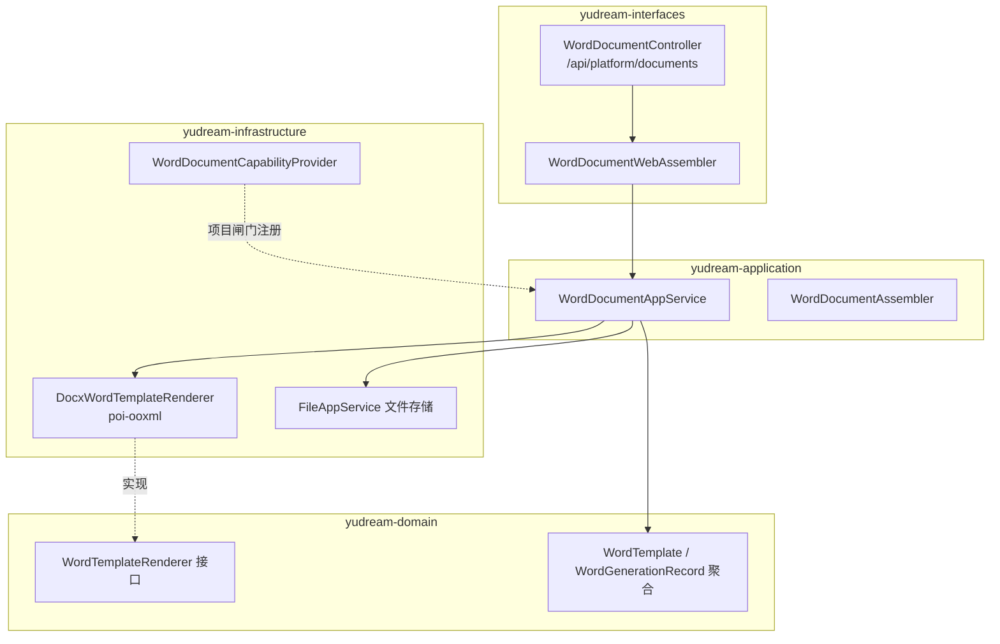
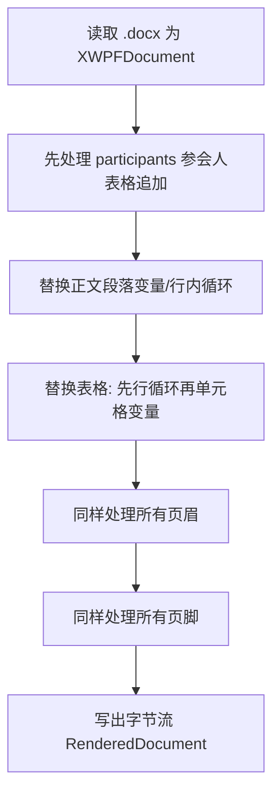

# Word 模板渲染能力

平台 Word 模板能力（能力编码 `document-template`）提供 DOCX 模板上传、占位符管理与文档生成：上传一份 `.docx` 模板，在正文中书写占位符与循环语法，调用生成接口传入数据 Map，即可产出填充后的 Word 文档并自动落库为生成记录。典型用途是活动证明、证书、报告类文件的批量生成（仓库 `artifacts/` 下的 activity-proof 模板即来自该能力的真实样例）。

> 源码：`yudream-application/.../platform/document/service/WordDocumentAppService.java`、`yudream-infrastructure/.../platform/document/service/DocxWordTemplateRenderer.java`、`yudream-interfaces/.../platform/document/controller/WordDocumentController.java`

---

## 整体架构

能力遵循平台标准的"领域服务接口 + infra 实现 + 应用编排 + 接口装配"分层：



- 领域层定义 `WordTemplateRenderer` 端口与 `RenderedDocument`（`byte[] content` + `contentType`）值对象，不依赖任何框架；
- infra 层 `DocxWordTemplateRenderer` 用 Apache POI（`poi-ooxml`）实现 DOCX 占位符替换；
- 生成的输出文件经 `FileAppService` 上传到文件存储（目录 `word-generated`），模板原件存于 `word-template` 目录。

## 双闸门启用

1. **项目闸门**：`WordDocumentCapabilityProvider` 标注 `@ConditionalOnProperty(prefix = "yudream.platform.capabilities.document-template", name = "enabled", havingValue = "true")`——配置不开则 provider 不注册；provider 构造与 `enable(config)` 只置内存开关，不建立任何外部连接。
2. **应用闸门**：`WordDocumentAppService` 的每个用例（分页查询、上传、更新、生成、记录查询……）入口都调用 `ensureEnabled()`，从 `CapabilityModuleRepo` 读持久化开关，未启用抛 `"Word 模板能力未启用"`。

能力描述符（`CapabilityDescriptor`）：类型 `DOCUMENT`，图标 `i-ri:file-word-2-line`，元数据声明占位符风格 `${变量名}`。

## 模板语法

`DocxWordTemplateRenderer` 支持三种占位符形态，作用于正文段落、表格单元格以及页眉/页脚：

| 语法 | 示例 | 说明 |
|---|---|---|
| Mustache 变量 | <code v-pre>&#123;&#123;activityName&#125;&#125;</code> | 单值替换，键支持 `a.b.c` 点路径 |
| Dollar 变量 | `${activityName}` | 同上，兼容另一种书写习惯 |
| 行内循环 | <code v-pre>&#123;&#123;#items&#125;&#125;...&#123;&#123;/items&#125;&#125;</code> | 在同一段落内按集合重复片段 |
| 表格行循环 | 起始行含 <code v-pre>&#123;&#123;#key&#125;&#125;</code>、结束行含 <code v-pre>&#123;&#123;/key&#125;&#125;</code> | 复制模板行并逐行填充集合数据 |

处理流程：



要点：

- 变量正则为 `\{\{\s*([A-Za-z0-9_.-]+)\s*}}` 与 `\$\{\s*([A-Za-z0-9_.-]+)\s*}`，键名只允许字母、数字、下划线、点、连字符；
- 表格行循环通过复制 `CTRow` XML 实现，标记独占的行本身不会出现在结果中；
- 特殊约定：当数据带 `participantTableAppend` 且 `participants` 为列表时，渲染器会把参会人**追加**到既有表格末尾（`appendParticipantTables`），适配证明文件中人数不固定的签名表场景。

### 模板示例

在 `.docx` 中这样书写：

```
兹证明 {{userName}} 于 {{activityDate}} 参加了「{{activityName}}」活动。
${duration} 小时，表现良好。
```

表格行循环：

```
| {{#participants}} | {{name}} | {{role}} |   <- 起始行含 {{#participants}}
| ...                               <- 模板行（可多行）
| {{/participants}} |               <- 结束行
```

对应数据：

```json
{
  "userName": "Steve",
  "activityName": "周末建筑赛",
  "activityDate": "2026-08-20",
  "duration": "3",
  "participantTableAppend": true,
  "participants": [
    { "name": "Steve", "role": "队长" },
    { "name": "Alex",  "role": "队员" }
  ]
}
```

## HTTP API

控制器挂载在 `/api/platform/documents`（`WordDocumentController`）：

| 方法 | 路径 | 说明 |
|---|---|---|
| GET | `/word-templates` | 模板分页（关键字过滤） |
| POST | `/word-templates` | 上传模板（multipart + `WordTemplateSaveRequest`） |
| PUT | `/word-templates/{id}` | 更新名称/占位符/描述/状态 |
| PUT | `/word-templates/{id}/file` | 替换模板文件 |
| DELETE | `/word-templates/{id}` | 删除模板 |
| POST | `/word-templates/{id}/enable` | 启用模板 |
| POST | `/word-templates/{id}/generate` | 以 `{ "data": {...} }` 生成文档 |
| GET | `/word-records` | 生成记录分页 |

约束与行为：

- 模板文件必须是 `.docx`（校验扩展名与 contentType，见 `validateDocxTemplateFile`）；模板 `code` 全局唯一；
- 只有 `TemplateStatus.ACTIVE` 的模板可生成，停用模板抛 `"Word 模板已停用"`；
- `generate` 成功与失败都会写 `WordGenerationRecord`（成功记录输出文件 id 与文件名，失败记录错误信息），便于审计追溯；
- 输出文件名为 `模板名-yyyyMMddHHmmss.docx` 形式（`buildOutputFilename`）。

> **ID 一律字符串**：`WordTemplate.id`、`templateFileId`、操作人 `operatorId` 等均为 Java `Long`/Snowflake ID。它们在 JSON 响应、插件 DTO、前端 TS 模型与 URL 参数中一律使用 **string** 表示，禁止 `Number(id)` 之类的数值转换。

## 使用示例

```bash
# 1. 上传模板
curl -X POST http://<host>/api/platform/documents/word-templates \
  -F 'file=@activity-proof.docx' \
  -F 'code=activity-proof' -F 'name=活动证明'

# 2. 生成文档
curl -X POST http://<host>/api/platform/documents/word-templates/<templateId>/generate \
  -H 'Content-Type: application/json' \
  -d '{ "data": { "userName": "Steve", "activityName": "周末建筑赛" } }'
```

生成成功后从返回的 `WordGenerationRecordDTO` 中取得输出文件信息下载 DOCX。

---

> 源码引用：
> - `yudream-domain/src/main/java/online/yudream/base/domain/platform/document/`（聚合、枚举 `TemplateStatus`、端口 `WordTemplateRenderer`、值对象 `RenderedDocument`）
> - `yudream-application/src/main/java/online/yudream/base/application/platform/document/service/WordDocumentAppService.java`
> - `yudream-infrastructure/src/main/java/online/yudream/base/infra/platform/document/service/DocxWordTemplateRenderer.java`、`WordDocumentCapabilityProvider.java`
> - `yudream-interfaces/src/main/java/online/yudream/base/interfaces/platform/document/controller/WordDocumentController.java`
> - 样例产物：根仓 `artifacts/activity-proof-word-template-example.docx` 及相关 render 目录
