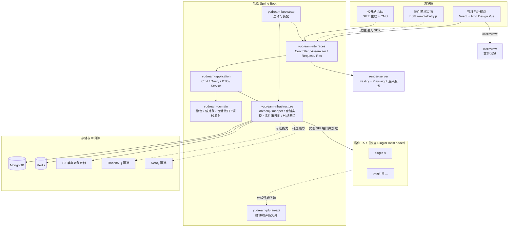
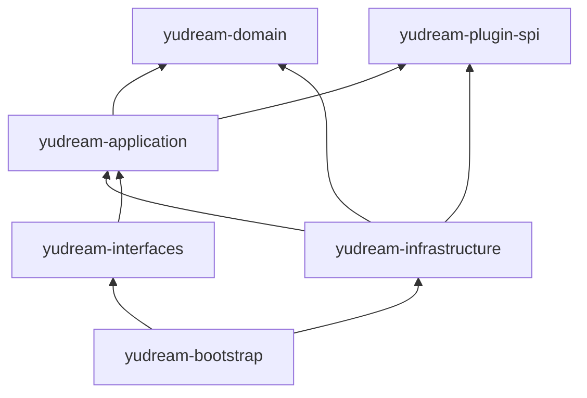
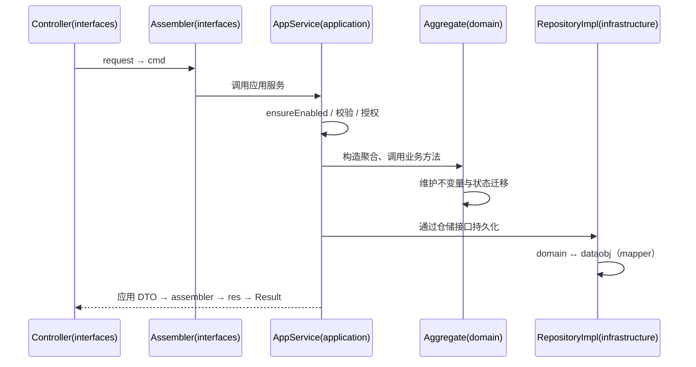
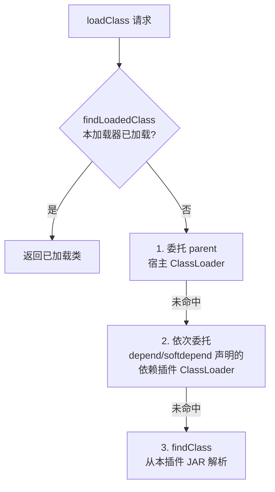
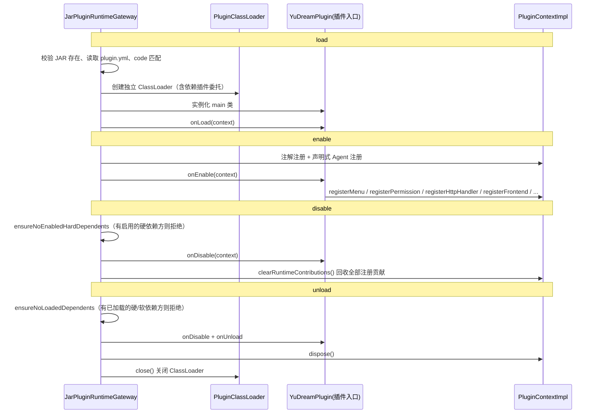

# 系统架构

YuDream Admin 是一个「DDD 分层后端 + 可插拔平台能力 + 插件运行时 + 前端 monorepo」的管理系统骨架。本文从四个视角讲清整体结构：

- 后端六个 Maven 模块的分层职责与依赖方向；
- `system`（基线能力）与 `platform`（可插拔能力）的边界与双闸门管控；
- 插件架构全景：SPI 契约、ClassLoader 隔离、注册/回收模型、端点与前端挂载；
- 前端 pnpm monorepo 的包划分。

## 整体架构



模块清单以根 `pom.xml` 的 `<modules>` 为准：`yudream-plugins/yudream-plugin-spi`、`yudream-domain`、`yudream-application`、`yudream-interfaces`、`yudream-infrastructure`、`yudream-bootstrap`。

> 源码引用：根 `pom.xml:13-18`

## 一、DDD 六模块分层

### 依赖方向

各模块的内部依赖关系以各模块 `pom.xml` 为权威事实：

| 模块 | 内部依赖 | 职责 |
| --- | --- | --- |
| `yudream-plugin-spi` | 无 | 第三方插件**唯一允许依赖**的编译期契约：插件入口、上下文、菜单/权限/HTTP/前端/能力等注册模型 |
| `yudream-domain` | 无（禁止框架/Web 依赖） | 聚合、值对象、枚举、仓储接口、领域服务、领域异常 |
| `yudream-application` | `domain`、`plugin-spi` | cmd/query/dto、应用 assembler、应用 service（编排仓储、领域服务、事务、校验） |
| `yudream-infrastructure` | `application`、`domain`、`plugin-spi` | dataobj、mapper、仓储实现、外部技术网关、插件运行时与平台能力 provider |
| `yudream-interfaces` | `application` | controller、request/res、接口 assembler、Excel row |
| `yudream-bootstrap` | `infrastructure`、`interfaces` | Spring Boot 启动类与全局装配 |



注意两点：

- `domain` 不依赖任何兄弟模块，也不依赖 Spring/Web 框架——领域层是纯 Java。
- `interfaces` 只依赖 `application`，**不依赖** `infrastructure`；仓储实现与领域层之间的装配由 `bootstrap` 完成。

> 源码引用：`yudream-domain/pom.xml`、`yudream-application/pom.xml`、`yudream-infrastructure/pom.xml`、`yudream-interfaces/pom.xml`、`yudream-bootstrap/pom.xml`

### 一次写请求的流向



### 分层硬规则（禁止项）

完整规范见 `.codex/skills/yudream-ddd-architecture/SKILL.md`，这里列出最容易踩的红线：

| 层 | 禁止项 |
| --- | --- |
| Controller（interfaces） | 禁止 `new XxxCmd/Res/ExcelRow`、禁止响应 `builder()`、禁止私有 `toXxx/parseXxx` 转换方法、禁止 Excel 模板构造与业务不变量；只做边界校验、调应用 service、经 assembler 返回 `Result` |
| 应用 service（application） | 不得接收接口 `request`、不得返回接口 `res`；非琐碎的 `domain ↔ DTO` 转换必须放应用 assembler |
| infrastructure | dataobj 不得外泄到应用/接口层；`domain ↔ dataobj` 转换只允许出现在 infra mapper |
| domain | 禁止引入框架/Web 依赖；领域异常与错误文案使用正常 UTF-8 中文，禁止 `\uXXXX` 转义 |

三层 assembler 的分工：

| assembler 所在层 | 负责方向 |
| --- | --- |
| 接口层 assembler | `request → cmd`、`DTO → res`、Excel 行映射 |
| 应用层 assembler | `domain → 应用 DTO` |
| infra mapper | `domain ↔ dataobj` |

## 二、system 基线 vs platform 可插拔能力

平台能力按是否可动态加载分两类，边界是硬性的：

| 分类 | 能力 | 特征 |
| --- | --- | --- |
| `system`（基线） | 接口加密、双 token、API Key、Passkey、OAuth | 始终可用，不参与动态开关 |
| `platform`（可插拔） | SSE、WebSocket、MQ、Neo4j、Python Runtime、HTTP 集成、文档生成、CMS、AI/Agent、本机插件市场源等 | 可动态加载/卸载，受双闸门管控 |

### 双闸门模型

```mermaid
flowchart LR
    CFG[yml 配置开关] -->|项目闸门<br/>@ConditionalOnProperty| P{允许加载 provider?}
    P -->|否| NOEP[不注册端点<br/>不启动恢复]
    P -->|是| REG[Provider 注册]
    REG --> E{应用闸门<br/>ensureEnabled 持久化状态}
    E -->|已启用| RUN[建立连接 / 执行用例]
    E -->|未启用| REJ[拒绝用例]
    DESC[CapabilityDescriptor.dependencies] --> CASCADE[依赖不可用拒绝启用<br/>禁用依赖级联禁用依赖方]
```

- **项目闸门**：配置/`@ConditionalOnProperty` 决定某个能力是否允许加载 provider。项目闸门不允许的能力，不得注册端点、不得启动恢复。
- **应用闸门**：应用层在每个用例前调用 `ensureEnabled(...)` 检查持久化的启用状态。
- **provider 惰性连接**：infra provider 只是工具包装——构造与 `enable(config)` 不得建立外部连接、声明队列或启动长驻资源；连接只在两道闸门通过且真实业务动作需要时创建，`disable` 时关闭清理。
- **依赖级联**：能力间的运行时依赖必须声明在 `CapabilityDescriptor.dependencies`；依赖不可用时拒绝启用，禁用依赖必须级联禁用依赖方。

详见 [平台能力](/guide/platform-capabilities)。

## 三、插件架构全景

### SPI：唯一编译期契约

插件 JAR **只允许**依赖 `yudream-plugins/yudream-plugin-spi` 模块，禁止依赖 `domain/application/infrastructure/interfaces/bootstrap`。SPI 的包结构即插件可用的全部契约面：

| SPI 包 | 内容 |
| --- | --- |
| `core` | `YuDreamPlugin`（插件入口）、`PluginContext`（注册/服务门面）、`PluginDescriptor` |
| `annotation` | `@PluginSpec` 等声明式注解 |
| `menu` / `permission` / `capability` / `dashboard` | `PluginMenuItem`、`PluginPermissionItem`、`PluginCapabilityItem`、`PluginDashboardCard` |
| `frontend` | `PluginFrontendModule`（前端模块与路由声明） |
| `http` | `PluginHttpHandler` |
| `system` | `FrameworkServices` 及消息、指令、模板渲染、AI 工具、语义记忆、文档/文件/密钥存储等宿主能力端口 |

每个插件 JAR 根目录必须有权威 `plugin.yml`，由 `PluginYamlDescriptorReader` 解析：

| 字段 | 必填 | 说明 |
| --- | --- | --- |
| `name` | 是 | 唯一稳定的插件 code，也是端点与前端资源的命名空间 |
| `displayName` | 否 | 仅展示用，缺省回退为 `name` |
| `version` | 是 | 插件版本 |
| `description` | 否 | 描述 |
| `main` | 是 | 入口类全限定名（实现 `YuDreamPlugin`） |
| `depend` | 否 | 硬依赖列表，必须先于本插件加载启用 |
| `softdepend` | 否 | 软依赖列表，缺失不阻塞，相关菜单/路由/端点须条件注册并显式降级 |

禁止打包 `META-INF/services/...YuDreamPlugin`（不走 JDK ServiceLoader，入口以 `plugin.yml` 的 `main` 为准）。

> 源码引用：`yudream-plugins/yudream-plugin-spi/src/main/java/online/yudream/base/plugin/spi/core/PluginContext.java`、`.../core/YuDreamPlugin.java`、`yudream-infrastructure/src/main/java/online/yudream/base/infra/platform/plugin/service/PluginYamlDescriptorReader.java`

### PluginClassLoader 隔离

每个插件由独立的 `PluginClassLoader`（继承 `URLClassLoader`）加载。类解析顺序固定为：



这个顺序意味着：

- JDK 与宿主类（含 SPI 契约类）永远由 parent 加载，**插件与宿主共享同一个 SPI 类身份**，`instanceof` 与泛型调用安全；
- 依赖插件导出的类先于本 JAR 解析，保证 `depend`/`softdepend` 语义在类加载层面成立；
- 插件之间打包的同名第三方库互不可见，实现隔离。

> 源码引用：`yudream-infrastructure/src/main/java/online/yudream/base/infra/platform/plugin/service/PluginClassLoader.java`（`loadClass` 17-34 行）

### 生命周期与注册/回收模型

插件生命周期由 `JarPluginRuntimeGateway` 驱动，四个动作与 `YuDreamPlugin` 的四个回调一一对应：



**回收模型**的核心在 `PluginContextImpl.clearRuntimeContributions()`（277-293 行）：依次关闭所有 `onDispose` 登记的资源，然后清空菜单、权限、能力、首页卡片、前端模块、HTTP 端点与处理器、服务导出，以及全部去重 key 集合。也就是说——**插件在 `onEnable` 里通过 `registerXxx` 注册的一切，disable/unload 时都会被宿主完整回收**，插件不需要（也不应该）自行维护全局注册表。

两个保障依赖完整性的检查：

| 检查 | 触发时机 | 语义 |
| --- | --- | --- |
| `ensureNoEnabledHardDependents` | `disable(code)` 前 | 存在**已启用**且 `depend` 了本插件的插件时，抛出「请先禁用依赖插件」 |
| `ensureNoLoadedDependents` | `unload(code)` 前 | 存在**已加载**且 `depend`/`softdepend` 了本插件的插件时，抛出「请先卸载依赖插件」 |

另外，`enable` 阶段任何异常（包括 JAR 损坏抛出的 `ZipError` 等非 `RuntimeException`）都会触发 `clearRuntimeContributions()` 回滚已注册的贡献，避免残留注册让后续重试永远报「重复」错误。

> 源码引用：`yudream-infrastructure/src/main/java/online/yudream/base/infra/platform/plugin/service/JarPluginRuntimeGateway.java`（`load` 287-311、`enable` 313-335、`disable` 337-355、`unload` 357-379、`ensureNoEnabledHardDependents` 837-845、`ensureNoLoadedDependents` 847-856）、`.../PluginContextImpl.java`

### registerXxx 注册面一览

`PluginContext` 是插件与宿主交互的唯一门面，全部方法如下：

| 方法 | 作用 |
| --- | --- |
| `pluginCode()` | 返回当前插件 code |
| `framework()` | 获取 `FrameworkServices`（宿主能力集合入口） |
| `documents()` / `files()` / `secrets()` | 便捷方法：插件作用域的文档存储 / 文件存储 / 密钥存储（默认实现委托 `framework()`） |
| `interactions()` / `commands()` / `templateRenderer()` / `semanticMemory()` | 消息交互注册表 / 指令注册表 / 模板渲染 / 语义记忆 |
| `registerMenu(PluginMenuItem)` | 注册后台菜单；路径去重，重复抛「插件菜单重复」 |
| `registerPermission(PluginPermissionItem)` | 注册权限点；编码去重 |
| `registerCapability(PluginCapabilityItem)` | 注册能力项；编码去重 |
| `registerDashboardCard(PluginDashboardCard)` | 注册首页仪表盘卡片；编码去重 |
| `registerFrontend(PluginFrontendModule)` | 注册前端模块；模块名、路由 path/name 均去重；`entry` 缺省自动补为 `/api/platform/plugins/{code}/assets/remoteEntry.js` |
| `registerHttpHandler(method, path, handler)` | 注册函数式 HTTP 端点；method+path 去重 |
| `registerHttpController(Object)` | 注册注解式 Controller，由 `PluginAnnotationRegistrar` 扫描其端点注解 |
| `registerAiTool(PluginAiTool)` | 注册 AI 工具；descriptor.name 必填 |
| `exposeService(Class<T>, T)` | 导出进程内服务，供其他插件消费 |
| `service(pluginCode, Class<T>)` | 消费**已声明依赖**插件的服务；未声明依赖直接抛「插件未声明依赖」，依赖未启用返回 `Optional.empty()` |
| `services(Class<T>)` | 查找所有插件导出的该类型服务 |
| `dependencyAvailable(pluginCode)` | 判断已声明依赖当前是否启用 |
| `onDispose(AutoCloseable)` | 登记资源，disable/unload 时统一关闭 |

### HTTP 端点挂载

插件端点统一挂载在 `/api/plugins/{pluginCode}/**` 之下，由宿主的 `PluginDispatchController` 统一接收再分发到插件注册的 handler：

```java
// yudream-interfaces/.../platform/plugin/controller/PluginDispatchController.java:33
@RequestMapping({"/api/plugins/{code}", "/api/plugins/{code}/**"})
```

分发支持 `{pathVar}`、`*`、`**` 路径模式与 `*` 通配方法匹配（见 `PluginContextImpl.findHttpHandler` / `pathMatches`）。端点元数据（方法、路径、所需权限、是否包裹 `Result`）通过 `httpEndpoints()` 汇总，并注入 OpenAPI 文档（`OpenApiConfigure`）。

### 前端 remoteEntry 加载

生产模式下插件前端以 ESM 形式打进插件 JAR 的 `META-INF/yudream-plugin/frontend/{pluginCode}`，经后端暴露为 `/api/platform/plugins/{code}/assets/remoteEntry.js`（即 `registerFrontend` 未显式指定 `entry` 时的默认值）。宿主前端拿到已启用插件的 `PluginFrontendModule` 清单后：

1. 动态 `import()` 插件的 `remoteEntry.js`；
2. 向插件模块注入宿主提供的 `@yudream/plugin-sdk`（Vue、vue-router 等以 peerDependency 共享，保证单实例）；
3. 按模块声明的 `routes()` 把页面挂进后台布局与菜单。

workspace 别名加载仅是开发便利，生产 manifest 禁止依赖 workspace 别名。

> 源码引用：`PluginContextImpl.withDefaultFrontendEntry` / `defaultFrontendEntry`（380-397 行）、`yudream-frontend/apps/core-arco-design-vue/src/store/modules/app/plugin-route-runtime.ts`、`yudream-frontend/packages/plugin-sdk/package.json`

## 四、前端 monorepo

`yudream-frontend` 是基于 [Fantastic-admin](https://fantastic-admin.hurui.me/) 的 pnpm workspace monorepo（Vue 3.6 + TypeScript + Vite 8 + Arco Design Vue + UnoCSS），`packages/` 下共 9 个子包：

| 包 | name | 职责 |
| --- | --- | --- |
| `packages/components` | `@yudream/components` | 共享 UI 组件库：`Fa*` 为 Fantastic-admin 自带组件，`FaResponsiveTable` 为 YuDream 原创例外；`Yd*` 为 YuDream 原创组件与 composable；跨应用共享，发布到 Nexus npm，插件前端可经 resolver 消费 |
| `packages/plugin-sdk` | `@yudream/plugin-sdk` | 插件前端开发 SDK；宿主注入插件的运行时契约，含 `vite-shared` 共享构建配置；发布到 Nexus npm |
| `packages/composables` | `@fantastic-admin/composables` | 跨应用共享的组合式函数 |
| `packages/settings` | `@fantastic-admin/settings` | 框架默认设置与类型化配置合并（defu） |
| `packages/themes` | `@fantastic-admin/themes` | 主题配置（主色、深浅模式等由后台主题配置统一控制） |
| `packages/types` | `@fantastic-admin/types` | 全局 TypeScript 类型（含路由 meta 等） |
| `packages/dataviz` | `@yudream/dataviz` | 数据可视化封装（d3 + echarts） |
| `packages/iconify-tools` | `@fantastic-admin/iconify-tools` | 图标裁剪 CLI（`fa-iconify-tools`），按需打包图标集 |
| `packages/copyright` | `@fantastic-admin/copyright` | 构建版权横幅 Vite 插件 |

`apps/` 下两个应用：

| 应用 | name | 说明 |
| --- | --- | --- |
| `apps/core-arco-design-vue` | `@fantastic-admin/core-arco-design-vue` | 默认宿主应用（Arco Design Vue），管理后台本体 |
| `apps/component-showcase` | `@fantastic-admin/component-showcase` | 组件展示应用 |

应用开发规范要点：优先复用 `Fa*`/`Yd*` 内建组件；业务页面不自行指定品牌色/固定色板，只使用中性语义变量（`--color-bg-*`、`--color-text-*`、`--color-border-*`、`--color-fill-*`）。

> 源码引用：`yudream-frontend/packages/*/package.json`、`yudream-frontend/apps/*/package.json`

## 五、贯穿全局的注意事项

- **Long ID 一律字符串**：Java `Long`/Snowflake ID 在 JSON、插件 DTO、TS 模型、表单与 URL 参数中一律序列化为 `string`，前端禁止 `Number(id)`（超过 2^53 会丢精度）。
- **插件隔离边界**：插件调用宿主能力只能走 SPI 端口；宿主内部类（Spring Bean、dataobj 等）不得泄漏给插件。插件间业务 API 放 provider JAR 的稳定最小 `*.api` 包，consumer 以 `provided` 编译并经 `context.service(...)` 调用，禁止复制 provider API。
- **软依赖降级**：软依赖缺失不阻塞 consumer，但相关菜单/路由/端点必须条件注册并显式降级。
- **构建环境**：JDK 21、Maven 3.9+、Node.js 22.22+/24.15+、pnpm 11.9+；Windows 下跑 Maven 需显式设置 JDK 21。

## 相关文档

- [平台能力](/guide/platform-capabilities)
- [插件系统总览](/plugin/overview)
