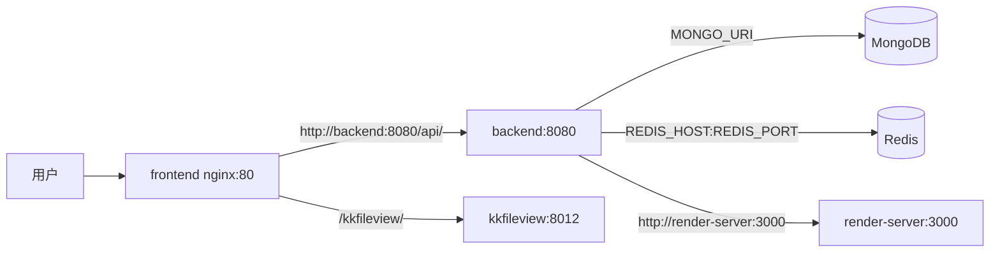

# 部署与发布

## 生产部署（Docker Compose，推荐）

完整可复制的 A/B `.env` 与 `docker-compose.yml` 模板见 [快速启动：Docker Compose 模板](/guide/getting-started#方式一docker-compose-部署推荐)。这里补充生产核对项；模板以当前根目录 `docker-compose.yml`、`docker/nginx.conf`、`application.yml` 和 render-server 源码为准，不使用旧的 Satori 变量名。

### 拓扑与镜像

应用镜像仓库是 `registry.yudream.online/yudream/yudreamadmin`：

- `backend:${TAG:-latest}`：Spring Boot，容器端口 `8080`。
- `frontend:${TAG:-latest}`：nginx，容器端口 `80`，只需对外发布这个入口。
- `render-server:${TAG:-latest}`：Fastify + Playwright，容器端口 `3000`，建议只 `expose`，不要映射宿主端口。
- `kkfileview:${KKFILEVIEW_TAG:-5.0.2}`：文件预览，容器端口 `8012`；浏览器经 frontend nginx 的 `/kkfileview/` 同源反代，生产可删除宿主端口映射。
- 模板 B 的基础镜像明确为 `docker.io/library/mongo:8.0` 与 `docker.io/library/redis:7.4-alpine`；模板 A 不创建数据库容器。



五个应用 hostname 是 Compose 服务名：`backend`、`frontend`、`render-server`、`kkfileview`，模板 B 另有 `mongo`、`redis`。nginx 的 `/api/` 使用 `proxy_pass http://backend:8080/api/`，并透传 WebSocket 升级头；`/kkfileview/` 同源反代到 kkFileView。SSE/WebSocket 读写超时为 3600 秒。不要让浏览器或外层网关绕过 frontend 直连 backend。

### 环境变量完整参考

以下变量按当前 `yudream-bootstrap/src/main/resources/application.yml`、基础设施配置类和 `yudream-render-server/src/config.ts` 整理。`${VAR}` 表示 Spring 不提供默认值，未设置时启动配置解析会失败；`${VAR:default}` 表示使用 `default`。Compose 模板为了便于复制，部分无默认值变量写成空字符串，但这不代表应用源码提供了默认值。

#### 基础连接

模板 A 必须提供 `MONGO_URI`、`REDIS_HOST`，模板 B 将 MongoDB/Redis 连接固定为 Compose 服务 `mongo`/`redis`。生产环境 MongoDB、Redis 必须是可用且受网络访问控制的外部服务或模板 B 的持久化容器。

| 变量 | 必填 | 作用与源码默认值 |
|---|---:|---|
| `TAG` | 否 | backend / frontend / render-server 镜像的版本 tag，默认 `latest`。 |
| `KKFILEVIEW_TAG` | 否 | kkFileView 镜像 tag，默认 `5.0.2`。 |
| `KKFILEVIEW_PORT` | 否 | kkFileView 宿主映射端口；容器端口固定 `8012`，默认 `8012`，生产建议删除映射。 |
| `BACKEND_PORT` | 否 | backend 宿主映射端口；容器端口固定 `8080`，默认 `8080`。 |
| `FRONTEND_PORT` | 否 | frontend nginx 宿主映射端口；容器端口固定 `80`，默认 `80`。生产只发布此入口。 |
| `RENDER_PORT` | 否 | render-server 宿主映射端口；容器端口固定 `3000`，默认 `3000`，生产建议删除映射。 |
| `MONGO_URI` | 是 | Spring Data MongoDB 完整连接串；源码为 `${MONGO_URI}`，无默认值。模板 B 固定为 `mongodb://mongo:27017/yudream`。 |
| `REDIS_HOST` | A 是 | Redis hostname；源码默认 `localhost`，模板 B 固定为 `redis`。 |
| `REDIS_PORT` | 否 | Redis 端口，默认 `6379`。 |
| `REDIS_PASSWORD` | 否 | Redis 密码，默认空。生产按 Redis 服务实际认证配置。 |
| `REDIS_DB` | 否 | Redis database 编号，默认 `0`。 |
| `REDIS_TIMEOUT` | 否 | Redis 操作超时，默认 `2000ms`。 |
| `REDIS_POOL_MAX_ACTIVE` | 否 | Lettuce 连接池最大活动连接数，默认 `8`。 |
| `REDIS_POOL_MAX_IDLE` | 否 | Lettuce 连接池最大空闲连接数，默认 `8`。 |
| `REDIS_POOL_MIN_IDLE` | 否 | Lettuce 连接池最小空闲连接数，默认 `0`。 |
| `SNOWFLAKE_DCI` | 否 | 雪花 ID 数据中心编号，默认 `1`。 |
| `SNOWFLAKE_MI` | 否 | 雪花 ID 机器编号，默认 `1`；多实例必须错开。 |

#### 邮件

| 变量 | 必填 | 作用与源码默认值 |
|---|---:|---|
| `MAIL_HOST` | 否 | SMTP 主机，默认 `smtp.qq.com`。 |
| `MAIL_PORT` | 否 | SMTP 端口，默认 `465`。 |
| `MAIL_USERNAME` | 是（启用邮件时） | SMTP 用户名；源码为 `${MAIL_USERNAME}`，无默认值。 |
| `MAIL_PASSWORD` | 是（启用邮件时） | SMTP 密码；源码为 `${MAIL_PASSWORD}`，无默认值。生产必须使用真实密钥。 |
| `MAIL_SSL_ENABLE` | 否 | SMTP SSL，默认 `true`。 |
| `MAIL_STARTTLS_ENABLE` | 否 | SMTP STARTTLS，默认 `false`。 |
| `MAIL_FROM` | 否 | 发件人地址，默认跟随 `MAIL_USERNAME`（`MAIL_FROM` 未设置且 `MAIL_USERNAME` 也未设置时无可用值）。 |

#### 缓存

| 变量 | 必填 | 作用与源码默认值 |
|---|---:|---|
| `CACHE_KEY_PREFIX` | 否 | 缓存 key 前缀，默认 `yudream`。 |
| `CACHE_ENABLED` | 否 | 是否启用缓存，默认 `true`。 |
| `CACHE_DEFAULT_NULL_EXPIRE` | 否 | 空值缓存过期时间，默认 `60`。 |
| `CACHE_L1_ENABLED` | 否 | 是否启用本地 L1 缓存，默认 `false`。 |
| `CACHE_L1_MAX_SIZE` | 否 | L1 缓存最大条目数，默认 `10000`。 |
| `CACHE_L1_EXPIRE` | 否 | L1 写入后过期时间，默认 `60`。 |
| `CACHE_METRICS_ENABLED` | 否 | 是否启用缓存指标，默认 `true`。 |
| `CACHE_METRICS_AGGREGATE` | 否 | 是否按前缀聚合缓存指标，默认 `true`。 |

#### 应用与日志

| 变量 | 必填 | 作用与源码默认值 |
|---|---:|---|
| `APP_BASE_URL` | 否 | 应用基础地址（邮件验证链接），默认 `http://localhost:8080`。 |
| `APP_WEB_URL` | 否 | Web 前端地址（邮件链接），默认跟随 `APP_BASE_URL`，若未设置则为 `http://localhost:9000`。 |
| `WEB_LOG_ENABLED` | 否 | Web 请求日志开关，默认 `true`。 |
| `WEB_LOG_PREFIX` | 否 | Web 请求日志前缀，默认 `YuDreamAdmin`。 |
| `SYSTEM_SEED_MENU_SYNC_MODE` | 否 | 菜单种子同步模式，默认 `MISSING_ONLY`。 |
| `SYSTEM_LOG_DOCKER_ENABLED` | 否 | Docker 容器日志采集开关，默认 `false`。 |
| `SYSTEM_LOG_DOCKER_CONTAINERS` | 否 | 采集的容器列表，默认空。 |
| `SYSTEM_LOG_DOCKER_TAIL` | 否 | 每个容器初始读取的日志行数，默认 `200`。 |
| `SYSTEM_LOG_DOCKER_TRANSPORT` | 否 | Docker 传输方式，默认 `auto`；可选 `auto`、`cli`、`socket`。 |
| `SYSTEM_LOG_DOCKER_SOCKET` | 否 | Docker API socket 路径，默认 `/var/run/docker.sock`。启用 socket 时还需挂载该 socket。 |

#### 平台开关

这些变量是平台能力的项目闸门，默认均为 `true`；模板 A/B 为未提供外部服务的能力显式关闭，并保留消息渲染开启。

| 变量 | 必填 | 作用与源码默认值 |
|---|---:|---|
| `PLATFORM_API_DOCS_ENABLED` | 否 | API 文档能力，默认 `true`。 |
| `PLATFORM_CMS_ENABLED` | 否 | CMS 能力，默认 `true`。 |
| `PLATFORM_WIKI_ENABLED` | 否 | Wiki 能力，默认 `true`。 |
| `PLATFORM_FORM_ENABLED` | 否 | 表单能力，默认 `true`。 |
| `PLATFORM_DOCUMENT_TEMPLATE_ENABLED` | 否 | 文档模板能力，默认 `true`。 |
| `PLATFORM_INTEGRATION_ENABLED` | 否 | 外部集成能力，默认 `true`。 |
| `PLATFORM_SSE_ENABLED` | 否 | SSE 能力，默认 `true`。 |
| `PLATFORM_WEBSOCKET_ENABLED` | 否 | WebSocket 能力，默认 `true`。 |
| `PLATFORM_RABBITMQ_ENABLED` | 否 | RabbitMQ 能力，默认 `true`；启用需外部 RabbitMQ。 |
| `PLATFORM_NEO4J_ENABLED` | 否 | Neo4j 能力，默认 `true`；启用需外部 Neo4j。 |
| `PLATFORM_AI_ENABLED` | 否 | AI 能力，默认 `true`。 |
| `PLATFORM_AGENT_ENABLED` | 否 | Agent 能力，默认 `true`。 |
| `PLATFORM_DATAVIZ_ENABLED` | 否 | 数据可视化能力，默认 `true`。 |
| `PLATFORM_MILKY_ENABLED` | 否 | QQ 消息平台能力，默认 `true`。 |
| `PLATFORM_MESSAGE_RENDER_ENABLED` | 否 | 消息渲染能力，默认 `true`；启用需 render-server。 |
| `PLATFORM_FILE_PREVIEW_ENABLED` | 否 | 文件预览能力，默认 `true`；启用需 kkFileView。 |
| `PLATFORM_INBOUND_MAIL_ENABLED` | 否 | 入站邮箱能力，默认 `true`；启用需 IMAP 配置。 |
| `YUDREAM_CREDENTIAL_KEY` | 保存任意受管凭据时 | 部署级 AES-256-GCM 主密钥，统一加密 Neo4j、Milky 与插件 SecretStore；必须为 Base64 编码且解码后恰为 32 字节。旧的三个专用变量仅用于历史密文解密，不用于新写入。 |

#### AI、Wiki、Chat 与渲染

| 变量 | 必填 | 作用与源码默认值 |
|---|---:|---|
| `PLATFORM_AI_CONNECT_TIMEOUT` | 否 | AI 客户端连接超时，默认 `30s`。 |
| `PLATFORM_AI_READ_TIMEOUT` | 否 | AI 客户端读取超时，默认 `30m`。 |
| `PLATFORM_AI_SSE_TIMEOUT` | 否 | AI 客户端 SSE 超时，默认 `30m`。 |
| `YUDREAM_CREDENTIAL_KEY` | 保存任意受管凭据时 | 部署级 AES-256-GCM 主密钥，统一加密 Neo4j、Milky 与插件 SecretStore；必须为 Base64 编码且解码后恰为 32 字节。生产通过 Secret 安全注入，不能使用默认值或提交到仓库。 |
| `PUBLIC_WIKI_CHAT_SSE_TIMEOUT` | 否 | 公开 Wiki 问答 SSE 超时，默认 `3m`。 |
| `PLATFORM_CHAT_SSE_TIMEOUT` | 否 | 平台 Chat SSE 超时，默认 `30m`。 |
| `PUBLIC_WIKI_CHAT_EXECUTOR_CORE` | 否 | 公开 Wiki 问答线程池核心线程数，默认 `2`。 |
| `PUBLIC_WIKI_CHAT_EXECUTOR_MAX` | 否 | 公开 Wiki 问答线程池最大线程数，默认 `2`。 |
| `PUBLIC_WIKI_CHAT_EXECUTOR_QUEUE` | 否 | 公开 Wiki 问答线程池队列容量，默认 `0`。 |
| `MESSAGE_RENDER_BASE_URL` | 否 | 后端调用 render-server 的 URL，默认 `http://localhost:3000`；Compose 应使用 `http://render-server:3000`。 |
| `MESSAGE_RENDER_TOKEN` | 否 | 后端渲染 token，默认空。当前 render-server 未校验 token，不应因此公开服务。 |
| `MESSAGE_RENDER_TIMEOUT` | 否 | 后端渲染请求超时，默认 `45s`。 |
| `MESSAGE_RENDER_MAX_RESPONSE_SIZE` | 否 | 后端渲染响应最大大小，默认 `16MB`。 |

`PLATFORM_NEO4J_ENABLED` 只控制 Neo4j provider 是否注册。项目闸门允许后，管理员在“平台 → 能力管理 → Neo4j”保存物理 URI、用户名、密码和 database；密码不会通过 API 返回，留空更新时保留既有密码。`YUDREAM_CREDENTIAL_KEY` 是唯一的持久化加密主密钥，使用 AES-256-GCM，必须由部署 Secret 注入。图数据库页面、Wiki 和插件只使用逻辑图表：它们不保存、返回或接收连接凭据，所有写入仍按 `tableCode` 与业务空间隔离。

#### S3

| 变量 | 必填 | 作用与源码默认值 |
|---|---:|---|
| `S3_ENDPOINT` | 启用对象存储时 | S3 兼容服务 endpoint，默认 `http://localhost:9000`；生产必须配置实际外部服务地址。 |
| `S3_ACCESS_KEY` | 启用对象存储时 | S3 access key，默认 `rustfsadmin`；生产必须改为真实凭据。 |
| `S3_SECRET_KEY` | 启用对象存储时 | S3 secret key，默认 `rustfsadmin`；生产必须改为真实密钥。 |
| `S3_BUCKET` | 否 | bucket 名称，默认 `yudream-admin`。 |
| `S3_REGION` | 否 | S3 region，默认 `us-east-1`。 |
| `S3_PATH_STYLE_ACCESS` | 否 | 是否使用 path-style 访问，默认 `true`。 |

#### 插件运行时

| 变量 | 必填 | 作用与源码默认值 |
|---|---:|---|
| `YUDREAM_CREDENTIAL_KEY` | 保存插件 SecretStore 时 | 插件 SecretStore 与 Neo4j、Milky 共用的部署级 AES-256-GCM 主密钥；必须为 Base64 编码且解码后恰为 32 字节。 |
| `PLATFORM_PLUGIN_HOST_VERSION` | 否 | 插件兼容性矩阵中的宿主版本，默认 `1.0.0`。 |
| `PLATFORM_PLUGIN_SPI_VERSION` | 否 | 插件兼容性矩阵中的 SPI 版本，默认 `2.13.0`；应与当前宿主 SPI 契约匹配（源码 `2.24.0`）。 |
| `PLATFORM_PLUGIN_FRONTEND_SDK_VERSION` | 否 | 插件兼容性矩阵中的前端 SDK 版本，默认 `1.0.1`；运行时行为版本为 `1.5.0`，npm 包为 `1.5.0`。 |
| `PLATFORM_PLUGIN_STORE_ROOT_URL` | 否 | 插件商店索引 URL，默认 `https://nexus.yudream.online/repository/plugin-store-releases/index.json`。 |
| `PLATFORM_PLUGIN_STORE_CONNECT_TIMEOUT_MILLIS` | 否 | 插件商店连接超时，默认 `5000` 毫秒。 |
| `PLATFORM_PLUGIN_STORE_REQUEST_TIMEOUT_MILLIS` | 否 | 插件商店请求超时，默认 `5000` 毫秒。 |
| `PLATFORM_PLUGIN_STORE_MAX_RESPONSE_BYTES` | 否 | 插件商店响应最大字节数，默认 `1048576`。 |

#### render-server

以下四项由 `yudream-render-server/src/config.ts` 实际读取；`RENDER_TOKEN` 虽可由 Compose 注入，但当前服务源码不读取/校验它。

| 变量 | 必填 | 作用与源码默认值 |
|---|---:|---|
| `RENDER_HOST` | 否 | 监听地址，默认 `127.0.0.1`；Compose 容器内使用 `0.0.0.0`。 |
| `RENDER_PORT` | 否 | 监听端口，默认 `3000`。 |
| `RENDER_MAX_QUEUE` | 否 | 最大渲染队列长度，默认 `32`。 |
| `RENDER_MAX_CONCURRENT` | 否 | 最大并发渲染数，默认 `2`。 |

根目录 Compose 中的 `RENDER_CONCURRENCY`、`RENDER_TIMEOUT_MS` 不是当前 render-server 源码读取的变量，不列入实际运行时参考；需要调整队列/并发时使用上表变量。

生产至少应安全注入并备份 `YUDREAM_CREDENTIAL_KEY`、替换 S3 凭据（启用对象存储时）与邮件账号密码（启用邮件时）。切勿随意更换主密钥：否则历史密文必须临时通过其对应旧变量解密，并在保存后迁移。管理员随后在能力管理中保存 Neo4j 物理凭据；不要通过 `PLATFORM_NEO4J_URI`、`PLATFORM_NEO4J_USERNAME`、`PLATFORM_NEO4J_PASSWORD` 或 `PLATFORM_NEO4J_DATABASE` 部署变量配置它们。两套 Compose 模板仍见[快速启动：Docker Compose 模板](/guide/getting-started#方式一docker-compose-部署推荐)：模板 A 使用已有 MongoDB/Redis，模板 B 在 Compose 内创建并持久化 MongoDB/Redis；未使用的 RabbitMQ、Neo4j、Wiki、AI、Agent、Milky 应保持模板中的关闭开关。

### 启动、停止与检查

在模板所在目录执行：

```bash
docker compose config
docker compose pull
docker compose up -d
docker compose ps
docker compose logs -f backend
docker compose logs -f frontend render-server
docker compose down       # 删除容器，保留数据卷
docker compose down -v    # 删除 MongoDB/Redis 数据卷，谨慎执行
```

模板 B 的 MongoDB/Redis 有 `service_healthy` 闸门；模板 A 的外部中间件由其平台负责健康检查。render-server 的事实健康端点是 `GET /health`，可执行 `curl http://localhost:${RENDER_PORT:-3000}/health`；frontend 可访问 `http://localhost:${FRONTEND_PORT:-80}`。backend 没有配置 actuator 健康端点，应以 `docker compose logs backend` 无启动异常并通过 frontend 的 `/api/` 请求验证。

首次登录访问 frontend（默认 `http://localhost`）。使用项目初始化数据提供的管理员账号；全新 MongoDB 没有初始化账号时，先执行项目的种子/初始化流程创建管理员。生产环境只发布 frontend 端口，并将 `.env` 中密钥置于安全的文件权限下。

### 可选中间件与外层代理

仓库的 `docker-compose.platform.yml` 另提供 RabbitMQ 4.3.2-management（profile `mq`）和 Neo4j 5.26.7（profile `graph`）。`NEO4J_USERNAME` 与 `NEO4J_PASSWORD` 只初始化该 Compose Neo4j 容器；后端物理 URI、用户名、密码和 database 必须在能力管理中保存，并由 `YUDREAM_CREDENTIAL_KEY` 加密。后台的「逻辑图表」、Wiki 与插件均不保存凭据，只通过选中的/授权的逻辑表隔离数据。只有打开对应项目闸门后才启用：

```bash
docker compose -f docker-compose.yml -f docker-compose.platform.yml --profile mq --profile graph up -d
```

外层 Nginx/Traefik 只转发到 frontend:80，并透传 `Upgrade`、`Connection`，放宽 SSE 读超时；frontend 内置配置已经完成 API 代理、Vue Router history 回退、静态资源缓存和 10240M 上传上限。

## 自建镜像（二次开发）

CI 使用 `maven:3.9-temurin-21` 与 `node:24.15` 构建；`CI_REGISTRY_IMAGE` 默认指向上述 registry。二次开发团队可将 `CI_REGISTRY_IMAGE` 指向自有 registry 构建发布。

## 契约发布（SPI / SDK / components）

SPI 与前端契约包通过 tag 流水线发布到 `nexus.yudream.online`：

| 产物 | 版本位置 | 发布流水线 |
|---|---|---|
| Maven SPI（`online.yudream.base:yudream-plugin-spi`） | `yudream-plugins/yudream-plugin-spi/pom.xml` + 根 pom 的 `yudream.plugin.spi.version`（两处同步） | `publish:maven-plugin-spi` / `verify:maven-plugin-spi` |
| npm plugin-sdk / components | `yudream-frontend/packages/*/package.json`，下游经 pnpm catalog 消费 | `publish:npm-plugin-sdk` / `publish:npm-components` / `verify:npm-contracts` |

发布前运行校验：`validate:contract-packages`、`validate:contract-package-tarballs`、`validate:contract-publish-pipeline`。

流程：本仓升级并验证版本 → 提交推送 → tag 流水线发布并等待 verify 通过 → 下游仓（`yudream-admin-plugins`）同步依赖、刷新 lockfile、校验并单独提交。未验证已发布的版本不得用于下游。

## 插件发布

- 插件 JAR 通过后台"插件管理"上传加载，或放入宿主 `plugins/` 目录由启动恢复。
- 插件商店托管于 Nexus `plugin-store-releases/index.json`，索引含 host/spi/frontend-sdk 版本兼容矩阵——升级主框架前先核对兼容矩阵。
- 第三方插件提交流程见主仓 `docs/third-party-plugin-submission.md`。
