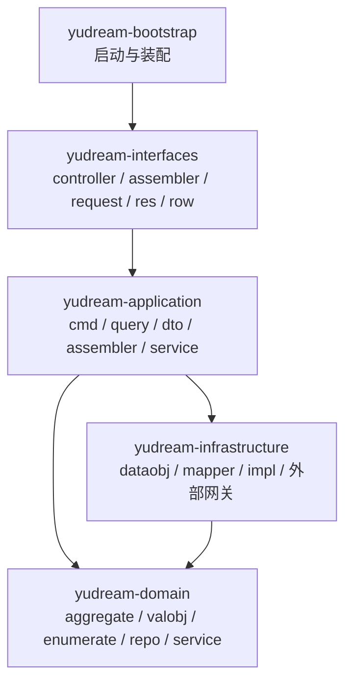

# 二次开发指南

本文面向**二次开发 YuDream Admin 主框架（宿主）**的开发者，涵盖环境准备、构建验证命令、DDD 分层改造实操路径、Controller 硬规则、提交前自查清单与 Git 工作流。插件开发请直接看 [插件开发](/plugin/overview)。

::: warning 动手前必读
修改后端代码前，请先完整阅读仓库内的 `.codex/skills/yudream-ddd-architecture/SKILL.md`，它是本仓分层与架构规则的唯一权威来源；本文是对其中第 2/8/9/11 节的整理与实操化。本文与 skill 冲突时以 skill 为准。
:::

## 环境要求

| 组件 | 版本 | 说明 |
|---|---|---|
| JDK | 21 | Windows 下跑 Maven 必须显式指向 JDK 21（见下节） |
| Maven | 3.9+ | |
| Node.js | 22.22+ / 24.15+ | 以 `yudream-frontend/package.json` 的 `engines` 为准：`^22.22.2 \|\| ^24.15.0 \|\| >=26.0.0` |
| pnpm | 11.9+ | `packageManager` 字段锁定为 `pnpm@11.9.0`；前端**只允许 pnpm**，`preinstall` 钩子会用 `only-allow` 拦截 npm/yarn |
| MongoDB / Redis | — | 本地或远程均可 |

源码参考：`yudream-frontend/package.json`、`yudream-frontend/apps/core-arco-design-vue/package.json`。

## Windows 下 Maven 误用 JDK 17 的坑

Windows 上常同时装有多个 JDK，Maven 默认读取系统 `JAVA_HOME`，很容易命中 JDK 17，编译直接报：

```text
invalid target release: 21
```

**这不是代码问题，是环境问题。** 不要改 `pom.xml` 降级，而是在当前 shell 会话里显式设置 JDK 21 再执行 Maven：

```powershell
$env:JAVA_HOME='C:/path/to/jdk-21'
$env:Path="$env:JAVA_HOME/bin;$env:Path"
mvn -pl yudream-bootstrap -am -DskipTests compile
```

Git Bash 下等价写法：

```bash
export JAVA_HOME='/c/path/to/jdk-21'
export PATH="$JAVA_HOME/bin:$PATH"
```

建议先用 `mvn -v` 确认输出的 `Java version` 是 21 再继续。同理，PowerShell 打印中文乱码只是终端显示问题，**不构成修改源文件的理由**（见下文乱码扫描一节）。

## 后端工程结构（DDD 分层）

宿主后端是五个 Maven 模块，每层只允许放对应职责的代码：



| 模块 | 允许的内容 | 硬性禁止 |
|---|---|---|
| `yudream-domain` | 聚合、值对象、枚举、仓储接口、领域服务 | 任何框架/Web 依赖 |
| `yudream-application` | `cmd`/`query`/`dto`/应用 assembler/应用 service | 接收接口 `request`、返回接口 `res` |
| `yudream-infrastructure` | `dataobj`/`mapper`/仓储实现/外部技术网关 | dataobj 外泄到应用/接口层 |
| `yudream-interfaces` | controller/接口 assembler/request/res/Excel row | 构造 Cmd/Res/ExcelRow、`builder()`、私有转换、业务不变量 |
| `yudream-bootstrap` | 启动与装配 | 业务逻辑 |

转换职责分层归属，各就各位：

| 转换方向 | 归属位置 |
|---|---|
| `request -> cmd`、`DTO -> res`、Excel 行映射 | 接口 assembler |
| `domain -> 应用 DTO` | 应用 assembler |
| `domain <-> dataobj` | infra mapper |

## 分层改造实操路径：以 `system/user` 为基线

新做或改造一个业务模块时，不要凭空设计，先对照 `system/user` 包的既有实现。它是本仓公认的分层基线，覆盖聚合、值对象、仓储、cmd/query/dto/service、controller/assembler 的完整样例。推荐步骤：

1. **读基线**：打开以下四个目录，看清每层各自放了什么：

   - `yudream-domain/src/main/java/online/yudream/base/domain/system/user/`
   - `yudream-application/src/main/java/online/yudream/base/application/system/user/`（`cmd`、`query`、`dto`、`assembler`、`service`）
   - `yudream-infrastructure/src/main/java/online/yudream/base/infra/system/user/`
   - `yudream-interfaces/src/main/java/online/yudream/base/interfaces/system/user/`（`controller`、`assembler`、`request`、`res`、`vo`）

2. **按同一包名结构建自己的模块**：例如做 `system/notice`，就在四个模块里各自建 `system/notice` 包，类名、分层与基线一一对应。

3. **先写领域与应用层，再写接口层**：聚合与不变量放 domain，用例编排放 application service，HTTP 边界最后写 controller。

4. **定向验证**：跑受影响模块的定向测试（命令见下节）。

5. **提交**：只暂存该模块文件，中文提交（见 Git 工作流一节）。

## 构建与验证命令

### 后端定向测试

任何后端改动，至少执行受影响模块的定向测试或编译：

```bash
mvn -pl <模块> -am -Dtest=<定向测试> -Dsurefire.failIfNoSpecifiedTests=false test
```

参数说明：

| 参数 | 作用 |
|---|---|
| `-pl <模块>` | 只构建指定模块，如 `yudream-application`、`yudream-plugins/yudream-sample-plugin` |
| `-am` | 连带构建其依赖的模块 |
| `-Dtest=...` | 只跑匹配的测试类/方法 |
| `-Dsurefire.failIfNoSpecifiedTests=false` | 依赖模块里没有匹配测试时不报错 |

没有对应测试时，至少跑一次编译验证：

```bash
mvn -pl yudream-bootstrap -am -DskipTests compile
```

### 前端类型检查

前端改动执行宿主应用的 typecheck（真实脚本为 `vue-tsc -p tsconfig.test.json --noEmit`）：

```bash
pnpm --dir yudream-frontend --filter @fantastic-admin/core-arco-design-vue run test:typecheck
```

skill 中另有等价的直接调用形式（绕过 engine 校验、关闭 lib 检查）：

```powershell
pnpm --config.engine-strict=false --filter @fantastic-admin/core-arco-design-vue exec vue-tsc --noEmit --pretty false --skipLibCheck --ignoreDeprecations 6.0
```

## Controller 硬规则

Controller 只做 HTTP 边界：路由、鉴权注解、触发校验、调用应用 service、经 assembler 包装返回 `Result`。

**禁止项**（逐条对照检查）：

- `new XxxCmd` / `new XxxRes` / `new XxxExcelRow`，响应用 `.builder()` 构造；
- `private toXxx` / `parseXxx` / `templateXxx` / `rowToXxx` 等私有转换方法；
- 在 controller 里用 stream 把 request 行映射成 command——必须包进 assembler 方法；
- Excel 模板构造、业务不变量——归接口 assembler 和 domain/application。

**允许项**：设置 page/size 上限、调用 auth/session 助手（如 `StpUtil.checkLogin()`）、透传应用 service 返回值、返回 `Result`。

真实示例（节选，注意每个端点的形态：request 经 assembler 转 cmd，service 返回 DTO 经 assembler 转 res）：

```java
// yudream-interfaces/.../system/user/controller/UserManageController.java
@RestController
@RequestMapping("/api/system/users")
@RequiredArgsConstructor
public class UserManageController {

    private final UserManageAppService userManageAppService;

    @GetMapping
    public Result<PageResult<UserManageRes>> page(UserPageQuery query) {
        StpUtil.checkLogin();
        return Result.ok(UserManageWebAssembler.toUserPage(userManageAppService.page(query)));
    }

    @PostMapping
    @PermissionRegister(code = "system:user:create", name = "新增用户", module = "系统管理", desc = "新增后台用户")
    public Result<UserManageRes> create(@Valid @RequestBody UserCreateRequest request) {
        return Result.ok(UserManageWebAssembler.toRes(userManageAppService.create(UserManageWebAssembler.toCmd(request))));
    }

    @PutMapping("/{id}")
    @PermissionRegister(code = "system:user:edit", name = "编辑用户", module = "系统管理", desc = "编辑用户资料")
    public Result<UserManageRes> update(@PathVariable Long id, @Valid @RequestBody UserUpdateRequest request) {
        return Result.ok(UserManageWebAssembler.toRes(userManageAppService.update(UserManageWebAssembler.toCmd(id, request))));
    }
}
```

::: tip Long ID 全程字符串
Java `Long`/Snowflake ID 在 JSON、TS 模型、表单与 URL 参数中一律序列化为 `string`，前端禁止 `Number(id)`——JavaScript 超过 `Number.MAX_SAFE_INTEGER` 会丢精度，回传保存/查询会查错记录。后端内部仍可用 `Long`，只在 API 边界转 `String`。
:::

## 提交前自查：定向扫描 + 清单

完成后端工作前，执行 skill Review Checklist 的两条定向扫描（`rg` 即 ripgrep）：

```bash
# 1. Controller 禁项扫描：私有转换、new Cmd、new ExcelRow、builder()
rg -n "private .*to[A-Z]|new .*Cmd|new .*ExcelRow|\.builder\(\)" yudream-interfaces/src/main/java/online/yudream/base/interfaces -g "*Controller.java"

# 2. 乱码/Unicode 转义扫描：中文文案禁止 \uXXXX 转义与乱码碎片
rg -n "\\u[0-9a-fA-F]{4}|\?\)" yudream-domain/src/main/java yudream-application/src/main/java yudream-infrastructure/src/main/java yudream-interfaces/src/main/java yudream-bootstrap/src/main/java -g "*.java"
```

两条命令都应该**无输出**。注意：只修复源文件中真实存在的乱码；PowerShell 终端打印乱码是显示问题，不要因此改文件。

然后对照 AGENTS.md 第 11 节的完成前自检清单逐项过一遍：

- [ ] 分层归属是否正确？Controller/assembler 是否触碰了禁项？
- [ ] dataobj、Spring Bean、宿主内部类是否泄漏给了插件或接口层？
- [ ] 平台能力是否遵守双闸门（项目闸门 + 应用闸门）与依赖级联？（详见 [平台能力](/guide/platform-capabilities)）
- [ ] 长 ID 是否全程字符串？
- [ ] 是否完成了目标构建/测试与定向扫描，中文文案无乱码？
- [ ] 改动架构规则时，是否在同一提交同步了对应 skill/文档？

## Git 工作流

- **按模块提交**：每个可独立使用的模块完成后，先运行对应验证，**只暂存该模块的文件**，创建提交后再进入下一模块。
- **中文提交信息**：描述完成的模块或修复，例如 `feat: 完成用户管理模块`、`fix: 修复菜单图标显示`。
- **skill 同步**：改动或修正了架构规则时，必须在**同一提交**内同步更新 `.codex/skills/yudream-ddd-architecture`（SKILL.md 或 `references/knowledge.json`），禁止代码与项目规则脱节。
- **不夹带私货**：不纳入 IDE 元数据、临时文件等与任务无关的改动。
- **不做外部动作**：未经明确要求不执行 `push`/`tag` 等操作。
- **受阻要报告**：模块因验证失败或工作区存在冲突的用户改动而无法提交时，先报告阻塞原因再继续。

可复用的知识沉淀：当某类问题被反复纠正、发现可复用工具/组件时，用 skill 自带脚本追加到 `references/knowledge.json`：

```powershell
python .codex/skills/yudream-ddd-architecture/scripts/add_knowledge.py rule controller-no-mapping "Controller must not create Cmd/Res/ExcelRow; put conversions in interface assembler."
```

## 参考源码

- 分层基线：`yudream-domain|yudream-application|yudream-infrastructure|yudream-interfaces/src/main/java/online/yudream/base/**/system/user/`
- Controller 示例：`yudream-interfaces/src/main/java/online/yudream/base/interfaces/system/user/controller/UserManageController.java`
- 架构规则权威来源：`.codex/skills/yudream-ddd-architecture/SKILL.md`、`references/knowledge.json`
- 工程规则索引：仓库根 `AGENTS.md`（第 2/8/9/11 节）、`yudream-frontend/AGENTS.md`
- 前端版本锁定：`yudream-frontend/package.json`、`yudream-frontend/apps/core-arco-design-vue/package.json`
