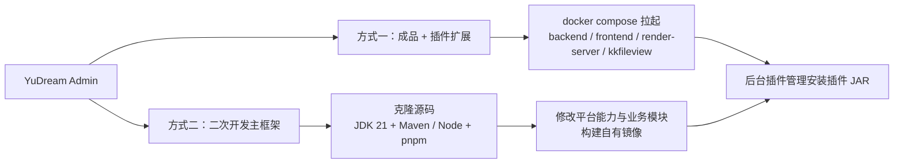

# 框架概览

**YuDream Admin** 是一套企业级管理后台框架：后端为 YuDream 原创实现，采用 DDD 五模块分层（JDK 21 + Spring Boot 3.5）；前端使用 [Fantastic-admin](https://fantastic-admin.hurui.me/) 构建 Vue 3 Monorepo。前端组件中，`Fa*` 为 Fantastic-admin 框架自带组件，只有 `FaResponsiveTable` 是 YuDream 原创例外；`Yd*` 为 YuDream 原创组件与 composable，不按 AI/非 AI 区分。项目同时内置一套完整的**插件体系**与 **17 项可按需加载的平台能力**。它有两种使用方式——作为**成品**直接部署、用插件扩展业务；或作为**主框架**克隆源码二次开发。

## 定位与价值

- **不写代码先能用**：框架自带用户、角色、部门、菜单、权限、文件、日志、监控、设置、仪表盘等完整后台能力，拉起镜像即是一个可投产的管理后台。
- **业务差异插件化**：业务功能通过插件 JAR 扩展，插件仅依赖稳定的 `yudream-plugin-spi` 契约模块，主框架升级不破坏插件。
- **能力按需加载**：SSE、MQ、Neo4j、AI/Agent、CMS 等重能力都是"平台能力"，通过双闸门动态启停，不用的能力不注册端点、不建连接、零运行时开销。
- **边界可长期维护**：DDD 分层硬规则 + Controller/assembler 禁项 + 插件依赖隔离，保证多人协作与持续演进时架构不腐化。

## 特性矩阵

### 平台能力（17 项）

所有平台能力的项目闸门配置形如 `yudream.platform.capabilities.<code>.enabled`，多数同时支持环境变量覆盖：

| 能力 code | 环境变量开关 | 说明 |
|---|---|---|
| `api-docs` | `PLATFORM_API_DOCS_ENABLED` | SpringDoc 接口文档 |
| `sse` | `PLATFORM_SSE_ENABLED` | SSE 服务端推送 |
| `websocket` | `PLATFORM_WEBSOCKET_ENABLED` | WebSocket 实时通信 |
| `rabbitmq` | `PLATFORM_RABBITMQ_ENABLED` | RabbitMQ 消息能力 |
| `neo4j` | `PLATFORM_NEO4J_ENABLED` | 单一部署级图数据库；后台逻辑图表隔离 Wiki 与插件数据 |
| `ai` | `PLATFORM_AI_ENABLED` | 多 provider AI（OpenAI / OpenAI 兼容 / Kimi / DeepSeek），Spring AI 原生工具调用 |
| `agent` | `PLATFORM_AGENT_ENABLED` | Agent 编排 + 执行追踪 |
| `cms` | `PLATFORM_CMS_ENABLED` | GrapesJS 可视化建站 CMS |
| `wiki` | `PLATFORM_WIKI_ENABLED` | Markdown 知识库 + RAG + Neo4j 图谱增强 |
| `form` | `PLATFORM_FORM_ENABLED` | 动态表单 DynamicForm |
| `document-template` | `PLATFORM_DOCUMENT_TEMPLATE_ENABLED` | Word 文档模板生成（POI） |
| `integration` | `PLATFORM_INTEGRATION_ENABLED` | HTTP 集成 |
| `dataviz` | `PLATFORM_DATAVIZ_ENABLED` | 数据可视化 |
| `milky` | `PLATFORM_MILKY_ENABLED` | QQ 消息平台：Milky 与腾讯官方 OpenAPI v2 共用出站端口 |
| `message-render` | `PLATFORM_MESSAGE_RENDER_ENABLED` | 对接 render-server 的 HTML/Markdown → 图片渲染 |
| `file-preview` | `PLATFORM_FILE_PREVIEW_ENABLED` | kkFileView 文件预览（Office / PSD / 压缩包等） |
| `inbound-mail` | `PLATFORM_INBOUND_MAIL_ENABLED` | IMAPS 入站邮箱，管理端查看邮件详情，插件按发件域与验证码核验 |

能力间依赖（如 `wiki` 依赖 `ai` 与 `neo4j`）声明在 `CapabilityDescriptor.dependencies`，禁用一个依赖会级联禁用所有依赖方。机制详解见 [平台能力](/guide/platform-capabilities)。

### 插件体系

- **唯一依赖**：插件编译期只允许依赖 `online.yudream.base:yudream-plugin-spi`（当前契约版本见仓库根 `pom.xml` 的 `yudream.plugin.spi.version`），禁止依赖宿主其他模块。
- **自描述 JAR**：JAR 根含权威 `plugin.yml`（`name` / `main` / `version`，`depend` 硬依赖、`softdepend` 软依赖），前端资源打进 `META-INF/yudream-plugin/frontend/{pluginCode}` 并以 ESM `remoteEntry.js` 动态加载。
- **生命周期完整**：所有注册走 `PluginContext.registerXxx(...)`，保证 disable / unload 可完整回收；硬依赖先于 consumer 加载，软依赖缺失时条件注册、显式降级。
- **端点统一挂载**：插件 HTTP 端点统一在 `/api/plugins/{pluginCode}/**` 之下。

详见 [插件开发](/plugin/overview)。

### 安全体系

属于 `system` 基线能力，始终可用、不走动态开关：

| 能力 | 说明 |
|---|---|
| 双 Token 会话 | Sa-Token 实现 access / refresh 双 token |
| 接口加密 | 请求/响应报文加密 |
| API Key | 第三方系统接入凭证 |
| Passkey | 基于 WebAuthn（Yubico webauthn-server-core 2.9）的无密码登录 |
| OAuth | 第三方账号授权登录 |

### AI / Agent

- **provider-first 配置**：`providers` 数组结构，每个 provider 持有 base URL、API Key、代理、默认模型与模型清单；前端调用传 `providerCode + modelCode`。
- **原生工具调用**：走 Spring AI 原生 tool calling，项目抽象 `AiAgentTool` 由 infra 层适配，不要求模型手工产出自定义 `toolCalls` JSON。
- **真流式 SSE**：端到端传播模型 delta；事件为可扩展信封（含 `event/action/module/traceId/timestamp/payload`），语义化命名 `ai.message` / `ai.tool` / `ai.result` / `ai.error` 等。

### CMS 可视化建站

GrapesJS 拖拽构建 + 完整发布闭环：权限菜单、管理路由、公开路由与渲染、发布/下线、SEO、页面与模板元数据，构建产物兼容存储为 `htmlContent` / `cssContent` / `builderProjectJson`。

## 两种使用方式概览

- **方式一**：不需要改任何源码。官方镜像（backend 必需、frontend 必需、render-server 与 kkfileview 按能力可选）部署后，通过插件商店或自研插件扩展业务。适合"成熟后台 + 若干自定义业务"的团队。
- **方式二**：需要修改主框架本身（新增平台能力、调整系统行为、深度定制 UI）时克隆源码开发，产物仍保留完整插件体系，两种方式可随时组合切换。

镜像与编排细节见 [两种使用方式](/guide/usage-modes) 与 [部署](/guide/deployment)。

## 技术栈

| 层 | 技术与版本（以源码声明为准） |
|---|---|
| 后端 | JDK 21、Spring Boot 3.5.15、Sa-Token 1.45.0、Spring Data MongoDB、Redis（sa-token-redis-jackson）、Spring AI 1.1.8、EasyExcel 4.0.3、POI 5.3.0、Tika 3.2.3、springdoc-openapi 2.8.17、Neo4j Java Driver 5.28.5、AWS SDK S3 2.31.78、Yubico WebAuthn 2.9.0 |
| 前端 | fantastic-admin 6.2.0、Vue 3.5、Vite 8、Arco Design Vue 2.58、Vue Router 5、Pinia 3、TypeScript、UnoCSS、pnpm 11.9 workspace（catalog 锁版本）、Node ^22.22.2 / ^24.15.0 |
| 渲染服务 | Node ≥ 22、Fastify 5、Playwright 1.60（Chromium headless）、markdown-it 14 |
| 中间件 | MongoDB、Redis 必需；RabbitMQ、Neo4j 可选；S3 兼容对象存储 |
| 部署 | Docker Compose + watchtower 镜像自动更新 |

## 模块布局

| 模块 | 包根 | 职责 |
|---|---|---|
| `yudream-domain` | `online.yudream.base.domain` | 领域层：聚合、值对象、枚举、仓储接口、领域服务；禁止框架/Web 依赖 |
| `yudream-application` | `online.yudream.base.application` | 用例编排：cmd / query / dto / assembler / service |
| `yudream-infrastructure` | `online.yudream.base.infra` | 技术适配：dataobj / mapper / 仓储实现 / 外部网关 |
| `yudream-interfaces` | `online.yudream.base.interfaces` | HTTP 边界：controller / assembler / request / res / Excel row |
| `yudream-bootstrap` | `online.yudream.base.bootstrap` | 启动与装配（唯一可执行 JAR，默认端口 8080） |
| `yudream-plugins/yudream-plugin-spi` | `online.yudream.base.plugin.spi` | 第三方插件唯一允许依赖的编译期契约模块 |
| `yudream-frontend` | — | 宿主前端与共享包（pnpm Monorepo） |
| `yudream-render-server` | — | 独立 Node 渲染服务（可选） |

## 注意事项

- **长 ID 一律字符串**：Java `Long` / Snowflake ID 在 JSON、插件 DTO、TS 模型、表单与 URL 参数中一律序列化为 `string`，前端禁止 `Number(id)` 转换，避免精度丢失。
- **官方业务插件不在主仓**：官方业务插件的前后端源码位于独立仓库 `yudream-admin-plugins`，不要回流主仓。
- **二次开发守分层**：改主框架前必读 [开发环境与工程规范](/guide/development)，以 `system/user` 包为分层基线。

## 下一步

- 想直接使用？阅读 [两种使用方式](/guide/usage-modes) 与 [快速启动](/guide/getting-started)。
- 想了解内部设计？阅读 [系统架构](/guide/architecture)。
- 想扩展功能？直接跳转 [插件开发](/plugin/overview)。

---

> 源码引用：`pom.xml`（后端依赖与版本）、`yudream-bootstrap/src/main/resources/application.yml`（17 项平台能力开关）、`docker-compose.yml`（镜像与环境变量）、`yudream-frontend/package.json` / `yudream-frontend/pnpm-workspace.yaml`（前端版本）、`yudream-render-server/package.json`（渲染服务版本）。
