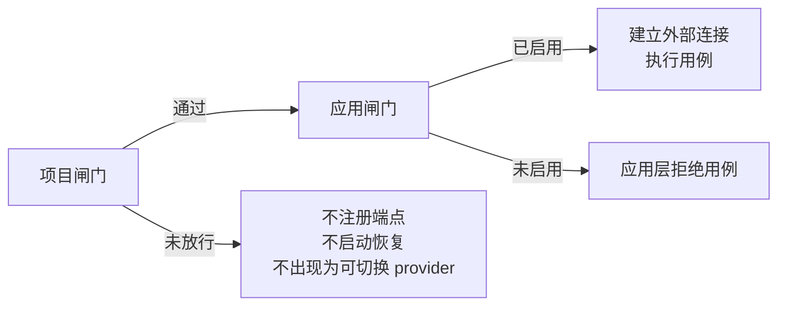

# 平台能力

YuDream 将系统能力分为两类：

- **system 基线能力**：安全与身份相关（接口加密、双 token、API Key、Passkey、OAuth），始终可用，不走动态开关。
- **platform 动态能力**：SSE、WebSocket、MQ、Neo4j、AI/Agent、CMS、文件预览、入站邮箱等，按需动态加载。

## 双闸门机制

平台能力运行必须同时通过两道闸门：



1. **项目闸门**：由配置文件决定本项目是否允许加载该能力的 provider。例如：

   ```yaml
   yudream:
     platform:
       capabilities:
         rabbitmq:
           enabled: true
   ```

   provider 上有对应的 `@ConditionalOnProperty`。未放行的能力不会注册端点、不会注册运行时恢复、也不会出现在能力管理界面中。

2. **应用闸门**：应用服务在每次用例前调用 `ensureEnabled(...)` 检查持久化的启用状态。禁用的能力会拒绝用例，且不会建立外部连接、不声明队列等中间件资源。

### 依赖级联

每个能力在 `CapabilityDescriptor.dependencies` 中声明运行时依赖（如 wiki 声明依赖 `ai` 与 `neo4j`）：

- 依赖不可用/未启用时，拒绝启用该能力；
- 禁用一个依赖时，自动级联禁用所有依赖它的能力，保证 UI 与运行时状态一致。

### Provider 只是工具包装

Infra provider 的构造与 `enable(config)` 只允许保存本地配置或标记状态，**不得建立连接、校验远端连通性、声明队列/topic 或启动常驻资源**。外部连接只在两道闸门都通过、且有真实业务动作需要时才创建；disable 时关闭清理。

## 能力清单

| 能力 code | 配置开关（`yudream.platform.capabilities.<code>.enabled`）* | 说明 |
|---|---|---|
| api-docs | `PLATFORM_API_DOCS_ENABLED` | SpringDoc 接口文档 |
| sse | `PLATFORM_SSE_ENABLED` | SSE 服务端推送 |
| websocket | `PLATFORM_WEBSOCKET_ENABLED` | WebSocket |
| rabbitmq | `PLATFORM_RABBITMQ_ENABLED` | RabbitMQ 消息能力 |
| neo4j | `PLATFORM_NEO4J_ENABLED` | 单一部署连接上的逻辑图表图数据库 |
| ai | `PLATFORM_AI_ENABLED` | 多 provider AI（OpenAI/OpenAI 兼容/Kimi/DeepSeek），Spring AI 原生工具调用 |
| agent | `PLATFORM_AGENT_ENABLED` | Agent 编排 + 执行追踪 |
| cms | `PLATFORM_CMS_ENABLED` | GrapesJS 可视化建站 CMS |
| wiki | `PLATFORM_WIKI_ENABLED` | Markdown 知识库 + RAG + Neo4j 图谱增强 |
| form | `PLATFORM_FORM_ENABLED` | 动态表单 DynamicForm |
| document-template | `PLATFORM_DOCUMENT_TEMPLATE_ENABLED` | Word 文档模板生成（POI） |
| integration | `PLATFORM_INTEGRATION_ENABLED` | HTTP 集成 |
| dataviz | `PLATFORM_DATAVIZ_ENABLED` | 数据可视化 |
| message-render | `PLATFORM_MESSAGE_RENDER_ENABLED` | 对接 render-server 的 HTML/Markdown → 图片渲染 |
| milky | `PLATFORM_MILKY_ENABLED` | QQ 消息平台：Milky 协议（HTTP API + WebSocket `/event`）与腾讯官方 OpenAPI v2（REST + Gateway/Webhook）共用出站端口 |
| file-preview | `PLATFORM_FILE_PREVIEW_ENABLED` | kkFileView 文件预览：浏览器直读优先，Office/PSD/压缩包等走 iframe |
| inbound-mail | `PLATFORM_INBOUND_MAIL_ENABLED` | IMAPS 只读入站邮箱：管理端浏览列表与详情，插件按发件域、验证码与关键词匹配 |

\* 以上均映射到同名环境变量（见 `yudream-bootstrap/src/main/resources/application.yml` 的 `yudream.platform.capabilities.*`），compose 部署时可直接以 `PLATFORM_*_ENABLED=true/false` 控制项目闸门。各能力详解见 [能力框架](/features/capability-framework) 与 features 分册。

Milky 能力（展示名「QQ 消息平台」）的连接凭据经 AES-GCM 加密落库；新写入使用 Base64 解码后恰为 32 字节的统一主密钥 `YUDREAM_CREDENTIAL_KEY` 与连接作用域 AAD。旧 `YUDREAM_MILKY_CREDENTIAL_KEY`（Base64，长度 16/24/32 字节）仅用于解密历史密文。一条连接可选 `protocol=milky` 或 `protocol=official`；协议与连接管理详见 [QQ 协议详解](/protocol/milky)。插件前端选择器走 SDK `sdk.messaging`，不要打管理端 `/api/platform/milky/**`。

## AI 能力要点

- **provider-first 配置**：AI 配置是 `providers` 数组，每个 provider 实例持有 base URL、API key、代理、默认模型与模型清单；前端传 `providerCode + modelCode`。
- **原生工具调用**：集成走 Spring AI 原生 tool calling（`ChatClient.toolCallbacks(...)`、`@Tool`），项目抽象 `AiAgentTool` 在 infra 层适配。
- **真流式 SSE**：端到端流式传播模型 delta；事件使用可扩展信封（含 `event/action/module/traceId/timestamp/payload`），语义化命名如 `ai.message` / `ai.tool` / `ai.result` / `ai.error`，另有 `ai.progress` 里程碑事件。
- 发送结构化 `ai.error` 后正常 complete，不再 `completeWithError`。

## 渲染能力（message-render）

对接独立部署的 render-server（Fastify + Playwright Chromium headless），暴露 `/v1/render/html|markdown|url` 接口，将页面渲染为图片返回。典型场景：

- Milky 机器人富文本消息转图片发送；
- Thymeleaf 模板渲染证书、活动证明等图片/PDF。

安全策略严格：HTML/Markdown 渲染禁脚本与外链、URL 仅允许单次公网跳转、容器只读无特权。

## 文件预览（file-preview）

对接 kkFileView，由平台签发短时效公开地址并给出 `DIRECT` / `KKFILE` / `NONE` 预览决策。浏览器走 frontend nginx 的 `/kkfileview/` 同源反代，kkFileView 再回源签名端点拉文件。插件通过 `context.filePreview()` 消费，不要各自对接 kkFileView。详见 [文件预览](/features/file-preview)。

## 入站邮箱（inbound-mail）

以 IMAPS 只读方式连接收件箱。管理端可浏览邮件列表与详情；插件通过 `framework().inboundMail()` 按发件域、验证码与关键词匹配邮件。插件拿不到邮箱凭据或正文，只拿到核验结果。详见 [入站邮箱](/features/inbound-mail)。
