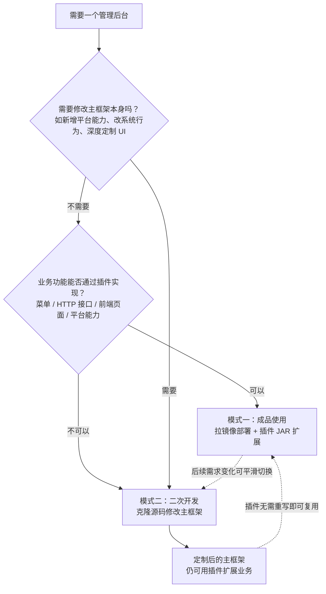

# 两种使用方式

YuDream Admin 有两种使用方式：**模式一（成品使用）**直接拉取官方镜像部署，通过插件 JAR 扩展功能；**模式二（二次开发）**克隆源码，在六模块 Maven reactor 与前端 monorepo 中修改主框架本身。两种模式可以组合：二次开发的产物仍保留完整插件体系。

## 如何选择



两种模式的产物形态对比：

```mermaid
flowchart LR
    subgraph 模式一：成品使用
        A1[官方镜像 backend/frontend/render-server] --> A2[docker compose 起栈]
        A2 --> A3[./plugins 目录放入插件 JAR<br/>或后台插件管理上传]
    end
    subgraph 模式二：二次开发
        B1[克隆源码] --> B2[六模块 Maven reactor<br/>+ 前端 monorepo]
        B2 --> B3[本地开发调试]
        B3 --> B4[CI_REGISTRY_IMAGE 指向自有 registry<br/>构建发布私有镜像]
        B4 --> A3
    end
```

## 模式一：成品使用（Docker Compose）

框架自带用户、角色、部门、菜单、权限、文件、日志、监控、设置、仪表盘等完整后台能力。仓库根目录的 `docker-compose.yml`（不含中间件，MongoDB/Redis 等需自备）使用三个官方镜像：

| 镜像 | 角色 | 是否必需 |
|---|---|---|
| `registry.yudream.online/yudream/yudreamadmin/backend:latest` | Spring Boot 后端，容器内端口 8080（宿主默认映射 `${BACKEND_PORT:-8080}`） | 必需 |
| `registry.yudream.online/yudream/yudreamadmin/frontend:latest` | 前端静态站点，nginx 托管 `core-arco-design-vue` 构建产物并支持 history 路由，容器内端口 80（宿主默认映射 `${FRONTEND_PORT:-80}`） | 必需 |
| `registry.yudream.online/yudream/yudreamadmin/render-server:latest` | 渲染服务（HTML/Markdown/模板 → 图片/PDF），容器内端口 3000，默认映射 `${RENDER_PORT:-3000}` | 可选，对应平台能力"消息渲染"（`PLATFORM_MESSAGE_RENDER_ENABLED`），用于消息卡片、机器人富文本降级、文档证明等场景 |

镜像 tag 由环境变量控制：`CI_REGISTRY_IMAGE`（默认 `registry.yudream.online/yudream/yudreamadmin`）与 `TAG`（默认 `latest`）。

### 快速起栈

```bash
# 仓库根目录
docker compose pull
docker compose up -d
```

关键配置项（均可用环境变量覆盖）：

- backend 依赖外部 MongoDB（`MONGO_URI`）与 Redis（`REDIS_HOST`/`REDIS_PORT`/`REDIS_PASSWORD`），compose 文件中的值为示例，需按需修改。
- 各平台能力的项目闸门开关：`PLATFORM_CMS_ENABLED`、`PLATFORM_AI_ENABLED`、`PLATFORM_SSE_ENABLED`、`PLATFORM_MESSAGE_RENDER_ENABLED` 等，见 `docker-compose.yml` 中 `PLATFORM_*` 系列变量。
- render-server 联动：backend 侧 `MESSAGE_RENDER_BASE_URL=http://render-server:3000`、`MESSAGE_RENDER_TOKEN`；render-server 侧对应 `RENDER_TOKEN`、`RENDER_CONCURRENCY`（默认 2）、`RENDER_TIMEOUT_MS`（默认 30000）。render-server 容器以 `read_only` + `cap_drop: ALL` 等加固配置运行。
- compose 内置 watchtower 服务，每 300 秒轮询镜像更新并自动重启带 `com.centurylinklabs.watchtower.enable=true` 标签的容器（backend、frontend）。

### 用插件 JAR 扩展功能

当成品使用时**无需改动任何源码**。backend 镜像内置插件扫描目录 `/app/plugins`（`Dockerfile.backend` 中 `ENV YUDREAM_PLATFORM_PLUGIN_DIRECTORIES=/app/plugins`），compose 将宿主机 `./plugins` 挂载到该路径：

```yaml
volumes:
  - ./plugins:/app/plugins
```

把插件 JAR 放进 `./plugins` 后重启 backend 即可加载，也可以在后台"插件管理"页面上传安装。插件可以扩展：

- 权限与菜单（随插件启停注册/回收）
- HTTP 接口，统一挂载 `/api/plugins/{pluginCode}/**`
- 前端页面：JAR 内 ESM `remoteEntry.js` 由宿主注入 SDK 动态加载进后台布局
- 首页卡片、平台能力、对框架能力的调用（仅限 SPI 端口）

插件可从插件商店安装，也可自行开发，参见 [插件开发](/plugin/overview)。

::: tip 适用场景
需求是"一个成熟后台 + 若干自定义业务"，希望主框架持续升级、自己只维护插件。插件与主框架通过稳定 SPI 契约解耦，主框架升级不破坏既有插件；升级前核对插件商店索引中的 host/spi 兼容矩阵即可（见 [部署与发布](/guide/deployment)）。
:::

## 模式二：二次开发主框架

当需要修改主框架本身（新增平台能力、调整系统行为、深度定制 UI）时，克隆源码开发。

### 后端：六模块 Maven reactor

根 `pom.xml` 聚合六个模块，按 DDD 分层组织：

| 模块 | 职责 | 关键约束 |
|---|---|---|
| `yudream-plugins/yudream-plugin-spi` | 第三方插件唯一允许依赖的编译期契约模块 | 插件代码禁止依赖其余五个模块 |
| `yudream-domain` | 聚合、值对象、枚举、仓储接口、领域服务 | 禁止框架/Web 依赖 |
| `yudream-application` | cmd/query/dto、应用 assembler、应用 service | 编排仓储、领域服务、事务、校验 |
| `yudream-infrastructure` | dataobj、mapper、仓储实现、外部技术网关 | dataobj 不外泄到应用/接口层 |
| `yudream-interfaces` | controller、request/res、接口 assembler、Excel row | Controller 只做边界校验与调用应用 service |
| `yudream-bootstrap` | 启动与装配，主类 `online.yudream.base.bootstrap.YuDreamApplication` | 打包为可执行 fat jar（后端镜像的 `app.jar`） |

环境与构建：JDK 21 + Maven 3.9+（Windows 下需显式设置 JDK 21 环境，否则误用 JDK 17 报 `invalid target release: 21`）。定向验证命令：

```bash
mvn -pl <模块> -am -Dtest=<定向测试> -Dsurefire.failIfNoSpecifiedTests=false test
```

### 前端：pnpm monorepo

`yudream-frontend` 为 pnpm monorepo，Node.js 22.22+/24.15+ + pnpm 11.9+：

- `apps/core-arco-design-vue`：宿主应用（`@fantastic-admin/core-arco-design-vue`），即 frontend 镜像的构建来源。
- `apps/component-showcase`：组件演示应用。
- `packages/`：`plugin-sdk`、`components`、`composables`、`types`、`themes`、`settings`、`dataviz`、`iconify-tools`、`copyright` 等共享包；插件前端通过宿主注入的 plugin-sdk 加载。

类型检查：

```bash
pnpm --dir yudream-frontend --filter @fantastic-admin/core-arco-design-vue run test:typecheck
```

### 渲染服务：独立 Node 服务

`yudream-render-server` 独立开发与部署，可单独迭代而不影响主框架。开发：`pnpm dev`（tsx watch，默认端口 3000）；生产：`pnpm build && pnpm start`。

### 产出私有镜像

二次开发完成后可复用官方 Dockerfile 构建私有镜像：`Dockerfile.backend`（基于 `eclipse-temurin:21-jre-jammy`，复制 `yudream-bootstrap` fat jar）、`Dockerfile.frontend`（基于 `nginx:alpine3.22-slim`，复制 `apps/core-arco-design-vue/dist` 与 `docker/nginx.conf`）。将 `CI_REGISTRY_IMAGE` 指向自有 registry 即可发布，部署方式回到模式一。

::: warning 注意
- 二次开发必须遵守 DDD 分层规范，详见 [开发环境与工程规范](/guide/development)。
- 官方业务插件的前后端源码一律在独立仓 `yudream-admin-plugins`，不要回流主仓。
- 自定义业务优先评估能否做成插件；能插件化的需求不要改主框架，避免后续升级冲突。
:::

::: tip 适用场景
需要给框架新增平台能力（如新的中间件集成、新的 AI 能力）、修改系统级行为（安全、双 token、菜单种子同步等），或定制主框架 UI 组件体系。
:::

## 升级路径与模式切换

- **模式一升级**：watchtower 自动拉取新镜像重启；手动则 `docker compose pull && docker compose up -d`。插件不受影响，但升级前应核对插件商店索引（`plugin-store-releases/index.json`）中的 host/spi 兼容矩阵。
- **模式二升级**：作为主仓的下游 fork 维护，拉取上游变更后按分层规范合并冲突；业务功能若已插件化则完全不受主仓升级影响。
- **模式一 → 模式二**：直接克隆源码改造即可，已有插件 JAR 原样可用，无需重写。
- **模式二 → 模式一**：用自有镜像替换官方镜像（改 `CI_REGISTRY_IMAGE`），插件体系与部署方式不变。

## 注意事项

- render-server 虽标为可选，但启用"消息渲染"平台能力（`PLATFORM_MESSAGE_RENDER_ENABLED=true`，compose 默认值）时 backend 会调用 `MESSAGE_RENDER_BASE_URL`，请确保 render-server 已部署或显式关闭该能力。
- 插件 JAR 根必须含权威 `plugin.yml`（`name`/`main`/`version`），否则无法加载；详见 [插件规范](/plugin/specification)。
- 插件与前端交互中，Java `Long`/Snowflake ID 在 JSON、URL、表单里一律序列化为 **string**，禁止 `Number(id)` 强转造成精度丢失。
- 中间件（MongoDB、Redis 为必需；RabbitMQ、Neo4j 为可选）不在主 `docker-compose.yml` 内，需自备或使用 `docker-compose.platform.yml`。

---

参考源码：`docker-compose.yml`、`Dockerfile.backend`、`Dockerfile.frontend`、`docker/nginx.conf`、根 `pom.xml`、`yudream-frontend/apps`、`yudream-frontend/packages`
