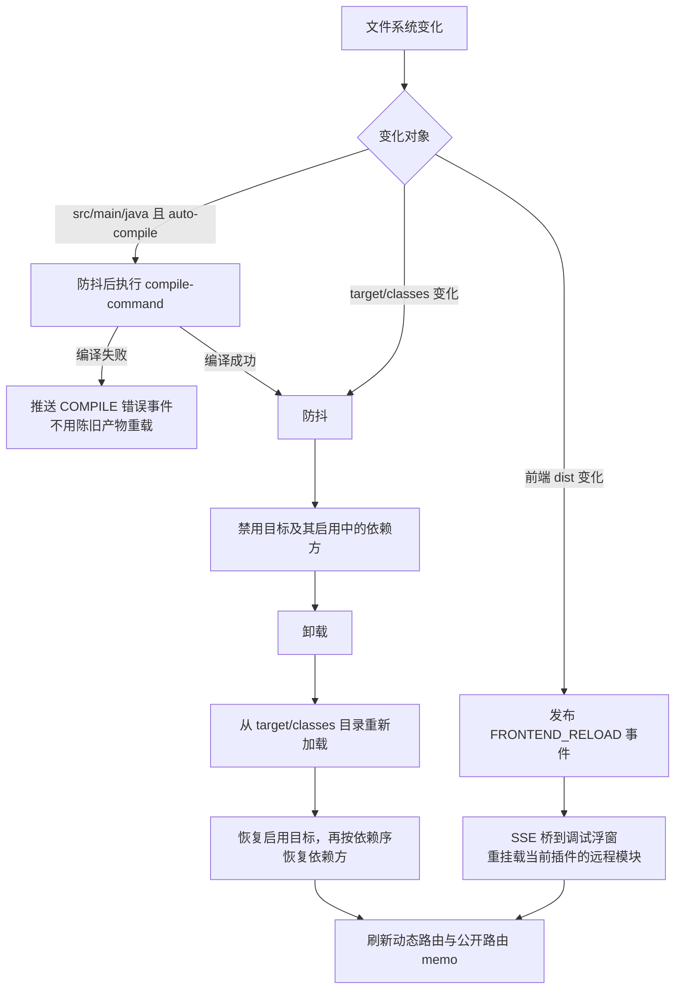

# 插件开发工具链与本地调试模式

本文介绍宿主内置的插件开发者工具套件：**插件开发模式（源码目录加载与热重载）**、**开发者调试浮窗** 与 **前端审查工具**。全部能力由宿主侧实现，插件本身无需任何适配代码。

> 本文聚焦开发期的本地调试工作流；插件结构与运行时规范见 [plugin/specification.md](./specification.md)，市场发布流程见 [plugin/marketplace.md](./marketplace.md)。
>
> 主要依据源码：`docs/plugin-system/dev-mode.md`、`templates/plugin-repo/`（含 `docs/plugin-release.md`）、`ci/verify-plugin-repo-template.sh`。

## 1. 能力总览

| 能力 | 入口 | 开关门 |
| --- | --- | --- |
| 开发模式（目录加载 + 监听热重载） | yml 配置或浮窗面板登记 | `yudream.platform.plugin.dev-mode.enabled`，缺省时自动检测 |
| 开发者工具 REST/SSE API | `/api/platform/plugin-devtools/**` | 权限码 `platform:plugin-devtools:view` / `manage` |
| 前端悬浮调试浮窗 | 管理后台常驻悬浮按钮 | 后端 status 可用 + 权限，或前端 DEV 模式降级可见 |
| Agent 执行链路追踪 | 调试浮窗「追踪」页 | `yudream.platform.agent.trace.enabled`（默认 `true`） |
| 前端审查（Fa 组件优先/品牌色令牌） | `pnpm audit:ui` + eslint 规则 | warn 级，不阻断构建 |

## 2. 插件开发模式

开发模式开启时，宿主不打包 JAR，直接从插件模块的 `target/classes/` 目录加载插件，并监听源码、编译产物与前端 dist 的变化自动热重载。**仅限本地开发，生产环境禁止开启**；开启时启动日志会输出显著警告。

### 2.1 开关：自动检测优先，配置兜底

`enabled` 为三态：

- **缺省（不配置）**：按宿主运行方式自动检测——类来自目录（IDE / `spring-boot:run`，即源码运行）则开启，来自 JAR 则关闭；
- 显式配置 `true` / `false` 时以配置为准。

状态端点返回 `hostRunMode`（SOURCE/JAR）与 `devModeAuto`（是否自动检测生效），浮窗「概览」页会标注「已启用（自动检测）」或「已启用（配置开启）」。

### 2.2 开发项目的两个来源

开发项目有两个来源，合并后统一参与目录加载与热重载：

- **CONFIG 源**：yml 的 `dev-mode.projects` 列表，面板只读；
- **FILE 源**：调试浮窗「设置」页登记的目录，持久化在本地清单文件（默认 `plugins/dev-projects.json`，相对 `user.dir`，可用 `dev-mode.store-file` 覆盖路径）。这是有意选择的非数据库存储——开发者与 coding agent 都能直接读取它来定位插件源码目录。

合并规则：同 code 时 CONFIG 优先并输出告警；面板只能增删 FILE 源项目。设置页「批量登记」可选择插件仓根目录，宿主有界扫描（深度 ≤ 3）其中的插件模块并去重写入清单，新条目默认 `compile-command: mvn -q compile -DskipTests -P dev-export`。登记时宿主依次读取 `<path>/target/classes/plugin.yml`、`<path>/src/main/resources/plugin.yml` 自动推断插件 code；都读不到会报错提示先执行一次 `mvn compile`。

### 2.3 配置示例

```yaml
yudream:
  platform:
    plugin:
      dev-mode:
        # enabled: true        # 可选；不配置时按源码/JAR 运行自动检测
        # store-file: ...      # 可选，面板登记清单路径，默认 plugins/dev-projects.json
        poll-interval-ms: 1000  # 文件轮询间隔
        debounce-ms: 800        # 变化防抖窗口
        projects:               # CONFIG 源，面板只读
          - code: demo          # 必须与 plugin.yml 的 name 一致
            path: /path/to/yudream-admin-plugins/yudream-plugins/yudream-plugin-demo
            auto-compile: true  # 监听到 .java 变化自动执行 compile-command
            compile-command: mvn -q compile -DskipTests -P dev-export
            # frontend-dist: ... # 可选，默认推导 {path}/../../yudream-frontend/packages/plugin-{code}/dist
```

### 2.4 工作原理

- **目录加载**：描述符读自 `target/classes/plugin.yml`；ClassLoader 由 `target/classes/` 与 `target/plugin-dev/lib/*.jar`（runtime 依赖，经 `dev-export` profile 导出）组成。同 code 的开发模式项目优先于 `plugins/` 目录中的 JAR，插件列表/详情带 `devMode` 标记。
- **前端资源**：开发模式插件的前端资产直接从 `frontend-dist` 目录取文件并做内容协商，不再走 JAR 内 classpath。
- **路由/菜单自动重建**：收到重载成功事件后，除重挂载当前插件页面外，还会防抖调用 `refreshDynamicRoutes` 重新拉取菜单与前端 manifest 重建动态路由，新增菜单无需手动刷新页面。

热重载监听管线如下：



注意：前端重挂载会重置页面状态，不是状态保持的 HMR。

### 2.5 一键生成插件骨架

浮窗「设置」页的「新建插件」可免去手工搭骨架：填父目录与 kebab-case 编码（可选显示名、版本、描述、depend/softdepend），宿主在 `{父目录}/yudream-plugin-{code}` 生成：

- 独立 pom（无 parent，SPI 依赖经本机 `~/.m2` 解析，默认版本跟随宿主根 pom 的 `yudream.plugin.spi.version`，可用 `spiVersion` 覆盖）；
- `plugin.yml`；
- 含 ping 自检指令的入口类（包名 `online.yudream.base.plugin.{code去连字符}`）；
- domain/application/infrastructure/interfaces 四个空分包。

生成即登记为开发模式项目；执行一次 `mvn compile` 后开发模式自动加载。目标目录已存在且非空时拒绝生成。

也可以完全离线手工搭建：复制仓库根的 `templates/plugin-repo/` 模板（`plugin.yml.example`、独立 CI 脚本、`release/plugins.txt` 等）初始化独立插件仓。

### 2.6 限制

- 热重载只重建本插件 ClassLoader；硬/软依赖提供者必须已启用，依赖方遇到 ABI 变化需手动重载。
- 开发模式插件不要走市场安装/更新/回滚流程；删除插件记录不会删除源码目录。
- Windows 下 `compile-command` 需要 `mvn` 在 PATH 中，否则填绝对路径。

## 3. 开发者调试浮窗

悬浮按钮常驻管理后台布局层（与路由无关），可拖拽换位、吸附屏幕边缘、收成半隐边缘条；全局快捷键 `Ctrl/Cmd+Shift+D` 开关浮窗。浮窗本体是非模态置顶浮窗（对齐 Vue DevTools 心智）：无遮罩、不锁页面滚动，打开时系统照常可用。

左侧图标导航按开发动线分页，常用页面如下：

- **概览**：开发模式状态（含自动检测标记与宿主运行方式）、Agent 追踪开关、插件计数、开发项目清单文件路径，以及插件生命周期事件流（LOAD/ENABLE/DISABLE/UNLOAD/RELOAD/COMPILE/FRONTEND_RELOAD，取最新 20 条）。
- **插件**：主从结构——先列插件清单（名称、状态、开发模式徽标与来源），点入某插件后分组展示其运行时贡献：HTTP 端点、QQ 指令、前端模块与路由、权限菜单、AI 工具、平台能力等。端点测试器与指令模拟器在详情内；开发模式插件可一键「重载」。清单工具栏可切换「依赖图」视图（depend/softdepend/被依赖四向关系），每张卡片提供「禁用预览」——列出禁用该插件的级联影响。
- **追踪**：Agent 执行链路实时执行区（SSE 增量累积）+ 分页历史记录；详情逐步展示输入摘要、思考过程、工具调用入出参、输出与耗时，可导出 JSON 用于缺陷上报。
- **日志**：按插件过滤的运行日志流——REST 拉取最近清单（默认 100、上限 500 条）+ SSE 实时追加，支持暂停、清空与展开异常堆栈。
- **设置**：开发项目管理（登记/批量登记子目录/移除/立即重载）、新建插件骨架、面板偏好重置。

可见性规则：拥有 `platform:plugin-devtools:view` 权限且后端 status 端点可用时显示；纯前端 DEV 模式（`import.meta.env.DEV`）下按钮始终可见，后端不可用时浮窗内降级提示。

> SSE 鉴权提示：宿主 sa-token 只从请求头读 token，SSE 不能用原生 `EventSource`（无法携带 `Authorization`），前端通过 fetch + ReadableStream 手工解析事件流。

## 4. 开发者工具 API（节选）

统一挂载 `/api/platform/plugin-devtools/**`：

| 方法与路径 | 说明 |
| --- | --- |
| `GET /status` | 开发模式与追踪开关状态（含 `hostRunMode`、`devModeAuto`、`devProjectStoreFile`） |
| `GET /plugins` | 插件清单（含 devMode 标记与 depend/softdepend 依赖列表） |
| `GET /plugins/{code}/assets` | 单插件运行时资产快照 |
| `POST /plugins/{code}/reload` | 手动重载（开发模式插件） |
| `GET /dev-projects` | 开发项目合并清单（CONFIG+FILE，含来源标记） |
| `POST /dev-projects` | 登记开发目录（code 可留空自动推断；已启用插件立即热切） |
| `POST /dev-projects/batch` | 扫描父目录下的插件模块并去重登记，返回 registered 与 skipped |
| `DELETE /dev-projects/{code}` | 移除 FILE 源项目（CONFIG 源需在 yml 中移除） |
| `POST /scaffold` | 新建插件骨架 Maven 模块并默认登记为开发模式项目 |
| `POST /plugins/{code}/command-test` | QQ 指令模拟触发，返回匹配指令、handler 输出/异常与耗时 |
| `GET /events/stream` | SSE：生命周期/编译/前端重载事件 |
| `GET /plugins/{code}/logs/stream` | SSE：按插件 logger 前缀过滤的实时日志 |

其中 QQ 沙盒相关接口注入合成消息时，发送人、群、用户、机器人等 ID 字段一律使用 **string** 类型传递（与全平台 Java Long/Snowflake ID 在 JSON/TS/URL 中必须为 string 的约定一致，禁止 `Number(id)`）。

## 5. 前端审查工具

宿主前端内置两条本地 eslint 规则（`yudream-frontend/eslint-rules/`，apps/** 启用 warn 级，不阻断构建）：

- `yudream/prefer-fa-component`：模板 `<a-*>` 标签与 Arco import 双检测，命中 Arco→Fa 映射表时告警并给出替代组件；确需 Arco 时 `eslint-disable` 本行并注明原因。
- `yudream/no-brand-color-token`：业务样式出现 Arco 品牌色阶梯令牌 `--primary-N` 时告警，引导改用 `--color-bg-*` / `--color-text-*` 等中性语义变量。

配套命令（`yudream-frontend` 根目录）：

```bash
pnpm audit:ui           # 全仓扫描 apps/*/src，生成 audit-report.json
pnpm test:eslint-rules  # 规则用例测试
```

vite dev 中间件把报告暴露在 `/__yudream-devtools/audit.json`（每次请求实时读文件），调试浮窗「审查」页直接展示；报告不存在时返回 404 与引导文案。

## 6. 故障排查

- **悬浮按钮不出现**：确认账号有 `platform:plugin-devtools:view` 权限；按钮可能被拖到屏幕边缘收成半隐边缘条——沿左右边缘找一下，或删除 localStorage 的 `pluginDevtoolsFab` 重置位置。
- **开发模式未按预期开启/关闭**：看「概览」页的「自动检测/配置开启」标记——未显式配置 `enabled` 时按源码/JAR 运行自动判定。
- **面板登记的目录不生效**：看「设置」页项目行的三个状态点（源码目录存在/类产物已编译/plugin.yml 可读）；登记清单在 `devProjectStoreFile` 指向的 JSON 文件，可直接检查内容。
- **改代码不重载**：看「概览」页最近动态的 COMPILE 事件——编译失败会推送错误且不重载；确认 `compile-command` 在宿主进程环境可执行（Windows 注意 PATH）。面板登记留空与批量登记默认 `mvn -q compile -DskipTests -P dev-export`，热编译会刷新 `target/plugin-dev/lib`。
- **前端改动不生效**：确认插件前端在 `vite build --watch`，且最近动态出现 FRONTEND_RELOAD。
