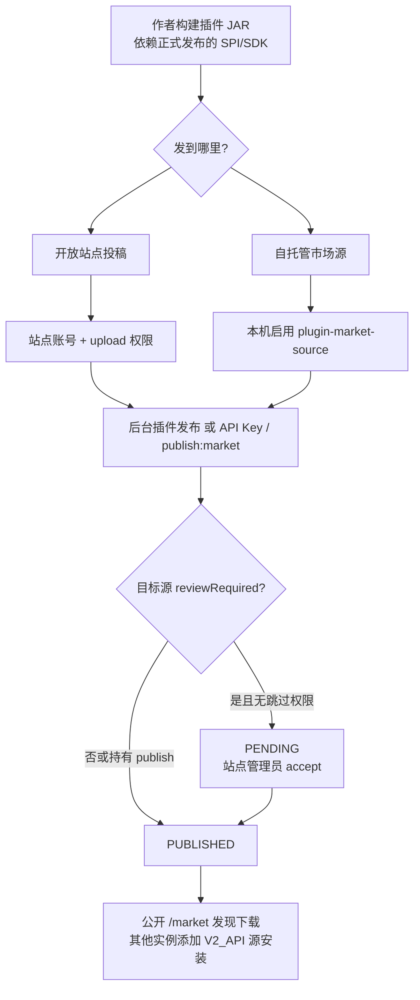

# 插件市场与第三方上架

插件市场把可安装的插件当作**不可变发布物**：已发布的 `{code}@{pluginVersion}` 不可覆盖，修复必须发新版本。第三方作者把 JAR 发到某套 YuDream 实例的**本机市场源**（开放站点或自托管），订阅方添加该实例的 v2 源后即可发现安装。官方仓的 Nexus catalog 只服务官方插件，不是第三方投稿通道。

供给端操作（分类、审核开关、v2 协议）见[自托管市场源](./market-source)。主仓作者对照清单见 `docs/third-party-plugin-submission.md`。

## 1. 两条投稿路径

| 路径 | 适合谁 | 发到哪里 | 审核 |
| --- | --- | --- | --- |
| **开放站点投稿** | 把插件交给已开放公开市场的站点 | 该站点 LOCAL 源，公开 `/market` 可发现 | 该站点 `reviewRequired`；持有 `publish` 可跳过 |
| **自托管市场源** | 自己跑 YuDream 当供给方 | 本机 LOCAL，对外 v2 | 本机开关，可关审核或自批 |

公开 `/market` **只发现与下载，不上传**。作者发布一律走后台「平台 → 插件中心 → 插件发布」，或同一端点的 API Key / 流水线。

## 2. 发之前的 JAR 约束

- 根目录权威 `plugin.yml`（`name` / `main` / `version`）；`depend` 硬依赖、`softdepend` 软依赖。
- 只依赖正式发布的 `yudream-plugin-spi`、`@yudream/plugin-sdk`、`@yudream/components`；JAR 不得内嵌 `online/yudream/base/plugin/spi/**`。
- 前端产物含 `META-INF/yudream-plugin/frontend/{pluginCode}/remoteEntry.js`。
- 目标源上 `{code}@{pluginVersion}` 尚未占用。
- Java `Long` / Snowflake ID 在 JSON 与前端一律 `string`。

分类、标签、许可证、兼容区间是社区元数据，界面字段或 `store.json` 提交；`plugin.yml` 不携带。规范见 [插件规范](./specification.md)。

## 3. 路径一：开放站点投稿

目标站点须启用 `plugin-market-source`，且 `publicEnabled` 未关。

1. 向站点管理员申请账号和 `platform:plugin-market-source:upload`。
2. 登录后台 → **平台 → 插件中心 → 插件发布**，上传 JAR。元数据从 JAR 内 `plugin.yml` 解析。
3. 默认需审核时进入 `PENDING`，由持有 `accept` 的人通过/拒绝。站点关闭审核，或作者另有 `platform:plugin-market-source:publish`，则直接 `PUBLISHED`。
4. 上架后出现在该站 `/market` 与 v2 目录。作者只能改自己的发布物，编辑不重审。

CI 投开放站点：插件仓配置受保护 `YUDREAM_MARKET_URL`（站点 origin）和 `YUDREAM_MARKET_API_KEY`（勾选 `upload`）。模板 `publish:market` 只在受保护 `v*` tag 调度。后台「查看 CI 模板」可复制完整片段。

其他实例要安装该插件时，把 `{origin}/api/public/plugin-market` 加为 `V2_API` 源（不要带 `/api/v2`）。

## 4. 路径二：自托管市场源

自己部署后打开项目闸门 `PLATFORM_PLUGIN_MARKET_SOURCE_ENABLED` 和应用闸门，即得到内置 LOCAL 源 `default`，对外基址 `{origin}/api/public/plugin-market`。

1. 给发布账号 `upload`（按需再给 `accept` / `publish`）。
2. 界面或 API Key 发到本机 LOCAL，流程与路径一相同。
3. 对外发现则打开 `publicEnabled`；只给受控实例用则关掉公开 `/market`，私下分发 v2 基址，源上可配 Bearer token。
4. 订阅方用「添加市场源」选 `V2_API`。远程订阅不依赖对方是否开启本能力，也不回落 Nexus。

闸门、菜单、状态机与协议见 [自托管市场源](./market-source)。

## 5. 官方插件发布（不是第三方通道）

官方业务插件在独立仓经受保护 `v*` 发布。Nexus Maven catalog（`publish-plugin` / `verify-publish`）仍是官方内部契约；`publish:market` 把同一份 `release/plugins.txt` 选择结果传到自托管市场源。第三方不要配置 `NEXUS_USERNAME` / `NEXUS_PASSWORD`，也不要组主仓 `submission/` MR。

选择机制要点（官方仓）：

- `PLUGIN_RELEASE_ONLY=1` 启用清单；`PLUGIN_RELEASE_MODULES` 可临时覆盖。
- 不使用 changed-plugin detection。
- 每个模块只选一个最终包（优先 `*-shaded.jar`），校验含 `remoteEntry.js` 且不含 SPI 类。

## 6. 多源订阅与安装

「插件市场源」能力**只提供本机源**。远程 `V2_API` / `STATIC_INDEX` 订阅始终可用：后台「插件市场」点「添加市场源」进入 `/platform/plugin-marketplace/add-source`。

- 市场列表合并各启用源：同 `code` 取最高 SemVer；安装记录 `marketSourceCode`，后续更新默认跟随来源并可跨源升级。
- 正式协议是 Market Source Protocol v2；静态 `schemaVersion=1` `index.json` 仅 legacy。

## 7. 相关文档

- [自托管市场源](./market-source)：供给端、审核、v2 端点
- [plugin/specification.md](./specification.md)：插件结构与运行时规范
- [plugin/repository.md](./repository.md)：插件仓布局与官方发布模板
- [plugin/dev-tools.md](./dev-tools.md)：开发模式与调试浮窗
