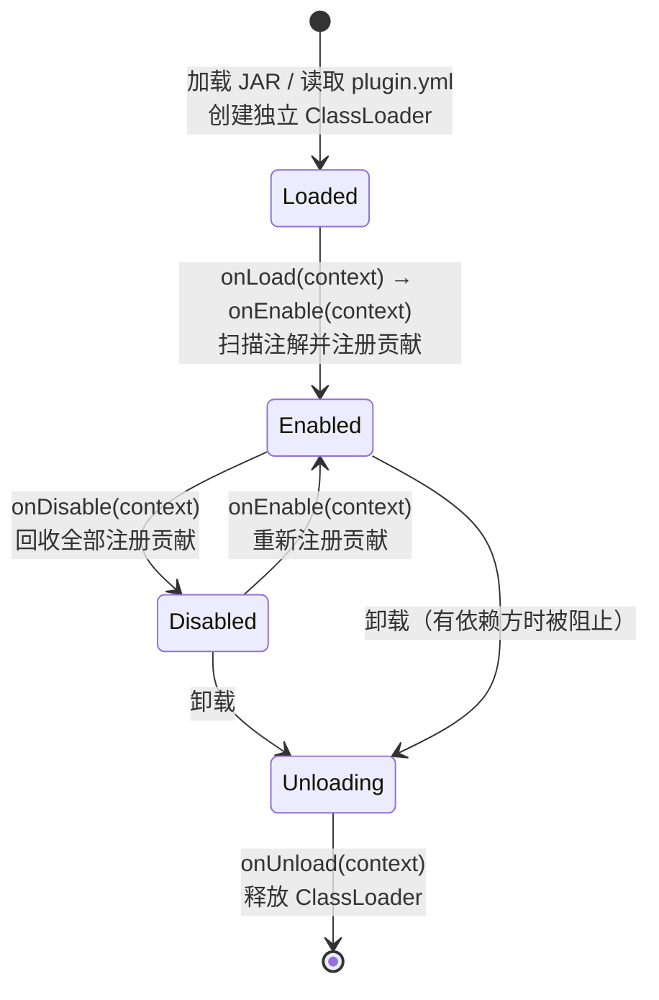
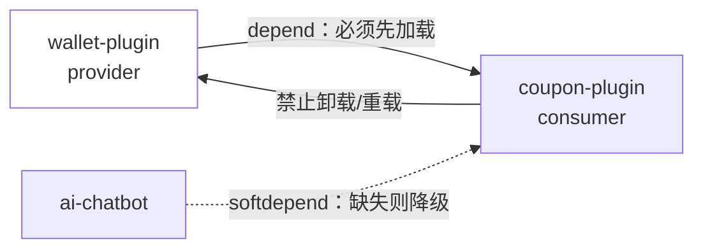

# 插件体系全景

插件是 YuDream Admin 的核心扩展机制：宿主框架保持稳定，所有业务扩展以独立 JAR 形式在运行时动态加载、启用、禁用与卸载。本文给出插件能力边界、生命周期、依赖规则与官方业务插件清单；动手开发请直接阅读 [创建你的第一个插件](/plugin/getting-started)。

## 插件能做什么

插件通过 SPI 注解与 `PluginContext.registerXxx(...)` 两类方式向宿主注册贡献。所有可用扩展点：

| 扩展点 | 注册方式 | 说明 |
|---|---|---|
| 插件元信息 | JAR 根 `plugin.yml` + `@PluginSpec` | code、名称、版本、描述、依赖；`plugin.yml` 是唯一权威来源 |
| 权限 | `@PluginPermission`（可重复）或 `context.registerPermission(PluginPermissionItem)` | 用于 HTTP 端点、前端按钮与菜单的访问控制，注册进系统权限管理 |
| HTTP 接口 | 方法注解 `@PluginHttpEndpoint` 或 `context.registerHttpController(...)` / `registerHttpHandler(...)` | 统一挂载 `/api/plugins/{pluginCode}/**`，自动接入登录态、权限校验与统一响应包装 |
| 后台菜单 / 前端页面 | `@PluginFrontend` + `@PluginRoute` 或 `context.registerFrontend(PluginFrontendModule)` | 生产环境经 JAR 内 ESM `remoteEntry.js` 动态加载，宿主注入 SDK 与路由上下文 |
| 首页仪表盘卡片 | `@PluginDashboardCard` 或 `context.registerDashboardCard(...)` | 参与首页 DIY 卡片 |
| 平台能力 | `@PluginCapability` / `context.registerCapability(PluginCapabilityItem)` | 声明式能力注册，受宿主双闸门（项目闸门 + 应用闸门）管控 |
| 消息指令 / 消息交互 | `@PluginCommand` / `@PluginCommands`、`context.commands()`、`context.interactions()` | QQ 机器人等消息渠道的指令与交互处理 |
| AI Agent 工具 | `context.registerAiTool(PluginAiTool)` | 向宿主 Agent 运行时注册可被模型调用的工具 |
| 框架能力调用 | `context.framework()` 稳定端口 | 用户、安全、邮件、渲染、AI、消息、语义记忆、私密存储等宿主能力（见下表） |
| 插件私有存储 | `context.files()` / `context.documents()` / `context.secrets()` | 按插件隔离的文件、文档（Mongo 集合）与密钥存储 |
| 插件模板渲染 | `context.templateRenderer()` | 渲染插件 JAR 内 `templates/` 的 Thymeleaf 模板并出图 |
| 插件间服务 | `context.exposeService(Api.class, impl)` / `context.service(code, Api.class)` | 进程内直调，不走 HTTP；消费者以 Maven `provided` 编译 provider 的 `*.api` 包 |
| 资源回收 | `context.onDispose(AutoCloseable)` | 注册随禁用/卸载自动关闭的资源 |

`context.framework()` 返回的 `FrameworkServices` 端口一览：

| 端口 | 类型 | 用途 |
|---|---|---|
| `users()` | `PluginUserService` | 用户认证、查询、创建、资料更新、角色/部门、QQ 绑定 |
| `qqBindings()` | `PluginQqBindingService` | QQ 绑定验证码 |
| `commands()` | `PluginCommandService` | 指令查询 |
| `ai()` | `PluginAiService` | AI 对话与 Agent 执行 |
| `security()` | `PluginSecurityService` | 权限校验（`hasPermission` / `requirePermission`） |
| `mail()` | `PluginMailService` | 邮件发送 |
| `wordTemplates()` | `PluginWordTemplateService` | Word 模板渲染 |
| `documents(pluginCode)` | `PluginDocumentStore` | 插件私有文档存储 |
| `files(pluginCode)` | `PluginFileStore` | 插件私有文件存储 |
| `secrets(pluginCode)` | `PluginSecretStore` | 插件私密切钥存储 |
| `messaging()` / `messagingRaw()` | `PluginMessagingService` / `PluginMessagingRawService` | 消息渠道（QQ 等）收发 |
| `render()` | `PluginRenderService` | 通用渲染 |
| `platformFile(fileId)` | `Optional<PluginStoredFile>` | 只读访问平台通用上传（`/api/files`）的大文件 |
| `setting(key)` | `Optional<String>` | 读取系统设置 |

## 插件不能做什么（边界）

以下是硬性边界，违反的插件无法通过代码审查，部分会在运行时被拒绝：

- **禁止依赖宿主内部模块**：插件编译期唯一允许的契约是 `online.yudream.base:yudream-plugin-spi`。禁止依赖 `yudream-domain` / `yudream-application` / `yudream-infrastructure` / `yudream-interfaces` / `yudream-bootstrap`，禁止直接引用宿主 Spring Bean、仓储实现或 dataobj。
- **需要新宿主能力时先扩 SPI**：先在 `yudream-plugin-spi` 发布稳定端口/DTO，再由宿主侧适配实现，插件不得绕过 SPI。
- **禁止打包 `META-INF/services/...YuDreamPlugin`**：运行时以 `plugin.yml` 的 `main` 为唯一权威入口，不走 Java ServiceLoader。
- **HTTP 端点不得自定义挂载前缀**：一律在 `/api/plugins/{pluginCode}/**` 之下，`@PluginHttpEndpoint.path` 是插件内相对路径。
- **插件间业务调用不走 HTTP**：HTTP 端点面向浏览器与外部系统；插件间 Java API 用 `exposeService` / `service` 进程内直调，且消费者禁止把 provider 的 API 类重复打进自己的 JAR。
- **生产前端禁止依赖 workspace 别名**：生产 manifest 只认 JAR 内 `META-INF/yudream-plugin/frontend/{pluginCode}/remoteEntry.js`；插件前端使用宿主注入的 SDK/client，不捆绑私有 axios 实例。
- **ID 序列化纪律**：Java `Long` / Snowflake ID 在 JSON、插件 DTO、TS 模型、表单与 URL 参数中一律使用 `string`，禁止 `Number(id)`（JS Number 超过 2^53 会丢精度）。

## 生命周期

宿主为每个插件创建独立 ClassLoader，插件经历加载 → 启用 → 禁用 → 卸载四个状态，对应 `YuDreamPlugin` 接口的四个回调（均为空实现，按需覆盖）：



生命周期要点：

- **贡献必须可回收**：所有运行时贡献（菜单、权限、端点、前端、AI 工具、消息交互……）必须经注解或 `PluginContext.registerXxx(...)` 注册，宿主在禁用/卸载时才能完整回收。长驻资源用 `context.onDispose(...)` 登记。
- **`onEnable` 是装配入口**：静态元信息（元数据、权限、菜单、路由）用注解声明由宿主扫描；动态、条件性贡献在 `onEnable` 中命令式注册。
- **禁用不等于卸载**：禁用保留 ClassLoader 与插件记录，仅回收贡献；卸载会释放 ClassLoader，且受依赖规则约束（见下节）。

## 依赖规则：depend 与 softdepend

依赖在 `plugin.yml` 中声明，`name` 是被引用的稳定 code：

```yaml
name: coupon-plugin
main: online.yudream.base.plugin.coupon.bootstrap.CouponPlugin
version: 1.0.0
depend:            # 硬依赖
  - wallet-plugin
softdepend:        # 可选依赖
  - ai-chatbot
```

| 规则 | depend（硬依赖） | softdepend（软依赖） |
|---|---|---|
| 提供方未安装/未启用 | 消费者**不能加载/启用** | 不阻塞消费者 |
| 加载顺序 | 提供方必须先于消费者加载并启用 | 存在时先于消费者加载 |
| 代码可见性 | 可 `context.service(...)` 直调其 `*.api` | 同左，但必须条件化 |
| 功能降级 | 不需要 | 必须用 `context.dependencyAvailable(code)` 判断，缺失时不注册相关菜单/路由/端点并显式降级 |



**禁止卸载规则**：当某个 provider 存在已加载的硬/软依赖方时，宿主拒绝卸载（及开发模式热重载）该 provider；运行时同样拒绝禁用存在启用中硬依赖方的插件，禁用/卸载前必须先处理依赖方。后台「插件管理」的依赖图视图提供「禁用预览」，会列出启用中的传递硬依赖方（按建议禁用顺序）、启用中的直接软依赖方与已加载的直接依赖方。

**插件间服务调用**（硬/软依赖的业务意义所在）：provider 在自身 JAR 内定义最小 `*.api` 包（接口 + DTO），在 `onEnable` 中 `context.exposeService(Api.class, impl)` 导出；消费者将 provider 的 API 以 Maven `provided` scope 编译，运行时 `context.service("wallet-plugin", Api.class)` 获取实例直调。软依赖场景必须先 `dependencyAvailable("ai-chatbot")` 再取服务。

## 官方业务插件清单

官方业务插件源码一律在独立仓 `yudream-admin-plugins` 维护，构建产物复制/挂载到宿主运行时的 `plugins/` 目录加载。当前随仓分发的 13 个业务插件（来自 `plugins/` 目录实际 JAR 清单；JAR 命名为 `yudream-plugin-{code}-1.0-SNAPSHOT.jar`）：

| 插件 code | 推断用途 | 说明 |
|---|---|---|
| `ai-chatbot` | AI 聊天机器人 | 对接 QQ 等消息渠道的 AI 对话/Agent 插件 |
| `alipay` | 支付宝支付 | 支付下单、回调等支付宝集成 |
| `authlib-injector` | Minecraft 外置登录 | authlib-injector 协议的 Minecraft 第三方认证 |
| `minecraft-activity-proof` | Minecraft 活动证明 | 活动证明模板渲染与 Word/PDF 生成 |
| `minecraft-server` | Minecraft 服务器管理 | MC 服务器信息/状态管理 |
| `project-progress` | 项目进度 | 项目进度跟踪展示 |
| `qq-binding` | QQ 绑定 | 系统用户与 QQ 号绑定 |
| `qqbot-automation` | QQ 机器人自动化 | QQ 机器人自动化任务 |
| `student-info` | 学生信息 | 学生信息管理 |
| `wallet` | 钱包 | 账户余额、充值消费等钱包能力 |
| `web-card` | 网页卡片 | 名片/卡片类页面展示 |
| `world-map` | 世界地图 | 地图可视化展示 |
| `yudream-skin` | 皮肤站 | Minecraft 皮肤/装扮管理 |

> 表中「推断用途」一列按插件名称推断，仅供索引参考；权威描述以各插件 JAR 内 `plugin.yml` 的 `displayName` / `description` 为准。

## 源码引用

- SPI 契约模块：`yudream-plugins/yudream-plugin-spi/src/main/java/online/yudream/base/plugin/spi/`
- 上下文与生命周期：`.../spi/core/PluginContext.java`、`.../spi/core/YuDreamPlugin.java`、`.../spi/core/PluginDescriptor.java`
- 框架服务端口：`.../spi/system/FrameworkServices.java`
- 样例插件：`yudream-plugins/yudream-sample-plugin/`
- 宿主插件加载目录约定：`plugins/README.md`
- 依赖图/禁用预览（开发者工具）：`docs/plugin-system/dev-mode.md`

## 文档导航

- [创建你的第一个插件](/plugin/getting-started) —— 从零到可用
- [插件规范与检查清单](/plugin/specification) —— 工程约束
- [后端 SPI 参考](/plugin/spi/) —— 按版本号组织的完整接口文档
- [@yudream/plugin-sdk](/plugin/sdk/) —— 前端 SDK 全量 API
- [插件前端工程化](/plugin/frontend-remote) —— remoteEntry 构建与打包
- [组件库](/components/) —— 宿主共享组件（演示 + 源码 + API）
