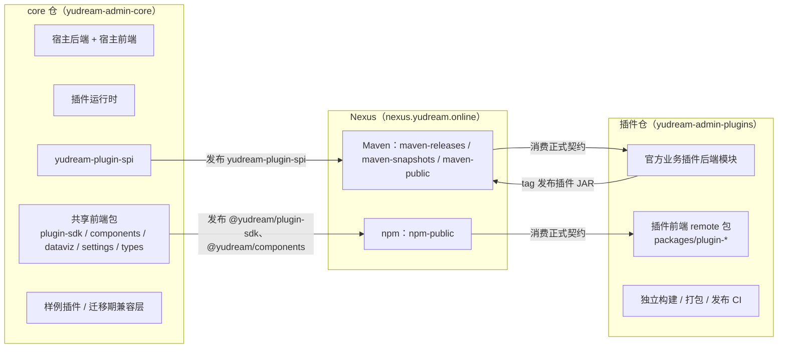

# 仓库分工与契约收敛

本文说明 YuDream 的两仓结构：core 主体仓与 `yudream-admin-plugins` 独立插件仓各自负责什么、两仓之间靠什么契约衔接，以及如何用 `templates/plugin-repo` 模板初始化一个新的插件仓。

## 概述

主体仓和插件仓的主链路已经拆开：



GitLab 只负责源码托管、CI 流水线和 CI artifacts；GitLab Package Registry 与 npmjs 的发布/拉取路径均已废弃。

## core 仓职责

core 仓（当前 `D:/code/yudream-admim` 对应的主体仓）保留：

| 内容 | 路径 |
|---|---|
| 插件 SPI 契约模块 | `yudream-plugins/yudream-plugin-spi` |
| 样例 / 教学插件 | `yudream-plugins/yudream-sample-plugin` |
| 宿主后端运行时 | `yudream-domain`、`yudream-application`、`yudream-infrastructure`、`yudream-interfaces`、`yudream-bootstrap` |
| 宿主前端 | `yudream-frontend/apps/*` |
| 共享前端包 | `yudream-frontend/packages/plugin-sdk`、`packages/components`、`packages/dataviz`、`packages/settings`、`packages/types` |
| 迁移期兼容层 | 临时存在，不得重新加入根 Maven reactor 与 pnpm workspace |

同时 core 仓必须保证：

- 根 `pom.xml` 只包含核心模块与 `yudream-plugin-spi`，不回收官方业务插件模块。
- 宿主前端不再从本地 `packages/plugin-*` 自动发现官方业务插件源码。
- 主体仓 pnpm workspace 不纳入业务插件前端包。
- CI 在分支和 tag 上直接校验拆分边界。

## 插件仓职责

独立插件仓 `yudream-admin-plugins` 承载：

- 官方业务插件后端模块（`yudream-plugins/yudream-plugin-*`）。
- 官方业务插件前端 remote 包（`yudream-frontend/packages/plugin-*`）。
- 插件仓自己的独立 GitLab CI：构建、打包、边界校验、契约消费校验、JAR 发布。

典型目录布局：

```text
yudream-admin-plugins/
├── pom.xml
├── yudream-plugins/
│   └── yudream-plugin-demo/          # 后端模块
├── yudream-frontend/
│   └── packages/
│       └── plugin-demo/              # 前端 remote 包
├── ci/                               # 插件仓校验与发布脚本
├── release/
│   └── plugins.txt                   # tag 发布显式模块清单
└── docs/
```

### 新增插件的默认落点

新增官方业务插件**默认放在独立插件仓**，不回填 core 仓。只有两种情况允许暂留 core 仓：样例/教学插件、迁移期临时兼容层。暂留内容必须同时满足：

- 不重新加入根 Maven reactor。
- 不重新加入 `yudream-frontend/pnpm-workspace.yaml`。
- 不被宿主前端通过本地源码自动发现加载。

### 前端 workspace 边界

插件仓前端 workspace **只允许** `packages/plugin-*`，不要恢复成 `packages/*`，也不要把 `@yudream/plugin-sdk`、`@yudream/components` 的源码复制进插件仓：

```yaml
# pnpm-workspace.yaml
packages:
  - packages/plugin-*
```

插件仓 CI 的前端构建入口同样只匹配 `yudream-frontend/packages/plugin-*/package.json`。共享包只使用公开入口（如 `@yudream/plugin-sdk`、`@yudream/plugin-sdk/vite-shared`），不依赖 `src/*` 内部路径。

## 契约收敛

两仓之间的稳定契约收敛为三个已发布包，插件仓只消费正式发布版本，不依赖 core 仓 `root parent` 或本地共享源码：

| 契约 | 坐标 | 发布/消费源 |
|---|---|---|
| Maven SPI | `online.yudream.base:yudream-plugin-spi` | release 发布到 Nexus `maven-releases`，snapshot 发布到 `maven-snapshots`，消费经 `maven-public` |
| npm 插件 SDK | `@yudream/plugin-sdk` | Nexus `npm-public`（`https://nexus.yudream.online/repository/npm-public/`） |
| npm 共享组件 | `@yudream/components` | 同上 |

通用 Maven 依赖和插件优先从阿里云公共仓库拉取，未命中时回退 Nexus；YuDream Maven 契约最终从 Nexus `maven-public` 拉取。第三方 npm 包继续使用公共源，`@yudream` scope 统一走 Nexus `npm-public`。

::: warning 版本纪律
未验证已发布的契约版本不得用于下游。SPI 版本以 `yudream-plugins/yudream-plugin-spi/pom.xml` 与 core 仓根 `pom.xml` 的 `yudream.plugin.spi.version` 为准，版本号永远从源文件读取；插件仓只改自己根属性中的版本号。
:::

## 使用 templates/plugin-repo 初始化新插件仓

core 仓的 `templates/plugin-repo/` 目录是「官方业务插件独立仓」场景的初始化模板，包含：

- `.gitlab-ci.yml.example`、`.npmrc.example`、`settings.xml.example`、`pnpm-workspace.yaml.example`
- `ci/` 下的校验与发布脚本：`verify-plugin-repo-independence.sh`、`verify-core-maven-registry.sh`、`verify-plugin-maven-boundary.sh`、`verify-core-npm-contracts.sh`、`verify-plugin-jar-assets.sh`、`verify-plugin-release-selection.sh`、`publish-plugin-jars.sh`、`verify-published-plugin-jars.sh`、`stage-plugin-repo-foundation.sh`、`stage-plugin-source-migration.sh`
- `release/plugins.txt`：官方 tag 发布的显式模块清单（默认包含全部 `yudream-plugin-*` artifactId）
- `plugin.yml.example`、`store.json.example`、`submission.json.example`、`LICENSE`（第三方投稿材料模板）
- `docs/plugin-release.md`：完整的选择、版本与 catalog 规则

初始化步骤：

1. 复制模板到新仓根目录。
2. 在新仓 GitLab CI variables 中配置受保护、掩码的发布凭据 `NEXUS_USERNAME`、`NEXUS_PASSWORD`，并保护 `v*` tag。
3. 配置 Maven：优先阿里云公共仓库，缺失回退 Nexus；YuDream 契约从 `maven-public` 拉取，插件 JAR 发布到 `maven-releases`。
4. 让插件仓只依赖正式发布的 `yudream-plugin-spi`（Maven）与 `@yudream/plugin-sdk`、`@yudream/components`（npm）。
5. 前端 workspace 只保留 `packages/plugin-*`。
6. 官方 tag 发布由 `release/plugins.txt` 显式选择模块，不使用 changed-plugin detection；需临时缩小范围时设置 `PLUGIN_RELEASE_MODULES`（逗号或空白分隔，未知/空白/重复 ID 会使流水线失败），`PLUGIN_RELEASE_ONLY=1` 使用完整显式清单。

插件仓 CI 会自动校验最终 JAR 内存在 `META-INF/yudream-plugin/frontend/*/remoteEntry.js`（见 `ci/verify-plugin-jar-assets.sh`），tag 流水线把插件 JAR 发布到 Nexus `maven-releases`。

### 第三方市场投稿

第三方作者不使用模板的官方发布 job，也不配置任何写凭据。作者在受控 `submission/` 目录中通过 MR 提交 `plugin.yml`、`store.json`、`submission.json`、`LICENSE`、构建完成的 `plugin.jar` 及其 SHA-256、图标截图等资源；普通 MR CI 只作本地校验，绝不上传 Nexus。要求各文件与 JAR 内根 `plugin.yml` 的 code、version、main 完全一致，使用稳定 SemVer，JAR 不含 `online/yudream/base/plugin/spi/**`。审核通过后由受信发布者在 protected tag 或受保护手动流水线代发。完整格式与审核清单见主仓 `docs/third-party-plugin-submission.md`。

## 回归校验命令

core 仓（本仓根目录执行）：

```bash
sh ci/verify-core-plugin-decoupling.sh
sh ci/verify-contract-packages.sh
sh ci/verify-contract-package-tarballs.sh
sh ci/verify-plugin-repo-template.sh
```

插件仓（插件仓根目录执行）：

```bash
sh ci/verify-plugin-repo-independence.sh
sh ci/verify-core-maven-registry.sh
sh ci/verify-core-npm-contracts.sh
sh ci/verify-plugin-jar-assets.sh
```

## 源码与文档引用

- `docs/repository-split/README.md`（拆分结论与当前事实清单）
- `docs/plugin-system/standalone-plugin-repo-default.md`（官方业务插件默认独立仓规则）
- `templates/plugin-repo/README.md`（模板使用说明原文）
- `templates/plugin-repo/plugin.yml.example`（第三方投稿 `plugin.yml` 模板）
- `templates/plugin-repo/ci/verify-plugin-jar-assets.sh`（JAR 前端资源校验脚本）
- `docs/third-party-plugin-submission.md`（第三方投稿完整规范）
