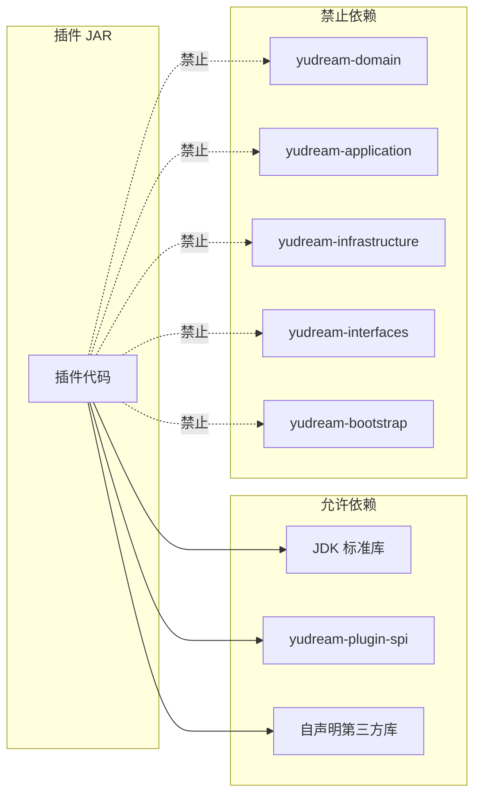
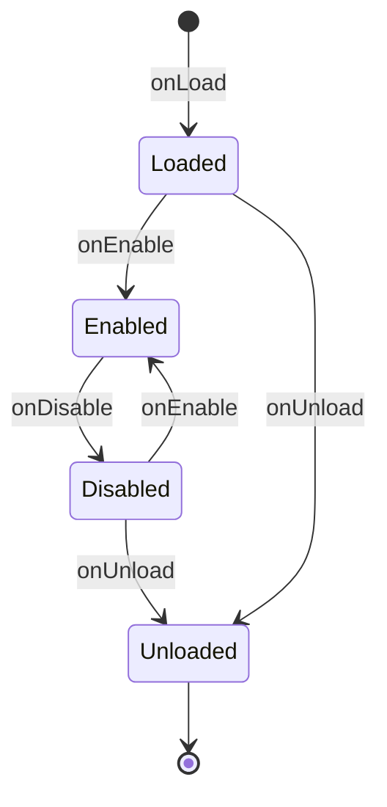

# 插件开发规范

本文是 YuDream 插件开发的工程约束总集。新增插件、改造既有插件、扩展插件 SPI 时都必须遵守。接口签名、字段与注解均以当前源码为准，文末列出了所有引用到的源码路径。

## 概述

YuDream 插件是独立构建的 JAR，运行时由宿主动态加载、启用、禁用、卸载。插件通过唯一的编译期契约模块 `yudream-plugin-spi` 与宿主交互，不能触碰宿主内部实现。规范覆盖六个维度：

- **依赖边界**：插件能依赖什么、禁止依赖什么。
- **命名规范**：插件 code、Maven artifact、权限码、HTTP 路径、前端包名。
- **工程结构**：推荐的分包目录树与 DDD 分层要求。
- **运行时约定**：入口类职责、生命周期、HTTP 挂载路径、前端资源路径。
- **兼容协议**：外部协议回调如何绕过统一响应包装。
- **验证清单**：构建与运行时逐项检查命令。

## 依赖边界

插件编译期只允许依赖三类东西：

| 允许依赖 | 说明 |
|---|---|
| JDK 标准库 | 无版本外的额外约束，宿主运行时为 JDK 21 |
| `online.yudream.base:yudream-plugin-spi` | 插件与宿主之间的唯一编译期契约，建议以 `provided` 或 `compile` + 打包排除的方式引用，**不得把 SPI 类打进插件 JAR** |
| 插件自身显式声明的第三方库 | 必须能随插件隔离 ClassLoader 加载，由插件 JAR 自行携带 |

插件**禁止**依赖：

- 宿主五个实现模块：`yudream-domain`、`yudream-application`、`yudream-infrastructure`、`yudream-interfaces`、`yudream-bootstrap`。
- 宿主内部的 Spring Bean、Mapper、Repository、dataobj（DO）、Controller、Request/Response 类。
- 其他插件的内部实现包（只允许依赖对方 `*.api` 包，见下文「插件间服务」）。

需要调用宿主能力（用户、文件、文档、模板渲染等）时，一律通过 `PluginContext.framework()` 返回的 `FrameworkServices` 端口完成；端口不存在时先在 SPI 发布新端口，而不是绕过边界。



### 插件间服务

插件之间的业务 API 不进入 `yudream-plugin-spi`，采用 provider/consumer 模式：

- **provider**：在自己 JAR 的稳定最小 `*.api` 包中定义接口，通过 `PluginContext.exposeService(Api.class, implementation)` 导出实现。
- **consumer**：以 Maven `provided` 作用域编译依赖 provider 的 API JAR，在 `plugin.yml` 中声明 `depend`（硬依赖）或 `softdepend`（软依赖），运行时通过 `PluginContext.service(String pluginCode, Class<T> serviceType)`（返回 `Optional<T>`）调用。
- consumer JAR **不得**重复打包 provider 的 API 类；多实现扩展场景用 `PluginContext.services(Class<T> serviceType)`（返回 `List<T>`）发现所有已启用实现。
- provider 存在已加载的硬/软依赖方时禁止卸载，必须先卸载依赖方。

## 命名规范

| 对象 | 规范 | 真实示例 |
|---|---|---|
| 插件 code（`plugin.yml` 的 `name`） | 小写短横线，全局唯一，是插件的稳定标识 | `sample-plugin` |
| 显示名（`plugin.yml` 的 `displayName`） | 仅面向用户展示，不参与标识 | `示例插件` |
| Maven artifactId | `yudream-plugin-{code}` | `yudream-plugin-minecraft-server` |
| Java 包名 | `online.yudream.base.plugin.{business}` | `online.yudream.base.plugin.sample` |
| 权限码 | `plugin:{code}:{action}` | `plugin:sample:view` |
| HTTP 路径 | 只写插件内相对路径，运行时统一挂到 `/api/plugins/{code}` | `/hello` |
| 前端包名 | `@yudream/plugin-{code}` | `@yudream/plugin-demo` |

权限码的 action 按查看 / 使用 / 管理区分：

```text
plugin:{code}:view     公开资源列表、状态页
plugin:{code}:use      普通用户页面与个人资源
plugin:{code}:manage   管理菜单与管理接口
```

- 前端按钮（`v-auth`）使用的权限码必须与后端接口一致，不允许前后端各造一套。
- 只有完全公开的协议接口才允许不声明权限。

::: warning 长 ID 一律序列化为 string
Java `Long`（含 Snowflake ID）在插件 HTTP 响应 JSON、插件间服务 DTO、前端 TS 模型、表单与 URL 参数中一律使用字符串。前端禁止 `Number(id)`，避免超过 `Number.MAX_SAFE_INTEGER` 后精度丢失。
:::

## 推荐分包结构

中大型插件必须按职责分包，与宿主 DDD 分层对齐：

```text
online/yudream/base/plugin/{business}/
├── bootstrap/        插件入口类、运行时组装、生命周期回调
├── domain/           聚合、值对象、枚举、领域仓储接口、领域服务
├── application/      cmd、query、dto、assembler、service
├── infrastructure/   dataobj、mapper、仓储实现、外部 SDK 适配
├── interfaces/       controller、assembler、request、res、http facade
├── migration/        迁移任务、迁移 DTO、迁移状态
└── frontend/         （前端源码通常在独立 packages/plugin-{code} 包，见下）
```

分层硬规则：

- `domain` 不依赖框架与 Web；`application` 编排用例，不接收 HTTP request、不返回 HTTP response；`infrastructure` 负责持久化与外部技术细节；`interfaces` 只做 HTTP 边界与 request/res 转换。
- Controller 必须薄：读取 `PluginHttpRequest`、调用应用服务、返回 `PluginHttpResponse`，不写业务规则、不做复杂字段映射、不直接操作持久化对象。
- 小型插件可以合并部分层，但**禁止**把所有业务塞进插件入口类。

### 入口类职责

入口类实现 `YuDreamPlugin`，只做装配：

- 用 `@PluginSpec` 声明 `code` / `name` / `version` / `description` / `dependencies`，或重写 `descriptor()`。
- 用 `@PluginPermission`、`@PluginFrontend`、`@PluginRoute`、`@PluginHttpEndpoint`、`@PluginDashboardCard`、`@PluginCapability` 等注解声明静态能力；只有动态能力、条件注册或兼容逻辑才用 `PluginContext.registerXxx(...)` 命令式注册。
- 在生命周期方法中组装自身服务，并把所有可释放资源注册到 `context.onDispose(...)`。

入口类**不得**写：业务流程、数据库迁移主体逻辑、HTTP 解析与响应转换、大量 UI 路由构造、对宿主内部实现的直接访问。

`plugin.yml` 必须位于 JAR 根目录，是权威元信息。字段（以样例插件为例）：

```yaml
name: sample-plugin          # 插件 code，唯一稳定标识
displayName: 示例插件         # 展示名
main: online.yudream.base.plugin.sample.SampleYuDreamPlugin  # 入口类全限定名
version: 1.0.0
description: YuDream sample plugin
# depend: []        # 硬依赖插件 code 列表，必须先于本插件加载启用
# softdepend: []    # 软依赖插件 code 列表，缺失不阻塞，但功能必须条件降级
```

禁止在插件 JAR 中打包 `META-INF/services/...YuDreamPlugin` 服务发现文件。

### 软依赖降级

`softdepend` 缺失时不阻塞本插件启用，但相关菜单、路由、权限、端点、任务必须**条件注册**：先判断 `PluginContext.dependencyAvailable(String pluginCode)`，返回 `false` 就不注册关联贡献项。不能用无条件扫描的静态注解声明软依赖功能。

## HTTP 接口约定

插件 HTTP 端点统一挂载在：

```text
/api/plugins/{pluginCode}/**
```

`@PluginHttpEndpoint` 注解签名（`spi/annotation/PluginHttpEndpoint.java`）：

| 属性 | 类型 | 默认值 | 说明 |
|---|---|---|---|
| `method` | `String` | — | HTTP 方法，如 `GET`、`POST` |
| `path` | `String` | — | 插件内相对路径，如 `/hello` |
| `permission` | `String` | `""` | 权限码，空表示不校验（仅公开协议接口允许） |
| `wrapResult` | `boolean` | `true` | 是否包裹统一响应信封，兼容协议接口设为 `false` |

真实示例（样例插件 `SampleYuDreamPlugin.java`）：

```java
@PluginHttpEndpoint(method = "GET", path = "/hello", permission = VIEW_PERMISSION)
public PluginHttpResponse hello(PluginHttpRequest request, PluginContext context) {
    PluginUserProfile profile = context.framework().users()
            .findById(request.principal().userId())
            .orElse(null);
    return PluginHttpResponse.ok(Map.of(
            "message", "Hello from YuDream sample plugin",
            "plugin", CODE,
            "user", profile,
            "roles", context.framework().users().listRoles(request.principal().userId())
    ));
}
```

端点规则：

- 管理接口必须声明 `plugin:{code}:manage` 权限。
- 用户侧接口以系统用户为核心，用 `request.principal()` 取当前登录用户，再经 `FrameworkServices.users()` 查资料，**不新增平行账号体系**。需要把插件结论展示到人员管理时，使用 `users().replaceTags(userId, pluginCode, tags)` 按命名空间写入标签，不要给用户表加平行字段。需要把插件结论展示到人员管理时，使用 `users().replaceTags(userId, pluginCode, tags)` 按命名空间写入标签，不要给用户表加平行字段。
- 长任务日志用 SSE 或可轮询状态接口，不把大日志塞进一次性响应。
- 文件上传、下载、预览接口必须明确权限、归属校验与内容类型。

路径风格建议：

```text
GET    /status
GET    /settings
PUT    /settings
GET    /admin/resources
POST   /admin/resources
GET    /me/resources
POST   /me/resources
GET    /migration/{source}/status
GET    /migration/{source}/events
```

## 前端资源路径

插件前端源码放在 `packages/plugin-{code}`（官方业务插件在独立插件仓内，见[仓库分工](./repository.md)），推荐结构：

```text
packages/plugin-{code}/
└── src/
    ├── index.ts
    ├── pages/
    ├── components/
    ├── composables/
    ├── api/
    └── types.ts
```

约束：

- 禁止把插件页面写进宿主 `apps/*/src/views`。
- 使用宿主 SDK/client 发请求，不内置私有 axios；使用宿主组件库与后台布局风格。
- 需要宿主目录（消息连接/群、用户/部门/角色、Agent/供应商）时走 `sdk.messaging` / `sdk.users` / `sdk.ai`，不要再包一层插件 HTTP 去转发 `framework.*()`，也不要打宿主管理接口（如 `/api/platform/milky/**`）。插件自有 CRUD、当前用户部门（`/me/departments`）等仍走 `/api/plugins/{pluginCode}/**`。
- 生产产物必须导出 remote ESM，不依赖 workspace alias（workspace 加载只是开发便利）。

生产 JAR 内前端资源路径（插件仓 CI 会强制校验 `remoteEntry.js` 存在）：

```text
META-INF/yudream-plugin/frontend/{pluginCode}/remoteEntry.js
META-INF/yudream-plugin/frontend/{pluginCode}/assets/*
```

三种资源加载方式：

- **内联样式（兼容模式）**：`import styles from './styles.css?inline'`，在 `install()` 中创建或更新宿主 `<style>` 的 `textContent`。宿主不会自动加载未声明的独立 CSS。
- **独立资源**：在 `PluginFrontendModule` 的 `styles` / `scripts` 字段声明相对路径（如 `List.of("assets/plugin.css")`），宿主在导入 `remoteEntry.js` 前按声明顺序加载。
- **其他静态资源**：随 JAR 放入同一前端目录，通过 `sdk.assets.url("assets/logo.svg")` 取 URL。路径必须是相对路径，不得含 `..` 或反斜杠。

Vite 产物应保留相对引用与 hash 文件名；动态 import 的 JS chunk 无须写入 `scripts`。

## 生命周期与迁移

`YuDreamPlugin` 提供四个生命周期回调（均为默认空实现）：

| 回调 | 签名 | 调用时机 | 职责约束 |
|---|---|---|---|
| `onLoad` | `void onLoad(PluginContext context)` | 插件类加载后 | 轻量准备，不做 IO |
| `onEnable` | `void onEnable(PluginContext context)` | 启用时 | 只做轻量装配，昂贵操作延迟到业务调用 |
| `onDisable` | `void onDisable(PluginContext context)` | 禁用时 | 停止业务活动 |
| `onUnload` | `void onUnload(PluginContext context)` | 卸载时 | 配合 `onDispose` 完成全部清理 |



资源释放硬规则：

- 长连接、线程池、定时任务、外部 SDK client 必须注册到 `context.onDispose(AutoCloseable closeable)`，禁用/卸载时由运行时统一回收。
- 构造函数中不建立外部连接；插件扫描阶段不执行迁移、网络请求或大 IO。
- 所有经 `PluginContext.registerXxx(...)` 注册的贡献项（菜单、权限、能力、卡片、前端、HTTP 端点）在禁用/卸载时由运行时回收，插件不需手动反注册。

### 数据迁移

迁移任务（`migration/` 包）必须满足：

- 启动接口立即返回任务状态，不同步阻塞。
- 迁移日志通过 SSE 或状态接口查看（如 `GET /migration/{source}/events`）。
- 页面刷新后能恢复当前任务状态（状态需持久化）。
- 迁移过程记录 warning/error，但 UI 不把长警告列表堆到主界面。
- 外部数据与系统用户、部门、角色对齐时，优先复用系统用户创建规则和默认部门/角色规则。

## 兼容协议（wrapResult=false）

支付回调、Authlib Injector、Yggdrasil 等外部协议接口需要按对方协议原文响应，可绕过宿主统一响应包装：

```java
@PluginHttpEndpoint(method = "POST", path = "/notify", wrapResult = false)
```

绕过包装后仍必须：

- 明确认证或签名校验方式（回调验签、密钥比对等）。
- 自行控制错误响应格式，与协议方约定一致。
- 避免把内部异常堆栈泄漏给外部调用方。
- 与系统用户身份模型对齐，不新增平行账号体系。

## 验证清单

以下命令以「当前插件仓根目录」为工作目录；官方业务插件默认在 `yudream-admin-plugins` 仓执行（`{code}` 替换为实际插件 code）：

后端：

```bash
mvn -pl yudream-plugins/yudream-plugin-{code} -am -DskipTests package
mvn -pl yudream-bootstrap -am -DskipTests compile   # 在 core 仓内开发样例/兼容层时
```

前端：

```bash
cd yudream-frontend
pnpm --filter @yudream/plugin-{code} build
pnpm --filter @fantastic-admin/core-arco-design-vue run test:typecheck
```

发布前逐项确认：

- [ ] 插件只依赖 JDK、`yudream-plugin-spi` 与自声明第三方库，JAR 内不含 `online/yudream/base/plugin/spi/**`
- [ ] `plugin.yml` 位于 JAR 根且 `name`/`main`/`version` 完整，code 全局唯一
- [ ] HTTP 路径均为插件内相对路径，最终落在 `/api/plugins/{pluginCode}` 下
- [ ] 权限码统一为 `plugin:{code}:{action}`，前后端一致
- [ ] HTTP Controller 委托应用服务，无业务规则与持久化对象操作
- [ ] 前端拆分为 `pages/components/api/types`，生产 manifest 不依赖 workspace alias
- [ ] JAR 内含 `META-INF/yudream-plugin/frontend/{pluginCode}/remoteEntry.js` 与 assets
- [ ] 启用/禁用/卸载后菜单、路由、端点正确注册与回收，长驻资源经 `onDispose` 释放
- [ ] 软依赖缺失时相关功能条件降级而非报错
- [ ] 兼容协议接口 `wrapResult=false` 且有验签与错误格式控制
- [ ] 长 ID 在 JSON/URL/表单中全程为 string

## 源码引用

- `yudream-plugins/yudream-plugin-spi/src/main/java/online/yudream/base/plugin/spi/core/PluginContext.java`（注册与服务发现接口）
- `yudream-plugins/yudream-plugin-spi/src/main/java/online/yudream/base/plugin/spi/core/YuDreamPlugin.java`（生命周期回调）
- `yudream-plugins/yudream-plugin-spi/src/main/java/online/yudream/base/plugin/spi/annotation/PluginHttpEndpoint.java`（`wrapResult` 等属性）
- `yudream-plugins/yudream-plugin-spi/src/main/java/online/yudream/base/plugin/spi/annotation/PluginSpec.java`
- `yudream-plugins/yudream-plugin-spi/src/main/java/online/yudream/base/plugin/spi/frontend/PluginFrontendModule.java`（`styles`/`scripts` 资源声明）
- `yudream-plugins/yudream-sample-plugin/src/main/java/online/yudream/base/plugin/sample/SampleYuDreamPlugin.java`（入口类真实示例）
- `yudream-plugins/yudream-sample-plugin/src/main/resources/plugin.yml`（`plugin.yml` 真实示例）
- `docs/plugin-system/specification.md`（主仓工程规范原文）
- `templates/plugin-repo/ci/verify-plugin-jar-assets.sh`（JAR 前端资源校验）
