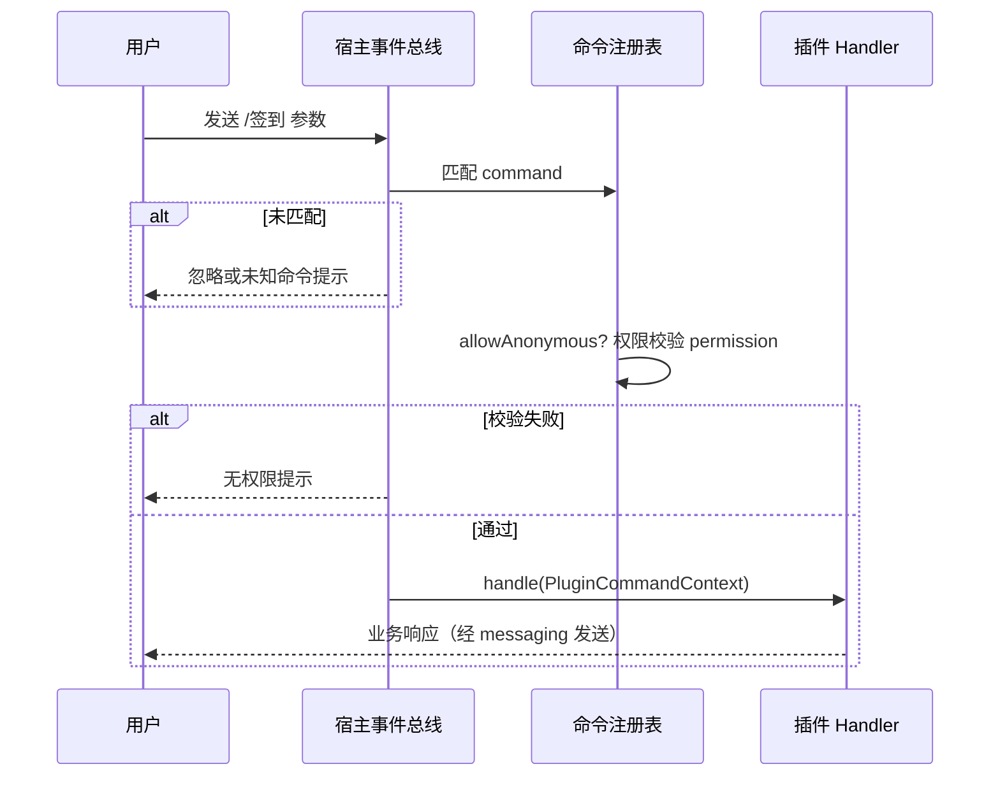

# 命令端口：消息指令注册与官方面板同步

插件可以向机器人/系统注册**命令**（如 `/签到`、`/wallet 查询`），由宿主统一解析、鉴权与分发。

> 源码：`yudream-plugins/yudream-plugin-spi/src/main/java/online/yudream/base/plugin/spi/system/command/`

---

## 注册：PluginCommandRegistry

通过 `context.commands()` 获取：

```java
public interface PluginCommandRegistry {
    AutoCloseable register(PluginCommandDefinition definition, PluginCommandHandler handler);
}
```

### register 参数表

| 参数 | 类型 | 说明 |
|---|---|---|
| definition | `PluginCommandDefinition` | 命令元数据 |
| handler | `PluginCommandHandler` | 处理函数 |

返回的 `AutoCloseable` 在插件 disable/unload 时由宿主统一回收；也可用 `context.onDispose(...)` 自行管理生命周期。

## PluginCommandHandler

```java
@FunctionalInterface
public interface PluginCommandHandler {
    void handle(PluginCommandContext context) throws Exception;
}
```

handler 抛出的异常由宿主记录日志，不影响其他命令。

---

## DTO 字段表

### PluginCommandDefinition

```java
public record PluginCommandDefinition(String code, String command, String name, String permission,
                                      String description, boolean allowAnonymous)
```

| 字段 | 类型 | 说明 |
|---|---|---|
| code | `String` | 插件内唯一标识 |
| command | `String` | 命令字面量（触发词） |
| name | `String` | 展示名 |
| permission | `String` | 执行所需权限码（遵循 `plugin:{code}:{action}`） |
| description | `String` | 用途说明 |
| allowAnonymous | `boolean` | 是否允许匿名（未登录/未绑定）用户触发 |

### PluginCommandContext

```java
public record PluginCommandContext(PluginEvent event, String command, List<String> arguments, Long userId)
```

| 字段 | 类型 | 说明 |
|---|---|---|
| event | `PluginEvent` | 触发的原始消息事件（见 [消息端口](/plugin/spi/v1/messaging)） |
| command | `String` | 命令名 |
| arguments | `List<String>` | 命令后的参数列表（按空白切分，null 规范化为空列表） |
| userId | `Long` | 系统侧用户 ID（可空，匿名时为 null） |

### PluginCommandInfo

面向管理端展示的信息结构：

```java
public record PluginCommandInfo(String pluginCode, String code, String command, String name,
                                String permission, String description, boolean allowAnonymous) {}
```

| 字段 | 类型 | 说明 |
|---|---|---|
| pluginCode | `String` | 注册该命令的插件 code |
| code | `String` | 插件内唯一标识 |
| command | `String` | 命令字面量 |
| name | `String` | 展示名 |
| permission | `String` | 所需权限码 |
| description | `String` | 用途说明 |
| allowAnonymous | `boolean` | 是否允许匿名触发 |

---

## 查询：PluginCommandService

通过 `context.framework().commands()` 获取：

```java
public interface PluginCommandService {
    List<PluginCommandInfo> listAccessible(Long userId);
}
```

| 参数 | 类型 | 说明 |
|---|---|---|
| userId | `Long` | 系统侧用户 ID |

返回该用户当前可用的全部命令（含其他插件注册的），遵循权限模型，前端命令面板据此渲染。

---

## 完整示例

```java
@Override
public void onEnable(PluginContext context) {
    context.commands().register(
            new PluginCommandDefinition(
                    "sign", "/签到", "每日签到",
                    "plugin:sample-plugin:use",
                    "签到领取积分", false),
            ctx -> {
                Long userId = ctx.userId();          // 匿名时为 null，需判空
                List<String> args = ctx.arguments(); // /签到 双倍 -> ["双倍"]
                doSign(userId, args);
            });
}
```

---

## 与 @PluginCommand 注解的关系

方法上标注 `@PluginCommand`（`@Repeatable`，即一个方法可响应多个命令）与编程式 `register` **等价**——宿主启动时由注解扫描器把标注的方法自动注册进同一注册表。注解适合"一个方法一条命令"的简单场景；需要动态构造定义（如按配置批量注册）时用编程式。

注解属性与 `PluginCommandDefinition` 字段一一对应，其中 `permission`/`description` 默认空串、`allowAnonymous` 默认 false：

```java
@Target(ElementType.METHOD)
@Retention(RetentionPolicy.RUNTIME)
@Repeatable(PluginCommands.class)
public @interface PluginCommand {
    String code();
    String command();
    String name();
    String permission() default "";
    String description() default "";
    boolean allowAnonymous() default false;
}
```

使用示例：

```java
@PluginCommand(code = "sign", command = "/签到", name = "每日签到",
        permission = "plugin:sample-plugin:use", description = "签到领取积分")
public void onSign(PluginCommandContext ctx) {
    doSign(ctx.userId(), ctx.arguments());
}
```

---

## 解析与鉴权流程



## 注意事项

- 命令字面量全局唯一性由宿主管理，重复注册会被拒绝或覆盖，建议带上插件特色前缀。
- `allowAnonymous = true` 的命令拿到的 `ctx.userId()` 可能为 `null`，handler 内必须判空。
- 命令回复经 [消息端口](/plugin/spi/v1/messaging) 发送；需要协议级细节参见 [QQ 协议详解](/protocol/milky)。
- `listAccessible` 遵循权限模型，可用于在插件管理端展示"当前用户可用命令"。
- 官方 QQ 机器人连接启用后，宿主会把系统指令与已启用插件指令自动注册到官方指令 UI：单聊底部自定义菜单（`PUT /v2/menu`）以及单聊、群聊、文字子频道、频道私信的指令面板（`/v2/panels`）。菜单按钮是 `send_message`、面板元素是 `command`。启动时先拉取远端菜单/面板到本地快照，插件全部加载后再按 remark + items 语义差异分类创建或更新；运行中插件启停/重载与本地快照对比，30s 合并写入，菜单无变动则跳过官方调用，避免面板查询 30 QPM、写入 10 QPM 被打满。官方未提供面板删除接口，非托管面板不会被改动。群聊官方事件是原生 AT/私聊事件，不是 Milky mention 段。若点击后只产生 `INTERACTION_CREATE`（没有后续 `GROUP_AT_MESSAGE_CREATE`），宿主把 `button_data` / `send_message` / 指令名当成官方定向消息（`mention_self=true`），并先 `PUT /interactions/{id}` 回执。宿主从正文剥掉 `<@bot>` 后再解析命令，命中指令时只走命令分发、不广播 `onMessage`，未命中指令的官方 AT/私聊/交互正文仍按该原生标记触发 AI。Milky 连接继续只看真实 mention 段。底部菜单一级最多 10 项、子菜单最多 5 项；面板每场景最多 20 项。命令回复走被动回复（自动附带最近 `msg_id` / `event_id`）。


---

> 源码引用：`.../plugin/spi/system/command/` 全部文件；注解定义见 `.../plugin/spi/annotation/PluginCommand.java`
