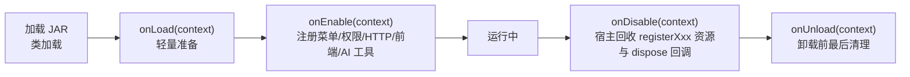

# 生命周期与 PluginContext

> SPI v1 · 包 `online.yudream.base.plugin.spi.core`
>
> 源码：`yudream-plugins/yudream-plugin-spi/src/main/java/online/yudream/base/plugin/spi/core/`（`YuDreamPlugin.java`、`PluginContext.java`、`PluginDescriptor.java`）

core 包是 SPI 的入口契约：插件实现 `YuDreamPlugin`，宿主在生命周期各阶段回调它，并在启用时注入 `PluginContext`——插件通过这个门面注册贡献项、访问框架能力、消费其他插件的服务。



---

## YuDreamPlugin —— 插件入口接口

每个插件必须提供一个实现了 `YuDreamPlugin` 的入口类，并在 `plugin.yml` 的 `main` 中声明其全限定名。全部方法均有默认实现，按需覆盖。

| 方法 | 签名 | 说明 |
|---|---|---|
| `descriptor()` | `default PluginDescriptor descriptor()` | 默认从类上的 `@PluginSpec` 反射构造描述符（`mainClass` 取当前类名，`dependencies` 取注解值，`softDependencies` 为空列表）；无注解且未覆盖时抛 `IllegalStateException` |
| `onLoad(context)` | `default void onLoad(PluginContext context)` | JAR 被类加载后调用，仅做轻量准备，此时插件尚未启用 |
| `onEnable(context)` | `default void onEnable(PluginContext context)` | 插件启用时调用。所有注册（菜单/权限/HTTP/前端/AI 工具等）应在此完成，保证 disable 可完整回收 |
| `onDisable(context)` | `default void onDisable(PluginContext context)` | 停用时调用；宿主同时回收通过 `registerXxx` 注册的资源与 `onDispose` 回调 |
| `onUnload(context)` | `default void onUnload(PluginContext context)` | JAR 即将卸载前的最后清理时机 |

### 参数表：所有生命周期回调共用

| 参数 | 类型 | 说明 |
|---|---|---|
| `context` | `PluginContext` | 宿主注入的运行时门面，见下文 |

## PluginDescriptor —— 插件描述符

```java
public record PluginDescriptor(String code, String name, String version, String description,
        String mainClass, List<String> dependencies, List<String> softDependencies)
```

紧凑构造器将 null 依赖列表归一为 `List.of()`。

| 字段 | 类型 | 说明 |
|---|---|---|
| `code` | `String` | 插件唯一 code，即 `plugin.yml` 的 `name`，也是存储作用域与服务发现的键 |
| `name` | `String` | 展示名称 |
| `version` | `String` | 插件版本 |
| `description` | `String` | 描述 |
| `mainClass` | `String` | 入口类全限定名 |
| `dependencies` | `List<String>` | 硬依赖插件 code 列表，必须先于本插件加载并启用 |
| `softDependencies` | `List<String>` | 可选依赖 code 列表；缺失不阻塞加载，相关功能需条件注册降级 |

## PluginContext —— 运行时门面

宿主注入给插件的运行时门面，职责分四组：基础信息与能力入口、运行时贡献注册、插件间服务、消息与清理。

### 基础信息与能力入口

| 方法 | 签名 | 说明 |
|---|---|---|
| `pluginCode()` | `String pluginCode()` | 当前插件唯一 code（即 plugin.yml 的 `name`） |
| `framework()` | `FrameworkServices framework()` | 框架能力端口聚合入口，详见 [FrameworkServices](/plugin/spi/v1/framework-services) |
| `documents()` | `default PluginDocumentStore documents()` | 插件作用域文档存储，等价于 `framework().documents(pluginCode())` |
| `files()` | `default PluginFileStore files()` | 插件作用域文件存储 |
| `secrets()` | `default PluginSecretStore secrets()` | 插件作用域密钥存储（宿主未开启时抛 `UnsupportedOperationException`） |
| `templateRenderer()` | `PluginTemplateRenderService templateRenderer()` | 插件作用域 Thymeleaf 模板渲染（模板位于插件 JAR `templates/`） |
| `semanticMemory()` | `PluginSemanticMemoryService semanticMemory()` | 语义记忆（向量索引/检索）服务 |

以上端口的逐方法文档见 [storage](/plugin/spi/v1/storage)、[document-render](/plugin/spi/v1/document-render)、[memory](/plugin/spi/v1/memory)。

### 运行时贡献注册

全部为 `void registerXxx(...)` 形式，注册的资源在 disable/unload 时由宿主统一回收：

| 方法 | 参数类型 | 说明 |
|---|---|---|
| `registerMenu(item)` | `PluginMenuItem` | 注册后台导航菜单 |
| `registerPermission(item)` | `PluginPermissionItem` | 注册权限点（供权限管理界面展示与授权） |
| `registerCapability(item)` | `PluginCapabilityItem` | 注册平台能力声明（受项目闸门/应用闸门双闸门管控） |
| `registerDashboardCard(card)` | `PluginDashboardCard` | 注册首页仪表盘卡片 |
| `registerFrontend(module)` | `PluginFrontendModule` | 注册前端 remote 模块与路由 |
| `registerHttpHandler(method, path, handler)` | `String` / `String` / `PluginHttpHandler` | 编程式注册单个 HTTP 端点，挂载到 `/api/plugins/{pluginCode}/**` |
| `registerHttpController(controller)` | `Object` | 扫描对象上带 `@PluginHttpEndpoint` 的方法批量注册端点 |
| `registerAiTool(tool)` | `PluginAiTool` | 注册 AI Agent 可调用的工具 |

各条目 record 的字段速查见 [registry-items](/plugin/spi/v1/registry-items)；HTTP 相关见 [http](/plugin/spi/v1/http)，注解声明式写法见 [annotations](/plugin/spi/v1/annotations)。

### 插件间服务

| 方法 | 签名 | 说明 |
|---|---|---|
| `exposeService(type, service)` | `<T> void exposeService(Class<T> serviceType, T service)` | 向其他插件暴露业务服务（接口定义在 provider 的稳定最小 `*.api` 包中） |
| `service(code, type)` | `<T> Optional<T> service(String pluginCode, Class<T> serviceType)` | 按插件 code + 类型消费其他插件暴露的服务；目标未启用时返回空 `Optional` |
| `services(type)` | `<T> List<T> services(Class<T> serviceType)` | 获取所有已启用插件暴露的指定类型服务列表 |
| `dependencyAvailable(code)` | `boolean dependencyAvailable(String pluginCode)` | 判断某插件是否已加载并启用——软依赖条件注册的标准判断依据 |

#### Provider / Consumer 示例

Provider 侧（在 `onEnable` 中暴露服务）：

```java
@Override
public void onEnable(PluginContext context) {
    // WalletApi 位于本插件的稳定最小 *.api 包中
    context.exposeService(WalletApi.class, new DefaultWalletApi(context));
}
```

Consumer 侧（编译期以 `provided` scope 依赖 provider 的 api JAR）：

```java
Optional<WalletApi> wallet = context.service("wallet-plugin", WalletApi.class);
wallet.ifPresent(api -> balance = api.summary());
```

### 消息与清理

| 方法 | 签名 | 说明 |
|---|---|---|
| `interactions()` | `PluginMessageInteractionRegistry interactions()` | 消息/命令/按钮/原生事件监听注册器，详见 [messaging](/plugin/spi/v1/messaging) |
| `commands()` | `PluginCommandRegistry commands()` | 消息命令编程式注册器，详见 [command](/plugin/spi/v1/command) |
| `onDispose(closeable)` | `void onDispose(AutoCloseable closeable)` | 注册 dispose 回调，disable/unload 时自动执行；用于关闭自建线程池、连接等资源 |

---

## 使用示例

完整的生命周期覆盖（软依赖条件注册模式）：

```java
@PluginSpec(code = "demo-plugin", name = "示例插件", version = "1.0.0")
public class DemoPlugin implements YuDreamPlugin {

    private ExecutorService executor;

    @Override
    public void onLoad(PluginContext context) {
        executor = Executors.newFixedThreadPool(2);
    }

    @Override
    public void onEnable(PluginContext context) {
        context.registerHttpController(new DemoController());

        // 仅当可选依赖存在时才注册相关功能
        if (context.dependencyAvailable("wallet-plugin")) {
            WalletApi wallet = context.service("wallet-plugin", WalletApi.class)
                    .orElseThrow();
            context.registerHttpHandler("GET", "/wallet-summary",
                    request -> PluginHttpResponse.ok(wallet.summary()));
        }

        // 登记需要释放的资源
        context.onDispose(() -> executor.shutdown());
    }
}
```

## 注意事项

- 不要在 `onLoad` 中做昂贵操作；`onEnable` 只做轻量装配，不建立长驻外部连接。
- 所有需要释放的资源必须经 `registerXxx` 或 `onDispose` 登记，否则禁用后泄漏。
- consumer 不得把 provider API 类打进自己的 JAR，Maven 用 `provided` scope。
- `descriptor()` 的权威来源仍是 JAR 根的 `plugin.yml`；注解只是便捷形态，两者冲突以宿主装载逻辑为准。
