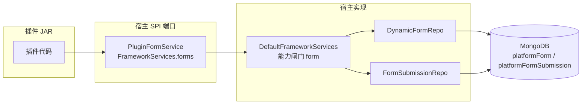

# 动态表单（Dynamic Form）

> SPI v1 · 当前源码 2.24.0 · 包 `online.yudream.base.plugin.spi.system.form`

宿主"动态表单"能力（可视化表单设计、发布、填写、结果收集）暴露给插件的只读端口：插件可搜索平台**已发布**表单构建选择器、按 code 查询表单摘要、核验指定用户是否在时间窗口内提交过指定表单。典型场景：活动插件把"参与证明"绑定到某个表单，核验参与者是否真正提交。

| 端口 | 获取方式 | 用途 |
|---|---|---|
| `PluginFormService` | `context.framework().forms()` | 已发布表单搜索、按 code 取摘要、提交核验 |

整体调用链：



---

## 一、PluginFormService

源码：`yudream-plugins/yudream-plugin-spi/src/main/java/online/yudream/base/plugin/spi/system/form/PluginFormService.java`

```java
public interface PluginFormService {

    default boolean enabled() { return false; }

    default List<PluginDynamicFormSummary> publishedForms(String keyword, int page, int size) { return List.of(); }

    default Optional<PluginDynamicFormSummary> formByCode(String code) { return Optional.empty(); }

    default boolean submittedBy(String formCode, Long submitterId, long fromEpochMillis, long toEpochMillis) { return false; }
}
```

### 方法一览

| 方法 | 签名 | 默认实现行为 | 宿主行为 |
|---|---|---|---|
| `enabled` | `default boolean enabled()` | 恒 `false` | 返回能力 `form` 的持久化启用状态 |
| `publishedForms` | `default List<PluginDynamicFormSummary> publishedForms(String keyword, int page, int size)` | 空 List | 分页搜索**已发布（PUBLISHED）**表单；keyword 匹配 name/code/description（忽略大小写）；`page` 从 1 开始，`size` 钳制到 [1, 200]，非正数按 20 |
| `formByCode` | `default Optional<PluginDynamicFormSummary> formByCode(String code)` | `Optional.empty()` | 按 code 查表单摘要，**不限状态**（表单停用后历史绑定仍可回显名称）；空白 code 直接返回 empty |
| `submittedBy` | `default boolean submittedBy(String formCode, Long submitterId, long fromEpochMillis, long toEpochMillis)` | `false` | 按表单 code + 提交人 + 提交时间窗口核验提交记录是否存在；`fromEpochMillis` / `toEpochMillis` ≤ 0 表示该端不限制；formCode 空白或 submitterId 为 null 返回 false |

## 二、能力闸门

动态表单是平台可动态加载能力，能力 code 为 **`form`**（持久化在能力模块表中，未配置视为未启用）。宿主实现所有方法（除 `enabled()` 本身外）先过闸门：

```java
// DefaultFrameworkServices.ensureFormEnabled()
if (!formEnabled()) {
    throw new IllegalArgumentException("动态表单能力未启用，请先在能力管理中启用 form");
}
```

**插件侧正确姿势是先判断再调用**：

```java
PluginFormService forms = context.framework().forms();
if (!forms.enabled()) {
    // 降级：隐藏表单绑定入口，或提示管理员去能力管理启用 form
    return;
}
```

## 三、DTO 字段

`PluginDynamicFormSummary`（源码 `.../spi/system/form/PluginDynamicFormSummary.java`）：

```java
public record PluginDynamicFormSummary(
        Long id,
        String code,
        String name,
        String description,
        String status,
        long publishedAt
) {
}
```

| 字段 | 类型 | 说明 |
|---|---|---|
| `id` | `Long` | 表单 ID（雪花 ID）。**进入 JSON / URL / 表单时一律序列化为 string，禁止 `Number(id)`** |
| `code` | `String` | 表单编码，业务唯一；插件绑定表单时应持久化 code 而非 id |
| `name` | `String` | 表单名称 |
| `description` | `String` | 表单描述，可为 null |
| `status` | `String` | 表单状态：`DRAFT` / `PUBLISHED` / `DISABLED` |
| `publishedAt` | `long` | 首次发布时间，**epoch 毫秒**；从未发布为 0 |

## 四、完整示例

```java
PluginFormService forms = context.framework().forms();

// 1) 管理端选择器：搜索已发布表单
if (forms.enabled()) {
    List<PluginDynamicFormSummary> options = forms.publishedForms("报名", 1, 50);
    // options -> 插件 HTTP 端点 -> 前端 FaSelect 选项
}

// 2) 绑定回显：按 code 取表单（即使后来停用也能拿到名称）
Optional<PluginDynamicFormSummary> form = forms.formByCode("campus-run-2026");

// 3) 参与核验：用户是否在活动时间窗口内提交过绑定表单
boolean submitted = forms.submittedBy(
        "campus-run-2026",
        userId,
        activityStartEpochMillis,
        activityEndEpochMillis
);
```

---

## 五、注意事项

- **能力闸门**：表单能力可能在管理后台被关闭；插件必须先 `enabled()` 检查并显式降级（隐藏绑定控件、提示管理员），不要把表单数据当作必然可用。
- **SPI 默认实现 ≠ 宿主行为**：全部方法都是 default（false / 空 List / empty Optional），只保证契约可编译演进；真实行为以宿主实现为准。
- **绑定用 code 不用 id**：`formCode` 已随每条提交记录冗余存储，按 code 核验不依赖表单记录的后续状态；表单删除后历史提交的核验结果不受影响。
- **Long ID 序列化**：`PluginDynamicFormSummary.id` 为雪花 `Long`，凡进入 JSON、URL 参数、表单的一律用 string 承载。
- **只读端口**：本端口不提供表单设计、发布、提交写入能力；提交由宿主表单模块的公开填写端点产生。
- **异常语义**：参数与能力状态问题统一抛 `IllegalArgumentException`（含中文消息，可直接用于错误提示）。

## 源码引用

- SPI 契约：`yudream-plugins/yudream-plugin-spi/src/main/java/online/yudream/base/plugin/spi/system/form/`（`PluginFormService.java`、`PluginDynamicFormSummary.java`）
- 宿主实现：`yudream-infrastructure/src/main/java/online/yudream/base/infra/platform/plugin/service/DefaultFrameworkServices.java`（`forms()` 匿名适配器）
- 领域与仓储：`yudream-domain/src/main/java/online/yudream/base/domain/platform/form/`（`DynamicForm`、`FormSubmission`、`DynamicFormRepo`、`FormSubmissionRepo`）
- 能力注册：`yudream-infrastructure/src/main/java/online/yudream/base/infra/platform/form/service/DynamicFormCapabilityProvider.java`（code `form`）
