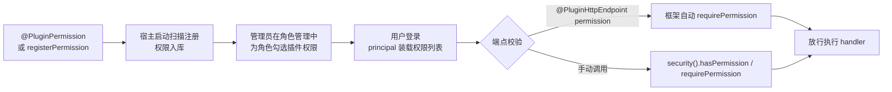

# 权限端口：PluginSecurityService 与 PluginPrincipal

插件在两种场合需要权限能力：**声明**自己的权限（`@PluginPermission` / `registerPermission`），以及**校验**当前用户是否持有某个权限（`FrameworkServices.security()`）。

> 源码：`yudream-plugins/yudream-plugin-spi/src/main/java/online/yudream/base/plugin/spi/system/security/`

---

## PluginSecurityService

```java
public interface PluginSecurityService {
    boolean hasPermission(PluginPrincipal principal, String permission);
    void requirePermission(PluginPrincipal principal, String permission);
}
```

| 方法 | 行为 |
|---|---|
| `hasPermission(principal, permission)` | 判断主体是否持有该权限，返回布尔值，不抛异常。**特例：`permission` 为空白时恒返回 `true`（视为"该动作不要求权限"）；`principal` 为 `null` 时（未登录）返回 `false`** |
| `requirePermission(principal, permission)` | 同上判断，不满足时抛出运行时异常 `BizException("无此插件权限：<permission>")` 中断业务——适合"先校验后执行"的命令式代码 |

宿主实现为 `PrincipalPluginSecurityService`（infra 层），判断逻辑直接委托给 `PluginPrincipal.hasPermission`。

```java
PluginPrincipal me = request.principal();          // 来自 HTTP 请求，未登录时可能为 null
if (context.framework().security().hasPermission(me, "plugin:wallet:manage")) {
    // 管理操作
} else {
    return PluginHttpResponse.json(403, Map.of("message", "缺少管理权限"));
}

// 或者断言式：失败抛运行时异常，消息为「无此插件权限：plugin:wallet:manage」。
// 该异常类型属宿主内部，插件编译期只依赖 SPI，按 RuntimeException 捕获即可：
try {
    context.framework().security().requirePermission(me, VIEW_PERMISSION);
    // ... 受保护的业务 ...
} catch (RuntimeException e) {
    return PluginHttpResponse.json(403, Map.of("message", e.getMessage()));
}
```

---

## PluginPrincipal —— 当前用户快照

```java
public record PluginPrincipal(Long userId, List<String> permissions) {
    public boolean hasPermission(String permission) { ... }
}
```

| 字段 | 类型 | 说明 |
|---|---|---|
| `userId` | `Long` | 用户 ID（JSON 传输中序列化为 string） |
| `permissions` | `List<String>` | 该用户持有的全部权限码 |

record 的紧凑构造器做了两步规范化：`permissions` 为 `null` 时置为空列表；否则做防御性拷贝（`List.copyOf`），持有后不可变。

`hasPermission(String)` 的通配规则：

- 权限码完全相等即通过；
- 主体持有 `"*"`（超级权限）时对任意权限码都返回 `true`；
- 其余情况返回 `false`。

获取途径：

- 插件 HTTP 端点：`PluginHttpRequest.principal()` —— 宿主已完成登录态解析与权限装载；
- 消息/命令事件场景：由宿主按触发用户构造后传入 `PluginEvent` 相关处理链路。

---

## 权限码命名约定

```
plugin:{pluginCode}:{action}
```

- `{pluginCode}`：插件的稳定 code（与 `plugin.yml` 的 `name` 一致）；
- `{action}`：动作名。规范推荐三级模型：

| 层级 | 后缀约定 | 含义 |
|---|---|---|
| 查看 | `view` | 可见页面/数据 |
| 使用 | `use` | 执行常规业务动作 |
| 管理 | `manage` | 配置、删除等高危操作 |

```java
@PluginSpec(code = "sample-plugin", name = "示例插件", version = "1.0.0")
@PluginPermission(code = "plugin:sample-plugin:view", name = "示例插件-查看",
        module = "sample", description = "查看示例插件页面")
@PluginHttpEndpoint(method = "GET", path = "/hello", permission = "plugin:sample-plugin:view")
```

---

## 声明到校验的完整链路



要点：

1. **声明**：注解方式（推荐）在宿主启动时由 `PluginAnnotationRegistrar` 统一扫描入库；编程式用 `context.registerPermission(PluginPermissionItem)`。
2. **授权**：插件权限出现在后台角色管理的权限树中，由管理员分配给角色。
3. **校验**：
   - HTTP 端点上标注了 `permission` 的，由插件分发器在进入 handler 前**自动**完成校验，未授权返回 403；
   - 未标注的端点默认需要登录但不要求特定权限；涉及敏感动作时在 handler 内手动调用 `requirePermission`。

---

## 注意事项

- 不要在插件内硬编码用户角色判断，一律走权限码——角色是宿主的动态数据。
- `requirePermission` 抛出的异常会被分发层转换为统一错误响应，无需自行捕获处理（除非要定制文案）。
- 消息机器人场景下若命令定义了 `permission`（见 [命令端口](/plugin/spi/v1/command)），同样遵循本页的码值规则。

---

> 源码引用：
> - `.../plugin/spi/system/security/PluginSecurityService.java`
> - `.../plugin/spi/system/security/PluginPrincipal.java`
> - 宿主实现：`yudream-infrastructure/src/main/java/online/yudream/base/infra/platform/plugin/service/PrincipalPluginSecurityService.java`
> - 示例：`yudream-plugins/yudream-sample-plugin/src/main/java/online/yudream/base/plugin/sample/SampleYuDreamPlugin.java`
