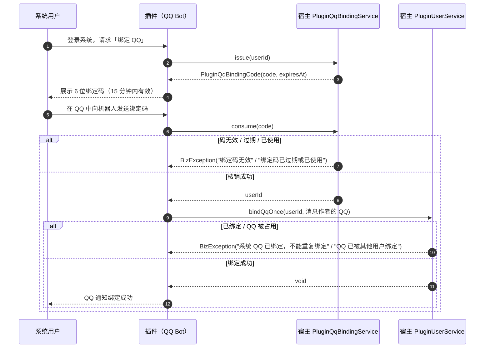

# 用户与 QQ 绑定（PluginUserService / PluginQqBindingService）

> SPI v1（2.7.0）· 包 `online.yudream.base.plugin.spi.system.user`
>
> 源码目录：`yudream-plugins/yudream-plugin-spi/src/main/java/online/yudream/base/plugin/spi/system/user/`

## 概述

`user` 包向插件暴露宿主用户体系的稳定应用契约：用户档案查询与认证、用户创建、资料更新、QQ 一次性绑定、角色/部门查询，以及 QQ 一次性绑定码的签发与核销。插件通过 `context.framework()` 获取这两个端口：

```java
PluginUserService users = context.framework().users();
PluginQqBindingService qqBindings = context.framework().qqBindings();
```

这些是**应用契约**（见 `package-info.java`），不是领域聚合或仓储 API。插件禁止绕过端口直接访问宿主的 `UserRepo`、Spring Bean 或 dataobj。宿主实现位于应用层 `PluginUserFrameworkService`，生产环境实际注入的是 infra 层的 `@Primary` 装饰器 `SandboxAwarePluginUserService`，它在 QQ 沙箱会话中改写身份判定并阻断写入（见文末「QQ 沙箱」一节）。

## 核心概念

- **PluginUserProfile**：面向插件的用户档案快照（record），承载查询/认证/创建的返回结果。
- **PluginUserOption / PluginDeptOption**：选项（option）形态的用户与部门，**所有 ID 一律为 `String`**（宿主把雪花 Long 转字符串后下发），供插件前端直接渲染选择器。
- **PluginUserRole / PluginUserDept**：用户上下文视角的角色与部门（Java 侧 ID 仍为 `Long`）。
- **一次性语义**：`bindQqOnce` 只允许从未绑定过 QQ 的用户完成首次绑定；`PluginQqBindingService` 签发的绑定码只能用一次、15 分钟过期。

## PluginUserService 方法详解

共 12 个方法（其中 `listDepartments` 有一对重载）。以下签名逐字摘自 `PluginUserService.java`；行为说明对应宿主实现 `PluginUserFrameworkService`。

### 1. authenticate — 用户名/邮箱 + 密码认证

```java
Optional<PluginUserProfile> authenticate(String usernameOrEmail, String password);
```

| 参数 | 类型 | 说明 |
|---|---|---|
| `usernameOrEmail` | `String` | 用户名或邮箱，内部会 `trim()` |
| `password` | `String` | 明文密码，与库中 BCrypt 哈希比对 |

**返回**：认证通过返回 `Optional.of(PluginUserProfile)`；任一校验失败返回 `Optional.empty()`，**不抛异常**。

**行为**（按实现顺序）：

1. 任一参数为空白 → `empty`。
2. 先按用户名精确查找；找不到且入参含 `@` 时回退按邮箱查找。
3. 用户不存在、密码字段为 `null` → `empty`。
4. 用户状态为 `DISABLED`、邮箱未验证、或密码哈希不匹配 → `empty`。

```java
Optional<PluginUserProfile> login = context.framework().users()
        .authenticate("steve@yudream.online", "s3cret");
login.ifPresent(profile -> log.info("认证成功: {}", profile.nickname()));
```

### 2. create — 创建用户

```java
PluginUserProfile create(PluginUserCreate create);
```

| 参数 | 类型 | 说明 |
|---|---|---|
| `create` | `PluginUserCreate` | 创建参数，见 DTO 字段表；为 `null` 时抛 `BizException("用户创建参数不能为空")` |

**返回**：创建成功后的用户档案（`avatar` 恒为 `null`，状态为 `UserStatus` 枚举名）。

**行为**：

- 透传到宿主用户管理应用服务，用户名/邮箱唯一性等约束由宿主校验，冲突时抛 `BizException`。
- 若提供 `encodedPassword`（预加密哈希），宿主会把 `$2y$` 前缀的 BCrypt 哈希规范化为 `$2a$` 再落库；`password` 与 `encodedPassword` 二选一。

### 3. findById — 按 ID 查询

```java
Optional<PluginUserProfile> findById(Long userId);
```

| 参数 | 类型 | 说明 |
|---|---|---|
| `userId` | `Long` | 用户 ID（雪花 ID，Java 侧为 `Long`） |

**返回**：存在返回档案，不存在返回 `Optional.empty()`。真实用法示例（摘自 `docs/plugin-system/tutorial.md`）：

```java
PluginUserProfile profile = context.framework()
        .users()
        .findById(request.principal().userId())
        .orElse(null);
```

### 4. findByUsername — 按用户名查询

```java
Optional<PluginUserProfile> findByUsername(String username);
```

用户名为唯一索引，精确匹配；找不到返回 `Optional.empty()`。

### 5. findByEmail — 按邮箱查询

```java
Optional<PluginUserProfile> findByEmail(String email);
```

邮箱唯一索引精确匹配；找不到返回 `Optional.empty()`。

### 6. findByQq — 按 QQ 号查询

```java
Optional<PluginUserProfile> findByQq(String qq);
```

按系统用户绑定的 QQ 号精确匹配，常用于把 QQ 消息发送者映射回系统用户；找不到返回 `Optional.empty()`。QQ 沙箱会话中若开启「强制未绑定」，本方法恒返回 `empty`（见文末）。

### 7. bindQqOnce — 首次绑定 QQ（一次性）

```java
void bindQqOnce(Long userId, String qq);
```

| 参数 | 类型 | 说明 |
|---|---|---|
| `userId` | `Long` | 目标用户 ID |
| `qq` | `String` | 待绑定 QQ 号，内部 `trim()` |

**返回**：`void`，失败一律抛 `BizException`。

**行为**（依次校验，任一失败即抛异常）：

| 场景 | 异常文案 |
|---|---|
| `userId` 为 `null` 或 `qq` 空白 | `用户和 QQ 不能为空` |
| 用户不存在 | `用户不存在` |
| 该用户已绑定过 QQ | `系统 QQ 已绑定，不能重复绑定` |
| 该 QQ 已被其他用户绑定 | `QQ 已被其他用户绑定` |

校验通过后更新用户 QQ 并保存。换绑/解绑不在 SPI 暴露面内，插件无法调用。

### 8. searchUsers — 关键字 + 部门分页搜索

```java
List<PluginUserOption> searchUsers(String keyword, Long deptId, int page, int size);
```

| 参数 | 类型 | 说明 |
|---|---|---|
| `keyword` | `String` | 模糊关键字（用户名/昵称等），空白视为不限；纯数字时额外按用户 ID 精确命中 |
| `deptId` | `Long` | 部门过滤，`null` 不限 |
| `page` | `int` | 页码，小于 1 时钳制为 1 |
| `size` | `int` | 每页大小，≤ 0 视为 20，钳制到 [1, 200] |

**返回**：`List<PluginUserOption>`，按 ID 去重；纯数字关键字命中的 ID 精确结果排在最前。仅返回 `ACTIVE` 状态用户。

```java
List<PluginUserOption> options = context.framework().users()
        .searchUsers("张", null, 1, 20);
// options 的 id / deptIds 均为字符串形态，可直接下发前端选择器
```

### 9. listDepartments(keyword) — 部门树（选项形态）

```java
List<PluginDeptOption> listDepartments(String keyword);
```

| 参数 | 类型 | 说明 |
|---|---|---|
| `keyword` | `String` | 部门名关键字，空白视为不限 |

**返回**：`List<PluginDeptOption>` 树形结构（`children` 递归），仅含 `ACTIVE` 部门；`id`/`parentId` 为字符串。适合做部门级联选择器。

### 10. listRoles — 用户角色列表

```java
List<PluginUserRole> listRoles(Long userId);
```

| 参数 | 类型 | 说明 |
|---|---|---|
| `userId` | `Long` | 用户 ID |

**返回**：`List<PluginUserRole(id, code, name)>`。QQ 沙箱会话中可被「模拟角色」改写返回（见文末）。

### 11. listDepartments(userId) — 用户所属部门

```java
List<PluginUserDept> listDepartments(Long userId);
```

| 参数 | 类型 | 说明 |
|---|---|---|
| `userId` | `Long` | 用户 ID |

**返回**：`List<PluginUserDept(id, name, defaultDept)>`，`defaultDept` 标记是否默认部门。注意与第 9 个方法同名重载：参数为 `String keyword` 时返回全量部门树，参数为 `Long userId` 时返回该用户所属部门。

### 12. updateProfile — 更新资料

```java
void updateProfile(Long userId, PluginUserProfileUpdate update);
```

| 参数 | 类型 | 说明 |
|---|---|---|
| `userId` | `Long` | 目标用户 ID |
| `update` | `PluginUserProfileUpdate` | 更新内容；为 `null` 时抛 `BizException("用户资料不能为空")` |

**返回**：`void`。透传宿主资料更新流程，昵称/邮箱/手机号/QQ 的格式与唯一性校验由宿主执行，失败抛 `BizException`。

::: warning avatar 字段当前不生效
`PluginUserProfileUpdate` 虽然声明了 `avatar` 字段，但宿主实现 `PluginUserFrameworkService.updateProfile` 仅把 `nickname/email/phone/qq` 透传到 `UserProfileUpdateCmd`，**`avatar` 会被静默忽略**。修改头像不要依赖本方法。
:::

### 13. 方法速查表

| # | 方法 | 签名 | 返回/失败行为 |
|---|---|---|---|
| 1 | `authenticate` | `Optional<PluginUserProfile> authenticate(String usernameOrEmail, String password)` | 失败返回 `empty`，不抛异常 |
| 2 | `create` | `PluginUserProfile create(PluginUserCreate create)` | 参数 `null`/违反唯一性 → `BizException` |
| 3 | `findById` | `Optional<PluginUserProfile> findById(Long userId)` | 不存在 → `empty` |
| 4 | `findByUsername` | `Optional<PluginUserProfile> findByUsername(String username)` | 不存在 → `empty` |
| 5 | `findByEmail` | `Optional<PluginUserProfile> findByEmail(String email)` | 不存在 → `empty` |
| 6 | `findByQq` | `Optional<PluginUserProfile> findByQq(String qq)` | 不存在 → `empty` |
| 7 | `bindQqOnce` | `void bindQqOnce(Long userId, String qq)` | 校验失败 → `BizException` |
| 8 | `searchUsers` | `List<PluginUserOption> searchUsers(String keyword, Long deptId, int page, int size)` | 仅 ACTIVE，size 钳制 [1,200] |
| 9 | `listDepartments` | `List<PluginDeptOption> listDepartments(String keyword)` | 部门树，仅 ACTIVE |
| 10 | `listRoles` | `List<PluginUserRole> listRoles(Long userId)` | 空列表表示无角色 |
| 11 | `listDepartments` | `List<PluginUserDept> listDepartments(Long userId)` | 用户所属部门 |
| 12 | `updateProfile` | `void updateProfile(Long userId, PluginUserProfileUpdate update)` | 参数 `null` → `BizException` |

（上表 9/11 为同名重载，合计 12 个方法。）

## PluginQqBindingService — 一次性绑定码

```java
public interface PluginQqBindingService {
    PluginQqBindingCode issue(Long userId);
    Long consume(String code);
}
```

宿主实现 `PluginQqBindingFrameworkService`（infra 层）要点：

- 绑定码为 **6 位数字**（`SecureRandom` 生成，冲突时重试），**有效期 15 分钟**。
- 码本身**不携带 QQ 号**——QQ 由消息作者在核销时提供（见实现注释），`issue` 只需 `userId`。
- 存储为进程内 `ConcurrentHashMap`：**单节点内存态**，重启即失效，不跨实例共享。
- `issue` 每次签发时顺带清理已过期条目。

### issue — 签发绑定码

| 参数 | 类型 | 说明 |
|---|---|---|
| `userId` | `Long` | 目标系统用户；为 `null` 抛 `BizException("用户不能为空")` |

**返回**：`PluginQqBindingCode(code, expiresAt)`，`expiresAt` 为 `Instant`（签发时刻 + 15 分钟）。

### consume — 核销绑定码

| 参数 | 类型 | 说明 |
|---|---|---|
| `code` | `String` | 6 位数字绑定码 |

**返回**：`Long`——签发时关联的 `userId`。核销即删除条目，一次性使用。

| 场景 | 异常文案 |
|---|---|
| `code` 为 `null` 或不匹配 `\d{6}` | `绑定码无效` |
| 码不存在、已过期或已被使用 | `绑定码已过期或已使用` |

### 典型绑定流程

用户在系统内已登录，想把 QQ 与账号绑定。插件（QQ Bot）让用户在系统侧取码、再到 QQ 侧回码：



参考代码骨架：

```java
// 取码（系统侧，用户已登录）
PluginQqBindingCode ticket = context.framework().qqBindings().issue(userId);
// 把 ticket.code() 与 ticket.expiresAt() 展示给用户；Instant 序列化为 ISO-8601 字符串

// 核销（QQ 侧，收到消息作者的绑定码）
Long boundUserId = context.framework().qqBindings().consume(messageText.trim());
context.framework().users().bindQqOnce(boundUserId, authorQq);
```

## DTO 字段表

全部为 `record`，构造即全参构造，访问器与字段同名。

### PluginUserProfile

| 字段 | 类型 | 说明 |
|---|---|---|
| `id` | `Long` | 用户 ID（雪花 ID；进入 JSON/URL/表单时**必须序列化为 string，禁止 `Number(id)`**） |
| `username` | `String` | 用户名 |
| `nickname` | `String` | 昵称 |
| `email` | `String` | 邮箱 |
| `phone` | `String` | 手机号 |
| `qq` | `String` | 绑定的 QQ 号 |
| `avatar` | `String` | 头像地址（`create` 返回时恒为 `null`） |
| `status` | `String` | 状态枚举名：`ACTIVE` / `DISABLED` |

### PluginUserCreate

| 字段 | 类型 | 说明 |
|---|---|---|
| `username` | `String` | 用户名（唯一） |
| `nickname` | `String` | 昵称 |
| `email` | `String` | 邮箱 |
| `phone` | `String` | 手机号 |
| `qq` | `String` | 初始绑定 QQ（可空） |
| `password` | `String` | 明文密码（与 `encodedPassword` 二选一） |
| `encodedPassword` | `String` | 预加密 BCrypt 哈希；`$2y$` 前缀会被宿主规范化为 `$2a$` |
| `emailVerified` | `boolean` | 邮箱是否已验证（影响 `authenticate` 能否通过） |

### PluginUserProfileUpdate

| 字段 | 类型 | 说明 |
|---|---|---|
| `nickname` | `String` | 昵称 |
| `email` | `String` | 邮箱 |
| `phone` | `String` | 手机号 |
| `qq` | `String` | QQ |
| `avatar` | `String` | 头像（**当前宿主实现忽略此字段**，见 updateProfile 警告） |

### PluginUserOption（ID 字符串化）

| 字段 | 类型 | 说明 |
|---|---|---|
| `id` | `String` | 用户 ID 的字符串形态（雪花 Long 转字符串） |
| `username` | `String` | 用户名 |
| `nickname` | `String` | 昵称 |
| `email` | `String` | 邮箱 |
| `avatar` | `String` | 头像 |
| `status` | `String` | `ACTIVE` / `DISABLED` |
| `deptIds` | `List<String>` | 所属部门 ID（字符串形态） |
| `deptNames` | `List<String>` | 所属部门名称，与 `deptIds` 顺序对应 |

### PluginDeptOption（树形）

| 字段 | 类型 | 说明 |
|---|---|---|
| `id` | `String` | 部门 ID（字符串形态） |
| `name` | `String` | 部门名 |
| `parentId` | `String` | 父部门 ID，根节点为 `null` |
| `status` | `String` | `ACTIVE` / `DEPRECATED`（本端口仅返回 ACTIVE） |
| `children` | `List<PluginDeptOption>` | 子部门，递归树形；无子级为空列表 |

### PluginUserRole

| 字段 | 类型 | 说明 |
|---|---|---|
| `id` | `Long` | 角色 ID（JSON 输出时序列化为 string） |
| `code` | `String` | 角色编码 |
| `name` | `String` | 角色名 |

### PluginUserDept

| 字段 | 类型 | 说明 |
|---|---|---|
| `id` | `Long` | 部门 ID（JSON 输出时序列化为 string） |
| `name` | `String` | 部门名 |
| `defaultDept` | `Boolean` | 是否默认部门 |

### PluginQqBindingCode

| 字段 | 类型 | 说明 |
|---|---|---|
| `code` | `String` | 6 位数字绑定码 |
| `expiresAt` | `Instant` | 过期时刻（签发 + 15 分钟），JSON 为 ISO-8601 字符串 |

## 注意事项

- **长 ID 字符串化**：`PluginUserOption`/`PluginDeptOption` 的 ID 已由宿主转为 `String`；`PluginUserProfile`/`PluginUserRole`/`PluginUserDept` 的 `Long` ID 一旦进入 JSON、URL 参数或前端表单，一律按 string 处理，禁止 `Number(id)`（雪花 ID 超出 JS 安全整数会丢精度）。
- **失败语义分两派**：`authenticate` 与全部 `findByXxx` 用 `Optional.empty()` 表达失败，不抛异常；`create`/`bindQqOnce`/`updateProfile`/`issue`/`consume` 用 `BizException` 表达失败，插件应按需捕获并转成自己的响应。
- **`listDepartments` 有两个重载**：`String keyword` → 全量部门树；`Long userId` → 用户所属部门。传参时注意 Java 重载解析。
- **绑定码是单节点内存态**：`PluginQqBindingFrameworkService` 用 `ConcurrentHashMap` 存码，服务重启后未使用的码全部失效，多实例部署时取码与核销必须落在同一节点。
- **绑定码不含 QQ**：`issue` 只关联 `userId`，QQ 号由核销方（消息作者）在调用 `bindQqOnce` 时提供，避免绑定码被截获后冒绑。
- **QQ 沙箱行为**：生产注入的 `SandboxAwarePluginUserService` 在 QQ 沙箱会话中——`create`/`bindQqOnce`/`updateProfile` 直接抛 `BizException("QQ 沙箱会话禁止写入系统用户数据：...")`；`findByQq` 可被「强制未绑定」改写为恒 `empty`；`listRoles` 可被「模拟角色」改写返回。插件代码无需区分，但沙箱调试时观察到的行为差异来自这里。
- **能力获取入口**：两个端口都从 `context.framework()` 获取，插件不得注入宿主 Spring Bean；接口演进走 SPI 发版流程。

## QQ 沙箱行为详解

生产环境注入的是 `@Primary` 装饰器 `SandboxAwarePluginUserService`，它包装应用层的 `PluginUserFrameworkService`。仅当 QQ 沙箱执行作用域（`QqSandboxExecutionScope`）激活时才改写行为，生产链路与沙箱共用同一实现，插件观察到的语义一致。

| 方法 | 沙箱会话中的行为 |
|---|---|
| `create` / `bindQqOnce` / `updateProfile` | 直接抛 `BizException("QQ 沙箱会话禁止写入系统用户数据：<方法名>")`，并向沙箱会话记录 `identity.override`（type=`writeBlocked`），**不会触达真实用户库** |
| `findByQq` | 若会话开启 `forceUnbound`，恒返回 `Optional.empty()`，并记录 type=`forceUnbound` 的覆盖事件 |
| `listRoles` | 若会话配置了 `simulateRoles`（角色 code 列表），返回按 code 从角色库解析出的模拟角色列表（未知 code 被忽略并记入 `unknownRoles`），不查询该用户真实角色 |
| 其余只读方法（`authenticate`/`findById`/`findByUsername`/`findByEmail`/`searchUsers`/`listDepartments`） | 透传委托实现，不做改写 |

对插件的含义：沙箱里调试 QQ 机器人时，「绑定/资料写入被拒、QQ 一律未绑定、角色可模拟」都是宿主刻意提供的隔离能力，插件代码不需要也不应该针对沙箱写特殊分支。

## 错误处理建议

两类失败语义对应两种处理风格：

```java
// Optional 风格：authenticate / findByXxx 不抛异常
PluginUserProfile profile = context.framework().users()
        .findById(userId)
        .orElseThrow(() -> new IllegalStateException("请先完成账号注册"));

// BizException 风格：create / bindQqOnce / updateProfile 校验失败即抛。
// BizException 是宿主运行时异常（插件编译期只依赖 SPI，无法直接引用该类型），
// 按 RuntimeException 捕获即可，getMessage() 为上表中的中文文案
try {
    context.framework().users().bindQqOnce(userId, qq);
} catch (RuntimeException e) {
    // 可把 e.getMessage() 透出给最终用户；也可按需自行包装
    log.warn("绑定失败: {}", e.getMessage());
}
```


- SPI 接口与 DTO：`yudream-plugins/yudream-plugin-spi/src/main/java/online/yudream/base/plugin/spi/system/user/`（`PluginUserService.java`、`PluginQqBindingService.java`、`PluginUserProfile.java`、`PluginUserCreate.java`、`PluginUserProfileUpdate.java`、`PluginUserOption.java`、`PluginDeptOption.java`、`PluginUserRole.java`、`PluginUserDept.java`、`PluginQqBindingCode.java`、`package-info.java`）
- 端口总入口：`yudream-plugins/yudream-plugin-spi/src/main/java/online/yudream/base/plugin/spi/system/FrameworkServices.java`
- 宿主实现：`yudream-application/src/main/java/online/yudream/base/application/platform/plugin/service/PluginUserFrameworkService.java`
- 沙箱装饰器：`yudream-infrastructure/src/main/java/online/yudream/base/infra/platform/plugin/service/SandboxAwarePluginUserService.java`
- 绑定码实现：`yudream-infrastructure/src/main/java/online/yudream/base/infra/platform/plugin/service/PluginQqBindingFrameworkService.java`
- 状态枚举：`yudream-domain/src/main/java/online/yudream/base/domain/system/user/enumerate/UserStatus.java`、`DeptStatus.java`
