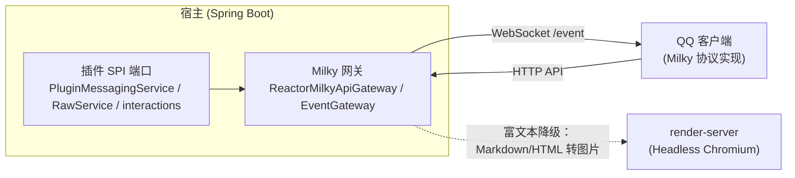

# 通信协议总览

平台的机器人接入与富文本消息渲染建立在两套协议之上：对外对接 QQ 机器人的 **Milky 协议**，对内服务于消息卡片与富文本降级的**渲染服务 HTTP 协议**。

> 历史说明：早期版本曾通过 Satori v1 协议对接机器人平台，现已弃用并从代码中移除，机器人接入统一走 Milky。

## Milky 协议（机器人接入）

Milky 是 QQ 机器人协议，宿主以「连接」为单位管理多个 Milky 实例：

- **HTTP API**：宿主经 `ReactorMilkyApiGateway.invoke(context, api, body)` 调用对端接口（如 `get_group_list`、发送消息等），返回 JSON；
- **事件流**：连接启用后，`ReactorMilkyEventGateway` 以 WebSocket 长连消费对端 `/event?access_token=<token>` 端点，事件解析为 `MilkyModels.Event`（含 `eventType`，如 `message_receive`）；
- **凭据安全**：连接 token 等配置经 `AesGcmMilkyCredentialCipher` 加密落库；新写入使用 Base64 解码后恰为 32 字节的 `YUDREAM_CREDENTIAL_KEY` 及连接作用域 AAD，旧 `YUDREAM_MILKY_CREDENTIAL_KEY`（16/24/32 字节）仅用于解密历史密文；
- **插件入口**：插件不直接触碰协议，统一经 [MessagingSpi](/plugin/spi/v1/messaging) 的平台无关端口收发消息，需要原生方法时走 `invoke(connectionId, method, payload)`。

完整字段、端点与事件分发链路见 [Milky 协议详解](/protocol/milky)。

## 渲染服务协议（内部）

render-server 是独立的 Headless Chromium 服务，把 HTML、Markdown 或外部 URL 渲染为图片/PDF：

| 端点 | 说明 |
|---|---|
| `POST /v1/render/html` | 渲染 HTML 片段 |
| `POST /v1/render/markdown` | 渲染 Markdown |
| `POST /v1/render/url` | 截取外部 URL |
| `GET /health` | 健康检查 |

- 错误语义：`400` 参数非法 / `429` 并发或队列满 / `500` 渲染失败 / `504` 超时；
- 并发由 `BrowserPool` 控制，上限来自 `RENDER_MAX_CONCURRENT` / `RENDER_MAX_QUEUE`；
- 安全模型：可控的子资源拦截、SSRF 私网段拒绝、输入体积限额、内置 CSP。

使用方式见 [消息渲染能力](/features/render)；插件经 `framework().render()` 访问。

## 能力闸门

两个能力都遵守项目闸门 + 应用闸门双闸门约定：

| 能力码 | 项目闸门开关 | 说明 |
|---|---|---|
| `milky` | `PLATFORM_MILKY_ENABLED` | QQ 机器人接入（默认开启） |
| `message-render` | `PLATFORM_MESSAGE_RENDER_ENABLED` | 富文本渲染服务 |

::: info 源码位置
- Milky：`yudream-infrastructure/src/main/java/online/yudream/base/infra/platform/milky/`
- 插件桥接：`yudream-infrastructure/.../infra/platform/plugin/service/MilkyPluginMessagingService.java`
- render-server：`yudream-render-server/src/`
:::
