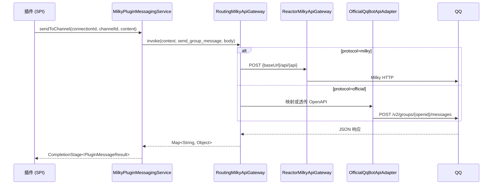
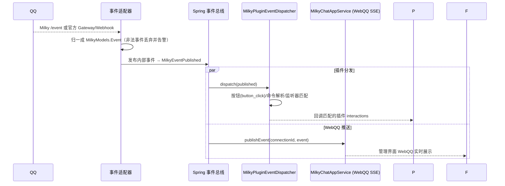

# QQ 机器人协议详解

宿主以「连接」为单位管理多个机器人实例。出站统一走 `MilkyApiGateway.invoke(context, api, body)`：共享方法名由传输适配器映射；官方 OpenAPI 路径可作为特异化入口透传。入站 Milky 走 WebSocket `/event`，官方走 Gateway 或 Webhook，归一成 `MilkyModels.Event` 后再进插件分发与 WebQQ。插件不直接接触协议细节，统一经 [MessagingSpi](/plugin/spi/v1/messaging) 收发消息。

> 源码依据：`yudream-infrastructure/src/main/java/online/yudream/base/infra/platform/milky/`（网关与凭据）、`.../milky/official/`（官方适配器）、`yudream-infrastructure/.../infra/platform/plugin/service/MilkyPluginMessagingService.java`（SPI 适配）、`yudream-interfaces/.../platform/milky/controller/`（管理端点）、`yudream-interfaces/.../platform/plugin/controller/PluginMessagingCatalogController.java`（插件前端目录）

## 连接模型

| 端点 | 说明 |
|---|---|
| `GET /api/platform/milky/connections` | 分页查询连接（支持 keyword） |
| `POST /api/platform/milky/connections` | 创建连接 |
| `PUT /api/platform/milky/connections/{id}` | 更新连接 |
| `POST /api/platform/milky/connections/{id}/enable` | 启用（启动事件 WebSocket 与发送通道） |
| `POST /api/platform/milky/connections/{id}/disable` | 停用（断开事件流，`MilkyRuntimeShutdownRequested` 触发清理） |
| `POST /api/platform/milky/connections/{id}/test` | 连通性测试 |

- 每个连接持有 `protocol`（`milky` 默认 / `official`）。Milky 连接保存平台地址与 Access Token；官方连接保存 AppID、AppSecret，默认 API 地址 `https://api.bot.qq.com`（沙箱 `https://sandbox.api.bot.qq.com`）。凭据经 `AesGcmMilkyCredentialCipher` AES-GCM 加密落库。新写入统一使用 `YUDREAM_CREDENTIAL_KEY`（Base64 解码后恰为 32 字节）及连接作用域 AAD，管理接口永不回传明文；旧 `YUDREAM_MILKY_CREDENTIAL_KEY`（16/24/32 字节）仅可解密历史密文。
- 能力描述符：能力码 `milky`，类型 `MESSAGING`，展示名 **QQ 消息平台**。项目闸门为 `PLATFORM_MILKY_ENABLED`（默认开启），应用层每次用例前经 `ensureEnabled("milky", "QQ 消息平台")` 二次校验。
- 插件前端选择器走 SDK `sdk.messaging.connections()/groups()`，对应 `GET /api/platform/plugins/messaging/**`（登录即可，不要求 `platform:milky:view`）。不要再包一层插件 HTTP，也不要打管理端 `/api/platform/milky/**`。
- 官方 Webhook：`POST /api/public/qqbot/{connectionId}/webhook`。回调校验（op=13）返回 `plain_token` + Ed25519 `signature`；业务事件验签后归一发布。

## 出站：共享端口 + 协议适配

所有对端调用收敛在 `RoutingMilkyApiGateway.invoke(context, api, body)`：



- 共享方法名（双方走同一入口）：`get_login_info`、`get_group_list`、`get_friend_list`、`get_group_info`、`get_group_member_list`、`send_group_message`、`send_private_message`、`recall_group_message`、`upload_group_file`、`set_group_kick`、`set_group_ban`、`get_group_join_requests`、`set_group_add_request`、`get_official_menu`、`set_official_menu`、`get_official_panels`、`create_official_panel`、`set_official_panel`。官方侧把这些名字映射到 OpenAPI；被动回复会自动附带最近的 `msg_id` / `event_id`（优先消息体，其次网关信封 `id`）。`set_group_ban` 在官方侧不是 Milky 秒数直传，而是映射成 `POST /v2/groups/{openid}/restrict_chat_setting` 的 `members[].op/mute_expire_at`。
- 官方特异化入口（频道 / 频道私信 / 频道禁言 / 群状态 / 入群自动审批 / 交互回执）：`send_channel_message` → `POST /channels/{channel_id}/messages`，`create_guild_dm` → `POST /users/@me/dms`，`send_guild_dm` → `POST /dms/{guild_id}/messages`，`recall_channel_message` → `DELETE /channels/{channel_id}/messages/{id}`，`get_guild_list` → `GET /users/@me/guilds`，`set_guild_mute` / `set_guild_member_mute` / `set_guild_members_mute` → `PATCH /guilds/{id}/mute` 或成员路径，`get_group_bot_state`、`get_join_approval_strategy`，`ack_official_interaction` → `PUT /interactions/{id}`。插件 SPI `send()` 会按 `referrer.message_scene` 选共享或特异化出口；`sendToChannel` 仍只发群。未列出的官方 REST 仍可用 `GET|POST|PUT|PATCH|DELETE /path` 透传。频道事件 `AT_MESSAGE_CREATE` / `DIRECT_MESSAGE_CREATE` 的 `message_scene` 分别是 `channel` / `dm`，不要当成 Milky 群 mention。官方没有 `get_resource_temp_url`，WebQQ 打开官方会话时跳过该调用；`get_group_member_list` 无接口权限时回落本连接事件缓存的成员，不再刷 ERROR。收到 `INTERACTION_CREATE` 后宿主会先 PUT 回执，再分发；指令面板/键盘把正文放在 `button_data` 或 `send_message` 时按官方 AT 消息处理，不是 Milky mention。
- 官方连接启用后会把系统指令（`菜单` / `帮助` / `菜单指令`）和已启用插件指令同步到官方指令 UI：单聊底部自定义菜单（`PUT /v2/menu`），以及 `c2c` / `group` / `channel` / `dm` 四套全局面板（`/v2/panels`）。启动恢复合并为一次同步，插件生命周期事件防抖。一级菜单最多 10 项，超出部分进入「更多」子菜单（最多 5 项）；面板每场景最多 20 项。按钮类型为 `send_message` / `command`，点击后填入聊天输入框。群聊官方事件是 `GROUP_AT_MESSAGE_CREATE` / `C2C_MESSAGE_CREATE` 这类原生 AT/私聊事件，不是 Milky 的 mention 段。宿主从正文剥掉 `<@bot>` 再解析命令，并用 `mention_self` 标记「这条消息是对机器人说的」；命中系统/插件指令时不再转给 `onMessage`，未命中指令的官方 AT/私聊仍按该原生标记触发 AI。Milky 连接继续只看真实 mention 段。
- 官方 OpenAPI 不提供历史消息拉取，也没有全量群列表。WebQQ `get_history_messages` / `get_message` 回落本连接事件流缓存（入站与出站各保留最近 200 条），进程重启后为空，请用 SSE 实时流。`get_group_list` 同样只读事件缓存；打开插件选择器时会对还只有 openid 的群补一次 `GET /v2/groups/{openid}/info`。

- 特异化入口覆盖官方 sitemap 中全部 47 条 REST（消息、群管理、入群审批、菜单/面板、频道、网关）。方法名写成 `GET /v2/groups/{group_openid}/info` 这类路径即可，插件走 `PluginMessagingRawService.invoke`，WebQQ 原生工作台同样支持。
- 官方富媒体（图片/语音/视频/文件）必须先 `POST /v2/groups|users/{openid}/files`（`srv_send_msg=false`）拿到 `file_info`，再随 `msg_type=7` 被动发出。系统菜单图的 `base64://` 与公网 URL 都会走这条上传链路，不能把 URL/base64 直接塞进 `messages.media`。
- 富文本（MARKDOWN / HTML）在消息渲染能力开启时先经 render-server 转图片再发送，结果中的 `rendered` / `degraded` 字段标记是否发生降级。
- 官方身份是 **openid**（`user_openid` / `group_openid` / `member_openid`），不能当成 QQ 号去查头像或写入 `User.qq`。账号绑定走 `sysMessagingIdentity`：Milky 数字 QQ 仍镜像到 `User.qq`；官方私聊绑 `user_openid`，官方群绑 `member_openid`（带 `group_openid`）。历史 `User.qq` 启动时按数字/非数字分类迁入身份表。`sendDirectToBoundUser` 在官方连接上只使用 `user_openid`，不会拿群成员 openid 当私聊对端。

## 入站：WebSocket / Gateway / Webhook

Milky 连接启用后走：

```
ws://{base-url}/event?access_token={token}
```

官方连接启用后走 Gateway（Hello / Identify / Heartbeat / Resume），也可把回调 URL 配到 `/api/public/qqbot/{connectionId}/webhook`。官方事件先归一：

| 官方事件 | 内部 eventType |
|---|---|
| `GROUP_AT_MESSAGE_CREATE` / `GROUP_MESSAGE_CREATE` / `C2C_MESSAGE_CREATE` | `message_receive` |
| `INTERACTION_CREATE`（带可解析按钮 id） | `button_click` |
| `INTERACTION_CREATE`（无按钮 id、有 `button_data` / `send_message` / 指令名） | `message_receive`（`mention_self=true`，官方交互自成一套，不伪造 mention 段） |
| `GROUP_ADD_ROBOT` / `GROUP_JOIN_REQUEST` | `group_request` |
| `GROUP_DEL_ROBOT` | `group_leave` |
| `GROUP_MEMBER_ADD` / `GROUP_MEMBER_REMOVE` | `group_member_increase` / `group_member_decrease` |
| `FRIEND_ADD` / `FRIEND_DEL` | `friend_add` / `friend_del` |
| `GROUP_MSG_REJECT` / `C2C_MSG_REJECT` | `message_reject` |
| 其他官方事件 | 保留 `t` 的小写名，`native_type` 仍为官方原名 |



关键处理逻辑（`MilkyPluginEventDispatcher`）：

- 仅 `message_receive`（或 `message`）类型进入消息管线；
- `button_click` 事件按按钮回调 ID 路由到注册的交互处理器；
- 文本消息先做**命令解析**（`/cmd args` 形态），命中菜单别名或插件注册命令后回调 `PluginCommandService`；未绑定系统用户时的行为受绑定策略约束。官方 AT/私聊用原生事件类型 + `mention_self` 标记「对机器人说」，不把官方 AT 伪装成 Milky mention 段；Milky 连接继续只看真实 mention 段。

::: warning ID 类型
`connectionId`、`channelId`、`userId`、`messageId` 等标识在后端为雪花 Long，但在 JSON / TS / URL 中一律是 `string`，禁止 `Number(id)`。
:::

## 沙盒调试

`QqSandboxController` + `QqSandboxRuntimeGatewayImpl` 提供**不入真群**的开发沙盒：模拟 `message_receive` 等事件注入完整分发管线（含随机丢消息模式），配合插件开发者工具的指令模拟器、端点测试器与用例保存/回放使用，详见 [插件开发者工具](/plugin/dev-tools)。

## 相关配置

| 配置 | 说明 |
|---|---|
| `PLATFORM_MILKY_ENABLED` | 项目闸门开关（默认 `true`） |
| `YUDREAM_CREDENTIAL_KEY` | 新写入的统一凭据主密钥（Base64 解码后恰为 32 字节） |
| `YUDREAM_MILKY_CREDENTIAL_KEY` | 仅解密历史 Milky 密文的回退密钥（Base64 解码后为 16/24/32 字节） |

## 与旧 Satori 协议的关系

历史版本通过 Satori v1 协议（HTTP/WebSocket/WebHook + 操作码帧）对接机器人，现已整体弃用并移除，相关文档（`docs/satori/protocol-v1-contract.md` 等）仅为历史存档。迁移要点：

- 协议入口从 Satori 连接切换为 Milky 连接；早期 Milky 密文可继续通过 `YUDREAM_MILKY_CREDENTIAL_KEY` 解密，但后续保存统一迁移到 `YUDREAM_CREDENTIAL_KEY`；
- 插件侧 API 不变：仍使用 `framework().messaging()` 平台无关端口与 `invoke()` 原生通道，无需改代码。
