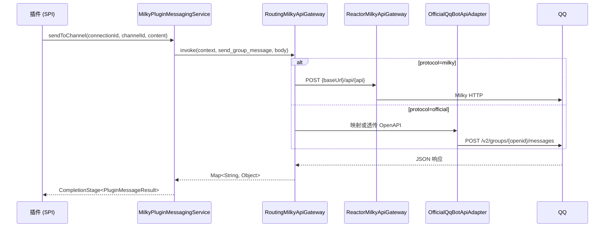
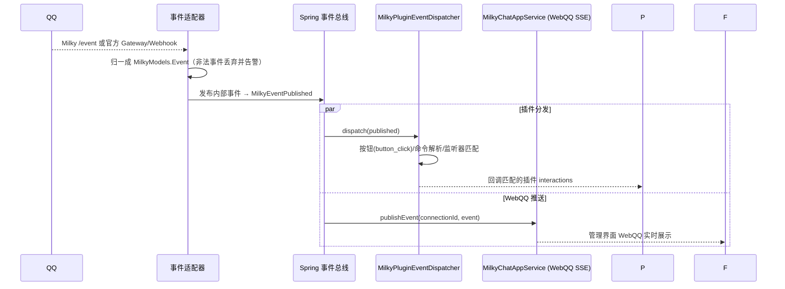

# QQ 机器人协议详解

宿主以「连接」为单位管理多个机器人实例。出站统一走 `MilkyApiGateway.invoke(context, api, body)`：共享方法名由传输适配器映射；官方 OpenAPI 路径可作为特异化入口透传。入站 Milky 走 WebSocket `/event`，官方走 Gateway 或 Webhook，归一成 `MilkyModels.Event` 后再进插件分发与 WebQQ。插件不直接接触协议细节，统一经 [MessagingSpi](/plugin/spi/v1/messaging) 收发消息。

> 源码依据：`yudream-infrastructure/src/main/java/online/yudream/base/infra/platform/milky/`（网关与凭据）、`.../milky/official/`（官方适配器）、`yudream-infrastructure/.../infra/platform/plugin/service/MilkyPluginMessagingService.java`（SPI 适配）、`yudream-interfaces/.../platform/milky/controller/`（管理端点）

## 连接模型

| 端点 | 说明 |
|---|---|
| `GET /api/platform/milky/connections` | 分页查询连接（支持 keyword） |
| `POST /api/platform/milky/connections` | 创建连接 |
| `PUT /api/platform/milky/connections/{id}` | 更新连接 |
| `POST /api/platform/milky/connections/{id}/enable` | 启用（启动事件 WebSocket 与发送通道） |
| `POST /api/platform/milky/connections/{id}/disable` | 停用（断开事件流，`MilkyRuntimeShutdownRequested` 触发清理） |
| `POST /api/platform/milky/connections/{id}/test` | 连通性测试 |

- 每个连接持有 `protocol`（`milky` 默认 / `official`）。Milky 连接保存平台地址与 Access Token；官方连接保存 AppID、AppSecret，默认 API 地址 `https://api.bot.qq.com`（沙箱 `https://sandbox.api.bot.qq.com`）。凭据经 `AesGcmMilkyCredentialCipher` AES-GCM 加密落库。新写入统一使用 `YUDREAM_CREDENTIAL_KEY`（Base64 解码后恰为 32 字节）及连接作用域 AAD，管理接口永不回传明文；旧 `YUDREAM_MILKY_CREDENTIAL_KEY`（16/24/32 字节）仅可解密历史密文。
- 能力描述符：能力码 `milky`，类型 `MESSAGING`，展示名 **QQ 消息平台**。项目闸门为 `PLATFORM_MILKY_ENABLED`（默认开启），应用层每次用例前经 `ensureEnabled("milky", "QQ 消息平台")` 二次校验。
- 官方 Webhook：`POST /api/public/qqbot/{connectionId}/webhook`。回调校验（op=13）返回 `plain_token` + Ed25519 `signature`；业务事件验签后归一发布。

## 出站：共享端口 + 协议适配

所有对端调用收敛在 `RoutingMilkyApiGateway.invoke(context, api, body)`：



- 共享方法名（双方走同一入口）：`get_login_info`、`get_group_list`、`get_friend_list`、`get_group_info`、`get_group_member_list`、`send_group_message`、`send_private_message`、`recall_group_message`、`upload_group_file`、`set_group_kick`、`set_group_ban`、`get_group_join_requests`、`set_group_add_request`。官方侧把这些名字映射到 OpenAPI；被动回复会自动附带最近的 `msg_id` / `event_id`。
- 特异化入口覆盖官方 sitemap 中全部 47 条 REST（消息、群管理、入群审批、菜单/面板、频道、网关）。方法名写成 `GET /v2/groups/{group_openid}/info` 这类路径即可，插件走 `PluginMessagingRawService.invoke`，WebQQ 原生工作台同样支持。
- 富文本（MARKDOWN / HTML）在消息渲染能力开启时先经 render-server 转图片再发送，结果中的 `rendered` / `degraded` 字段标记是否发生降级。
- 官方身份是 **openid**（`user_openid` / `group_openid` / `member_openid`），不能当成 QQ 号去查头像或做账号绑定。

## 入站：WebSocket / Gateway / Webhook

Milky 连接启用后走：

```
ws://{base-url}/event?access_token={token}
```

官方连接启用后走 Gateway（Hello / Identify / Heartbeat / Resume），也可把回调 URL 配到 `/api/public/qqbot/{connectionId}/webhook`。官方事件先归一：

| 官方事件 | 内部 eventType |
|---|---|
| `GROUP_AT_MESSAGE_CREATE` / `GROUP_MESSAGE_CREATE` / `C2C_MESSAGE_CREATE` | `message_receive` |
| `INTERACTION_CREATE` | `button_click` |
| `GROUP_ADD_ROBOT` / `GROUP_JOIN_REQUEST` | `group_request` |
| `GROUP_DEL_ROBOT` | `group_leave` |
| `GROUP_MEMBER_ADD` / `GROUP_MEMBER_REMOVE` | `group_member_increase` / `group_member_decrease` |
| `FRIEND_ADD` / `FRIEND_DEL` | `friend_add` / `friend_del` |
| `GROUP_MSG_REJECT` / `C2C_MSG_REJECT` | `message_reject` |
| 其他官方事件 | 保留 `t` 的小写名，`native_type` 仍为官方原名 |



关键处理逻辑（`MilkyPluginEventDispatcher`）：

- 仅 `message_receive`（或 `message`）类型进入消息管线；
- `button_click` 事件按按钮回调 ID 路由到注册的交互处理器；
- 文本消息先做**命令解析**（`/cmd args` 形态），命中菜单别名或插件注册命令后回调 `PluginCommandService`；未绑定系统用户时的行为受绑定策略约束。

::: warning ID 类型
`connectionId`、`channelId`、`userId`、`messageId` 等标识在后端为雪花 Long，但在 JSON / TS / URL 中一律是 `string`，禁止 `Number(id)`。
:::

## 沙盒调试

`QqSandboxController` + `QqSandboxRuntimeGatewayImpl` 提供**不入真群**的开发沙盒：模拟 `message_receive` 等事件注入完整分发管线（含随机丢消息模式），配合插件开发者工具的指令模拟器、端点测试器与用例保存/回放使用，详见 [插件开发者工具](/plugin/dev-tools)。

## 相关配置

| 配置 | 说明 |
|---|---|
| `PLATFORM_MILKY_ENABLED` | 项目闸门开关（默认 `true`） |
| `YUDREAM_CREDENTIAL_KEY` | 新写入的统一凭据主密钥（Base64 解码后恰为 32 字节） |
| `YUDREAM_MILKY_CREDENTIAL_KEY` | 仅解密历史 Milky 密文的回退密钥（Base64 解码后为 16/24/32 字节） |

## 与旧 Satori 协议的关系

历史版本通过 Satori v1 协议（HTTP/WebSocket/WebHook + 操作码帧）对接机器人，现已整体弃用并移除，相关文档（`docs/satori/protocol-v1-contract.md` 等）仅为历史存档。迁移要点：

- 协议入口从 Satori 连接切换为 Milky 连接；早期 Milky 密文可继续通过 `YUDREAM_MILKY_CREDENTIAL_KEY` 解密，但后续保存统一迁移到 `YUDREAM_CREDENTIAL_KEY`；
- 插件侧 API 不变：仍使用 `framework().messaging()` 平台无关端口与 `invoke()` 原生通道，无需改代码。
