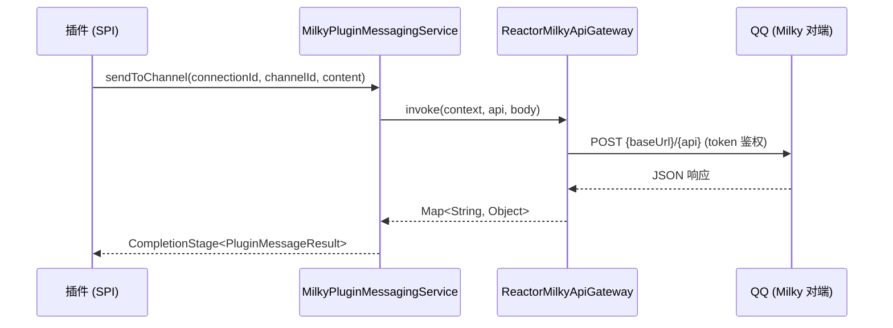
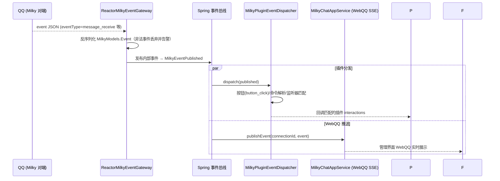

# Milky 协议详解

宿主通过 **Milky 协议**接入 QQ 机器人：以「连接」为单位管理多个机器人实例，出站走 HTTP API，入站走 WebSocket 事件长连。插件不直接接触协议细节，统一经 [MessagingSpi](/plugin/spi/v1/messaging) 收发消息。

> 源码依据：`yudream-infrastructure/src/main/java/online/yudream/base/infra/platform/milky/`（网关与凭据）、`yudream-infrastructure/.../infra/platform/plugin/service/MilkyPluginMessagingService.java`（SPI 适配）、`yudream-interfaces/.../platform/milky/controller/`（管理端点）

## 连接模型

| 端点 | 说明 |
|---|---|
| `GET /api/platform/milky/connections` | 分页查询连接（支持 keyword） |
| `POST /api/platform/milky/connections` | 创建连接 |
| `PUT /api/platform/milky/connections/{id}` | 更新连接 |
| `POST /api/platform/milky/connections/{id}/enable` | 启用（启动事件 WebSocket 与发送通道） |
| `POST /api/platform/milky/connections/{id}/disable` | 停用（断开事件流，`MilkyRuntimeShutdownRequested` 触发清理） |
| `POST /api/platform/milky/connections/{id}/test` | 连通性测试 |

- 每个连接持有平台地址（base URL）与访问 token；token 经 `AesGcmMilkyCredentialCipher` AES-GCM 加密落库。新写入统一使用 `YUDREAM_CREDENTIAL_KEY`（Base64 解码后恰为 32 字节）及连接作用域 AAD，管理接口永不回传明文；旧 `YUDREAM_MILKY_CREDENTIAL_KEY`（16/24/32 字节）仅可解密历史密文。
- 能力描述符：能力码 `milky`，类型 `MESSAGING`，项目闸门为 `PLATFORM_MILKY_ENABLED`（默认开启），应用层每次用例前经 `ensureEnabled(...)` 二次校验。

## 出站：HTTP API 调用

所有对端调用收敛在 `ReactorMilkyApiGateway.invoke(context, api, body)`：



- 典型 API：`get_group_list`（群组列表）、按 peer 发送消息等；富文本（MARKDOWN / HTML）在消息渲染能力开启时先经 render-server 转图片再发送，结果中的 `rendered` / `degraded` 字段标记是否发生降级；
- 插件需要未封装的对端方法时，走 `PluginMessagingRawService.invoke(connectionId, method, payload)` 直透调用（返回 `CompletionStage<Map<String,Object>>`），调用会同步记录到开发者工具沙盒时间线。

## 入站：WebSocket 事件流

连接启用后，`ReactorMilkyEventGateway.connect(...)` 以 WebSocket 长连消费对端事件：

```
ws://{base-url}/event?access_token={token}
```



关键处理逻辑（`MilkyPluginEventDispatcher`）：

- 仅 `message_receive`（或 `message`）类型进入消息管线；
- `button_click` 事件按按钮回调 ID 路由到注册的交互处理器；
- 文本消息先做**命令解析**（`/cmd args` 形态），命中菜单别名或插件注册命令后回调 `PluginCommandService`；未绑定系统用户时的行为受绑定策略约束。

::: warning ID 类型
`connectionId`、`channelId`、`userId`、`messageId` 等标识在后端为雪花 Long，但在 JSON / TS / URL 中一律是 `string`，禁止 `Number(id)`。
:::

## 沙盒调试

`QqSandboxController` + `QqSandboxRuntimeGatewayImpl` 提供**不入真群**的开发沙盒：模拟 `message_receive` 等事件注入完整分发管线（含随机丢消息模式），配合插件开发者工具的指令模拟器、端点测试器与用例保存/回放使用，详见 [插件开发者工具](/plugin/dev-tools)。

## 相关配置

| 配置 | 说明 |
|---|---|
| `PLATFORM_MILKY_ENABLED` | 项目闸门开关（默认 `true`） |
| `YUDREAM_CREDENTIAL_KEY` | 新写入的统一凭据主密钥（Base64 解码后恰为 32 字节） |
| `YUDREAM_MILKY_CREDENTIAL_KEY` | 仅解密历史 Milky 密文的回退密钥（Base64 解码后为 16/24/32 字节） |

## 与旧 Satori 协议的关系

历史版本通过 Satori v1 协议（HTTP/WebSocket/WebHook + 操作码帧）对接机器人，现已整体弃用并移除，相关文档（`docs/satori/protocol-v1-contract.md` 等）仅为历史存档。迁移要点：

- 协议入口从 Satori 连接切换为 Milky 连接；早期 Milky 密文可继续通过 `YUDREAM_MILKY_CREDENTIAL_KEY` 解密，但后续保存统一迁移到 `YUDREAM_CREDENTIAL_KEY`；
- 插件侧 API 不变：仍使用 `framework().messaging()` 平台无关端口与 `invoke()` 原生通道，无需改代码。
