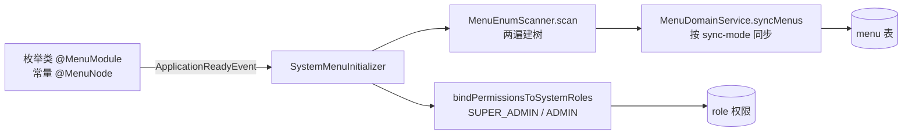

# 系统注解详解

宿主在 `yudream-domain` 中定义了一组运行时注解，分别服务于**方法级缓存**、**菜单种子声明**与**权限自动注册**三套机制。本页逐个给出作用、属性表、使用示例与运行期处理器源码位置，是 [独有工具与注解](/guide/tools-and-annotations) 概览页的深挖版。

> 说明：本页只覆盖宿主系统注解（`yudream-domain` 与 `yudream-application` 中全部 6 个 `@interface`）。插件 SPI 自带的注解（如 `@YuDreamPlugin`）属于另一套契约，见 [插件注解声明](/plugin/spi/v1/annotations)。

## 总览

| 注解 | 包 | 标注位置 | 触发时机 | 运行期处理器 |
| --- | --- | --- | --- | --- |
| `@Cache` | `domain.common.cache.anno` | 方法 | 方法调用前后 | `CacheAspect#aroundCache` |
| `@RefreshCache` | `domain.common.cache.anno` | 方法 | 方法成功返回后 | `CacheAspect#aroundRefreshCache` |
| `@DeleteCache` | `domain.common.cache.anno` | 方法 | 方法成功返回后 | `CacheAspect#aroundDeleteCache` |
| `@MenuModule` | `domain.system.menu.anno` | 枚举类 | 应用启动（`ApplicationReadyEvent`） | `MenuEnumScanner` + `SystemMenuInitializer` |
| `@MenuNode` | `domain.system.menu.anno` | 枚举常量 | 应用启动（同上） | 同上 |
| `@PermissionRegister` | `domain.system.security.anno` | 方法 | 应用启动（`ApplicationReadyEvent`） | `PermissionRegisterBootstrap` |

三个缓存注解共用同一个切面 `CacheAspect`（`yudream-infrastructure/src/main/java/online/yudream/base/infra/common/cache/aspect/CacheAspect.java`），总开关为 `yudream.cache.enabled`（默认 `true`，见 `yudream-infrastructure/.../infra/common/cache/prop/CacheProperties.java`）。

```mermaid
flowchart TB
    subgraph 注解定义 yudream-domain
        A["@Cache / @RefreshCache / @DeleteCache"]
        B["@MenuModule / @MenuNode"]
        C["@PermissionRegister"]
    end
    subgraph 运行期处理 yudream-infrastructure
        D[CacheAspect<br/>@Around 三个切点]
        E[MenuEnumScanner<br/>枚举 → Menu 领域树]
        F[SystemMenuInitializer<br/>同步菜单库 + 绑定角色权限]
        G[PermissionRegisterBootstrap<br/>扫描 Bean 方法 → 同步权限库]
    end
    A -->|方法调用| D
    B -->|启动时| E --> F
    C -->|启动时| G
```

## 方法级缓存三注解

源码目录：`yudream-domain/src/main/java/online/yudream/base/domain/common/cache/anno/`

三者共同约定：

- `key` 与 `condition` 均支持 SpEL，可引用方法参数（如 `#userId`）与返回值 `#result`；SpEL 解析由 `CacheKeySpelParser`（`yudream-infrastructure/.../infra/common/cache/aspect/CacheKeySpelParser.java`）完成。
- `key` 解析后含 `*` / `?` 通配符时：`@Cache` 读与 `@RefreshCache` 会跳过并 `log.warn`，仅 `@DeleteCache` 走 `RedisService.deleteByPattern(key)` 的 SCAN 批量删除。
- 所有写操作同时维护两级缓存：Redis（L2）与 Caffeine 本地缓存（L1，`LocalCacheManager`），删除时同步失效 L1（通配删除则 `invalidateAll()`）。
- 命中/未命中/写入/删除/布隆拦截均上报 `CacheMetricsService`，支持按前缀聚合指标。

### @Cache —— 读穿透缓存

执行前优先查缓存（L1 → L2），命中直接返回；未命中则执行方法并按条件写回。

| 属性 | 类型 | 默认值 | 说明 |
| --- | --- | --- | --- |
| `key` | `String` | 必填 | 缓存 Key，支持 SpEL，如 `"'user:info:' + #userId"` |
| `expire` | `long` | `300` | 过期秒数；`-1` 表示永不过期 |
| `condition` | `String` | `""` | 缓存条件 SpEL，为空或为 `true` 才缓存 |
| `cacheNull` | `boolean` | `false` | 是否缓存 null 值（防穿透） |
| `nullExpire` | `long` | `60` | null 值缓存过期秒数，仅 `cacheNull=true` 时生效 |
| `bloomFilter` | `String` | `""` | 布隆过滤器名，非空时未命中先查 `RedisBloomFilter.mightContain`，判定不存在直接返回 null |

切面执行顺序（`CacheAspect#aroundCache`）：总开关检查 → 解析 key → 通配符拦截 → L1/L2 读取（命中记 hit）→ 布隆过滤器拦截 → 执行方法 → `condition` 与 `cacheNull` 判定 → 写 Redis + L1 → 非空结果写入布隆过滤器。null 值以 `NullValue` 哨兵对象存储，读出时还原为 `null`。

```java
// 示例（注解 Javadoc 给出的典型形态）
@Cache(key = "'user:info:' + #userId", expire = 600, cacheNull = true, nullExpire = 30)
public UserDTO getUserInfo(String userId) { ... }
```

### @RefreshCache —— 写后刷新

方法**成功返回后**，用返回值覆盖指定 Key 的缓存（`result == null` 时直接跳过，不写缓存）。

| 属性 | 类型 | 默认值 | 说明 |
| --- | --- | --- | --- |
| `key` | `String` | 必填 | 缓存 Key，支持 SpEL，可用 `#result` 引用返回值 |
| `expire` | `long` | `300` | 过期秒数；`-1` 表示永不过期 |
| `condition` | `String` | `""` | 刷新条件 SpEL，为空或为 `true` 才刷新 |
| `async` | `boolean` | `false` | 异步刷新；开启后经 `cacheRefreshExecutor` 后台写缓存，提交失败仅 `log.error`，不影响方法返回 |

```java
// 示例（注解 Javadoc 给出的典型形态）
@RefreshCache(key = "'user:info:' + #result.id", async = true)
public UserDTO updateUser(UserUpdateCmd cmd) { ... }
```

### @DeleteCache —— 写后失效

方法成功返回后删除指定 Key；Key 含通配符时 SCAN 批量删除并清空全部 L1。

| 属性 | 类型 | 默认值 | 说明 |
| --- | --- | --- | --- |
| `key` | `String` | 必填 | 缓存 Key，支持 SpEL 与 `*` / `?` 通配符 |
| `condition` | `String` | `""` | 删除条件 SpEL，为空或为 `true` 才删除 |

```java
// 示例（注解 Javadoc 给出的典型形态）
@DeleteCache(key = "'user:info:' + #userId")
public void deleteUser(String userId) { ... }

@DeleteCache(key = "'user:dept:' + #deptId + ':*'")
public void rebuildDept(String deptId) { ... }
```

> 现状说明：截至当前源码，三个缓存注解尚无业务方法实际标注（全仓 grep 仅 `CacheAspect` 自身日志引用），以上示例来自注解 Javadoc 与切面行为推演。接入新业务时按上述语义使用即可，无需额外注册——切面已由 `@Aspect @Component` 自动生效。

## 菜单种子注解：@MenuModule / @MenuNode

源码：`yudream-domain/src/main/java/online/yudream/base/domain/system/menu/anno/MenuModule.java`、`MenuNode.java`

菜单不写在数据库迁移脚本里，而是声明在**枚举**上：枚举类标 `@MenuModule`（一个前端主导航模块），枚举常量标 `@MenuNode`（菜单或按钮节点）。启动时 `SystemMenuInitializer`（`yudream-infrastructure/.../infra/system/menu/bootstrap/SystemMenuInitializer.java`）监听 `ApplicationReadyEvent`，调用 `MenuEnumScanner.scan(...)` 把枚举转成 `Menu` 领域对象树，再按 `yudream.system.seed.menu.sync-mode`（`INIT_EMPTY` / `MISSING_ONLY` / `OVERWRITE`）经 `MenuDomainService.syncMenus(...)` 同步入库，并把全部菜单权限绑定到 `SUPER_ADMIN` / `ADMIN` 系统角色。

### @MenuModule（标注在枚举类上）

| 属性 | 类型 | 默认值 | 说明 |
| --- | --- | --- | --- |
| `code` | `String` | 必填 | 模块唯一标识，同时是顶层菜单分组 code 与模块权限码 |
| `name` | `String` | 必填 | 模块名称，对应前端主导航标题 |
| `icon` | `String` | `""` | 图标，UnoCSS / Iconify 类名，如 `i-ri:settings-3-line` |
| `sort` | `int` | `0` | 排序权重，越大越靠前 |

### @MenuNode（标注在枚举常量上）

| 属性 | 类型 | 默认值 | 说明 |
| --- | --- | --- | --- |
| `code` | `String` | 必填 | 节点唯一标识，默认同时作为权限码 |
| `name` | `String` | 必填 | 菜单/按钮名称 |
| `type` | `MenuNodeType` | `MENU` | `CATEGORY` 分组 / `LAYOUT` 布局 / `MENU` 页面 / `LINK` 外链 / `BUTTON` 按钮权限 |
| `parentClass` | `Class<?>` | `Object.class` | 父节点所在枚举类，默认当前枚举类；跨模块挂载时指向其他枚举 |
| `parentName` | `String` | `""` | 父节点常量名，为空表示挂在模块根下 |
| `parentCode` | `String` | `""` | 父节点 code 兜底，仅当 parentClass/parentName 解析失败时使用 |
| `module` | `String` | `""` | 所属模块 code，可覆盖枚举类上的 `@MenuModule` |
| `icon` | `String` | `""` | 节点图标 |
| `path` | `String` | `""` | 路由路径，对 CATEGORY/MENU 有效 |
| `component` | `String` | `""` | 前端组件路径（相对 `src/views/`）；`Layout` 表示布局组件，对 MENU 有效 |
| `link` | `String` | `""` | 外链地址，对 LINK 有效 |
| `sort` | `int` | `0` | 排序权重，越大越靠前 |
| `visible` | `boolean` | `true` | 是否在导航显示；隐藏节点仍生成路由并参与权限控制 |
| `permission` | `String` | `""` | 显式权限码，为空时继承 `code` |

扫描器 `MenuEnumScanner`（`yudream-infrastructure/.../infra/system/menu/scanner/MenuEnumScanner.java`）两遍构建：第一遍为每个常量创建 `Menu` 节点，第二遍按 `parentClass + parentName`（优先）或 `parentCode`（兜底）解析父 code 并挂树；解析不到父节点时降级挂到模块根下。权限码取 `permission()`，为空取 `code()`。

真实用例（`yudream-infrastructure/src/main/java/online/yudream/base/infra/system/menu/enumerate/SystemMenuModule.java`）：

```java
@MenuModule(code = "system", name = "系统管理", icon = "i-ri:settings-3-line", sort = 1)
public enum SystemMenuModule {

    @MenuNode(code = "system:personnel", name = "人员管理", type = MenuNodeType.LAYOUT,
            path = "/system/personnel", component = "Layout", icon = "i-ri:team-line", sort = 40)
    PERSONNEL,

    @MenuNode(code = "system:user", name = "用户管理", type = MenuNodeType.MENU,
            parentName = "PERSONNEL", path = "/system/user", component = "system/user/index.vue",
            icon = "i-ri:user-settings-line", sort = 30)
    USER,

    @MenuNode(code = "system:user:create", name = "新增用户", type = MenuNodeType.BUTTON,
            parentName = "USER", permission = "system:user:create")
    USER_CREATE,
    // ...
}
```

当前宿主注册的模块枚举共三个（见 `SystemMenuInitializer`）：`SystemMenuModule`、`PlatformMenuModule`、`ChatMenuModule`（`infra.platform.menu.enumerate`）。



## 权限注册注解：@PermissionRegister

源码：`yudream-domain/src/main/java/online/yudream/base/domain/system/security/anno/PermissionRegister.java`

标注在 Controller/Service 方法上，应用启动完成后由 `PermissionRegisterBootstrap`（`yudream-infrastructure/.../infra/system/security/bootstrap/PermissionRegisterBootstrap.java`）扫描全部 Spring Bean 的方法（含 CGLIB 代理类还原），把权限元数据同步到数据库，无需手工维护权限种子数据。

与 Sa-Token 的 `@SaCheckPermission` 配合，绑定规则：

| 方法标注情况 | 注册行为 |
| --- | --- |
| 仅 `@SaCheckPermission` | 以 value 中的权限码自动注册，name 取权限码、module 取 `default` |
| 两者皆有，`code` 非空 | 以 `@PermissionRegister` 的 code/name/module/desc 注册 |
| 两者皆有，`code` 为空 | code 继承 `@SaCheckPermission` 的权限码，name/module/desc 以 `@PermissionRegister` 为准 |
| 两者皆无 | 跳过 |

| 属性 | 类型 | 默认值 | 说明 |
| --- | --- | --- | --- |
| `code` | `String` | `""` | 唯一编码（如 `user:create`）；为空时自动从同方法 `@SaCheckPermission` 取值，避免重复定义 |
| `name` | `String` | 必填 | 展示名称 |
| `module` | `String` | 必填 | 所属模块（如「系统管理」「平台能力」） |
| `desc` | `String` | `""` | 描述 |

真实用例（`yudream-interfaces/src/main/java/online/yudream/base/interfaces/platform/agent/controller/AgentController.java`）：

```java
@PermissionRegister(code = "platform:agent:publish", name = "发布 Agent 应用",
        module = "平台能力", desc = "发布 Agent 应用")
@SaCheckPermission("platform:agent:publish")
@PostMapping("/{code}/publish")
public Result<Void> publish(@PathVariable String code) { ... }
```

扫描结果以 `PermissionMeta(code, name, module, desc)` 集合交给 `PermissionDomainService.syncPermissions(...)` 做增量同步。

## 使用约定与注意事项

- **权限码与菜单 code 全程字符串**：`code` / `permission` / `parentCode` 都是 `String`，不存在数值精度问题；但菜单、角色、用户等实体的主键是 Snowflake `Long`，在 JSON、TS 模型、URL 参数中一律使用 `string`，禁止 `Number(id)`（全局序列化由 `JacksonConfig` 保证，详见 [通用工具](/reference/toolkit#长-id-序列化-jacksonconfig)）。
- 缓存注解的 SpEL 参数名依赖编译期 `-parameters`，重命名方法参数会静默改变缓存 Key，需同步评估线上缓存。
- `@Cache` 的 Key 不要设计成含通配符的形式（读路径会跳过）；通配符只用于 `@DeleteCache` 的批量失效。
- 新增菜单枚举常量后，开发期可用 `OVERWRITE` 模式强制覆盖，生产保持 `MISSING_ONLY`；按钮节点的 `permission` 应与对应接口的 `@PermissionRegister` / `@SaCheckPermission` 权限码一致。
- `@PermissionRegister` 的 `name`/`module` 是必填项，漏写会在启动扫描时以默认值兜底（name=code、module=default），导致权限管理界面可读性差。

## 源码引用

- `yudream-domain/src/main/java/online/yudream/base/domain/common/cache/anno/Cache.java`
- `yudream-domain/src/main/java/online/yudream/base/domain/common/cache/anno/RefreshCache.java`
- `yudream-domain/src/main/java/online/yudream/base/domain/common/cache/anno/DeleteCache.java`
- `yudream-domain/src/main/java/online/yudream/base/domain/system/menu/anno/MenuModule.java`
- `yudream-domain/src/main/java/online/yudream/base/domain/system/menu/anno/MenuNode.java`
- `yudream-domain/src/main/java/online/yudream/base/domain/system/security/anno/PermissionRegister.java`
- `yudream-infrastructure/src/main/java/online/yudream/base/infra/common/cache/aspect/CacheAspect.java`
- `yudream-infrastructure/src/main/java/online/yudream/base/infra/common/cache/prop/CacheProperties.java`
- `yudream-infrastructure/src/main/java/online/yudream/base/infra/system/menu/scanner/MenuEnumScanner.java`
- `yudream-infrastructure/src/main/java/online/yudream/base/infra/system/menu/bootstrap/SystemMenuInitializer.java`
- `yudream-infrastructure/src/main/java/online/yudream/base/infra/system/menu/enumerate/SystemMenuModule.java`
- `yudream-infrastructure/src/main/java/online/yudream/base/infra/system/security/bootstrap/PermissionRegisterBootstrap.java`
- `yudream-interfaces/src/main/java/online/yudream/base/interfaces/platform/agent/controller/AgentController.java`
