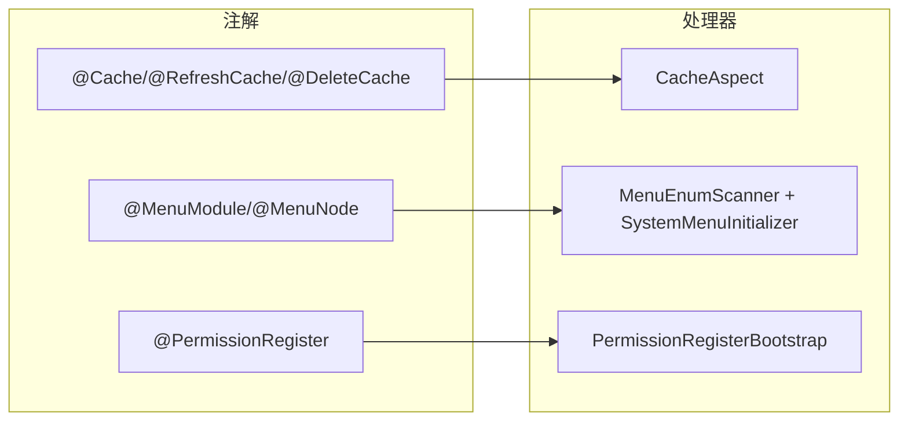

# 参考索引

本分区是宿主框架公共设施的**逐项参考手册**：每个主题对应一组真实源码，给出字段/属性表、方法签名与可直接对照的源码位置。与 [独有工具与注解](/guide/tools-and-annotations)（概览索引）、[插件 SPI v1 文档](/plugin/spi/v1/)（面向插件的稳定契约）分工不同——本区聚焦**宿主内部实现细节**，供二次开发与排查问题时查阅。

## 文档清单

| 页面 | 内容 | 主要源码位置 |
| --- | --- | --- |
| [通用工具与支撑组件](/reference/toolkit) | `Result<T>` / `ResultCode` 统一响应、长 ID 的 Jackson 序列化定制、`PageBaseRequest` 分页基类、EasyExcel 支撑 `ExcelHttpSupport` 与前端 `src/utils/excel.ts`、请求日志链 | `yudream-interfaces/.../interfaces/common/*` |
| [系统注解详解](/reference/annotations) | `@Cache` / `@RefreshCache` / `@DeleteCache` 方法级缓存三注解、`@MenuModule` / `@MenuNode` 菜单种子注解、`@PermissionRegister` 权限注册注解，及其运行期切面/扫描器 | `yudream-domain/.../domain/**/anno`、`yudream-infrastructure/.../aspect|bootstrap|scanner` |

## 各页速览

### 通用工具与支撑组件（toolkit）

- **统一响应**：所有 Controller 返回 `Result<T>`，前端按 `code` 判成败；静态工厂 `ok()` / `fail(ResultCode)` / `fail(int, String)`。注意 `Result.fail(String)` 固定得到 `code=1000`，需要语义化错误码时改用枚举或自定义 code。
- **长 ID 序列化**：`JacksonConfig` 为 `Long` / `long` 注册 `ToStringSerializer`，雪花 ID 在 JSON 中一律输出字符串。由此派生硬规则：TS 模型 ID 字段声明为 `string`，禁止 `Number(id)`；URL 路径与查询参数直接拼接字符串；反向（前端传字符串、后端收 `Long`）由 Jackson 自动完成。
- **分页基类**：`PageBaseRequest` 提供 `page`（默认 1）与 `size`（默认 10、上限 100）及中文校验文案；导出等大数据量场景由后端服务端自行放大上限。
- **Excel 三件套**：导出 / 模板 / 导入经 `ExcelHttpSupport.write` / `writeDynamic` / `importRows`，行映射放接口 assembler，Controller 保持瘦结构；前端用 `saveExcelResponse` + blob 导出，导入结果用 `importResultMessage` 提示。
- **请求日志链**：`ContentCachingRequestFilter` → `WebInvokeTimeInterceptor`（敏感键脱敏、body 截断、落库 `ApiLogDTO`）→ `WebLogConfigure` 注册，开关与前缀由 `yudream.web.log.*` 控制。

### 系统注解详解（annotations）

宿主系统注解全部定义在 `yudream-domain`（共 6 个 `@interface`），运行期处理器在 `yudream-infrastructure`：

- **缓存三注解**：SpEL Key/condition，两级缓存（Redis L2 + Caffeine L1），支持 null 值防穿透与布隆过滤器拦截；总开关 `yudream.cache.enabled`。读路径 Key 含通配符会被跳过，通配符只用于 `@DeleteCache` 批量失效。
- **菜单种子注解**：菜单声明在枚举上而非迁移脚本，启动时按 `yudream.system.seed.menu.sync-mode` 同步入库并绑定系统角色权限；按钮节点的 `permission` 应与接口侧权限码一致。
- **权限注册注解**：与 Sa-Token `@SaCheckPermission` 配合，启动时自动扫描 Bean 方法并同步权限库；`code()` 为空时自动继承 `@SaCheckPermission` 的值，避免重复定义。

## 相关配置项速查

以下配置项在两篇参考文档中均有上下文说明，此处集中列出便于检索：

| 配置项 | 默认值 | 说明 | 详见 |
| --- | --- | --- | --- |
| `yudream.cache.enabled` | `true` | 方法级缓存注解总开关，关闭后三个注解全部直通 | [系统注解详解](/reference/annotations#方法级缓存三注解) |
| `snowflake.data-center-id` / `machine-id` | - | 雪花 ID 生成参数；ID 跨 JSON/前端边界一律 string | [通用工具](/reference/toolkit#长-id-序列化-jacksonconfig) |
| `yudream.web.log.enabled` | `true` | 请求耗时日志与 API 审计入库开关 | [通用工具](/reference/toolkit#请求日志链) |
| `yudream.web.log.prefix` | `YuDreamAdmin` | 日志行前缀 | 同上 |
| `yudream.system.seed.menu.sync-mode` | - | `INIT_EMPTY` / `MISSING_ONLY`（生产推荐）/ `OVERWRITE`（开发期） | [系统注解详解](/reference/annotations#菜单种子注解menumodule-menunode) |

## 常见排查入口

- **前端拿到的 ID 与库中不一致 / 详情串号**：几乎都是某处把字符串 ID 转成了数值（`Number(id)`、`+id`），精度丢失导致。全局序列化已保证 JSON 输出为 string，检查 TS 模型字段类型是否为 `number` 即可定位，见 [长 ID 序列化](/reference/toolkit#长-id-序列化-jacksonconfig)。
- **新写的菜单/按钮没出现在导航**：确认枚举类标了 `@MenuModule` 且被加入 `SystemMenuInitializer` 的模块列表；父子关系靠 `parentName` 引用常量名，常量改名后需同步；生产模式 `MISSING_ONLY` 不会更新已存在编码的记录，开发期可临时用 `OVERWRITE`。
- **接口 403 但权限管理界面里找不到该权限码**：检查方法是否漏写 `@PermissionRegister` 或 `@SaCheckPermission`——两者皆无时启动扫描会跳过，权限不会入库。
- **缓存疑似不生效**：确认 `yudream.cache.enabled=true`；Key 含通配符的读路径会被跳过并打 warn 日志（`@Cache key contains wildcard`）；SpEL 参数名改动也会静默改变 Key。

## 宿主系统注解速查表

六张「名片」先给结论，逐属性详解见 [系统注解详解](/reference/annotations)：

| 注解 | 一句话作用 | 标注位置 | 关键属性 | 处理器 |
| --- | --- | --- | --- | --- |
| `@Cache` | 先查缓存（L1→L2），未命中执行方法并写回 | 方法 | `key`、`expire=300`、`cacheNull`、`bloomFilter` | `CacheAspect#aroundCache` |
| `@RefreshCache` | 方法成功后用返回值覆盖缓存，可异步 | 方法 | `key`、`expire=300`、`async=false`、`condition` | `CacheAspect#aroundRefreshCache` |
| `@DeleteCache` | 方法成功后删缓存，Key 可带通配符 SCAN 批量删 | 方法 | `key`、`condition` | `CacheAspect#aroundDeleteCache` |
| `@MenuModule` | 枚举类 → 前端主导航模块 | 枚举类 | `code`、`name`、`icon`、`sort` | `MenuEnumScanner` / `SystemMenuInitializer` |
| `@MenuNode` | 枚举常量 → 菜单/按钮节点（含路由与权限码） | 枚举常量 | `code`、`name`、`type`、`parentName`、`permission` 等 15 项 | 同上 |
| `@PermissionRegister` | 启动时把方法权限元数据自动同步入库 | 方法 | `code`（可省）、`name`、`module`、`desc` | `PermissionRegisterBootstrap` |

## 本分区维护约定

- 新增参考页时在本页「文档清单」表加一行，并在「各页速览」补对应小节，保持索引与正文同步。
- 参考页内容以源码为准：类/字段/配置项的默认值必须从源文件核对，不凭记忆书写；示例优先摘自真实业务代码。
- 涉及行为变化的后端改动（如缓存语义、菜单同步模式、权限绑定规则）应同步更新对应参考页，避免文档漂移。

## 与其他文档的边界

- [独有工具与注解](/guide/tools-and-annotations)：框架独创机制的**概览索引**（DevTools 面板、ESLint 规则、Agent 追踪等），本区是其部分条目的深挖实现参考。
- [插件注解声明](/plugin/spi/v1/annotations)：插件 SPI 契约自带的注解（`@YuDreamPlugin` 等），与本区的宿主系统注解是两套体系；插件开发入口见 [插件总览](/plugin/overview)。
- [平台能力](/guide/platform-capabilities)、[架构总览](/guide/architecture)：分层与能力闸门的宏观说明。
- 前端共享组件（`Fa*` / `Yd*`）的逐个 API 参考见 [组件文档](/components/)。

## 阅读约定

- 所有页面为简体中文，代码、路径、API 名保留英文原样。
- 每个条目标注相对仓库根的源码路径，示例优先取自真实业务代码；取自 Javadoc 或推演的示例会显式注明。
- 架构与流程使用 mermaid 图辅助理解，图中的模块名与类名均可在标注的源码路径下找到对应实现。
- 涉及实体主键（Snowflake `Long`）处统一强调：JSON、TS 模型、表单与 URL 参数中一律使用 `string`，禁止 `Number(id)`。
