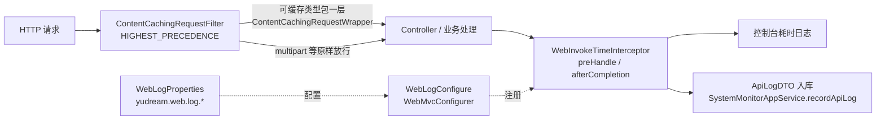

# 通用工具与支撑组件

本篇汇总宿主接口层的通用基础设施：统一响应包装 `Result<T>` / `ResultCode`、长 ID 的 Jackson 序列化定制、Excel 导入导出支撑 `ExcelHttpSupport` 与前端 `src/utils/excel.ts`、分页基类 `PageBaseRequest`，以及请求日志链（`ContentCachingRequestFilter` → `WebInvokeTimeInterceptor` → `WebLogConfigure`）。

## 统一响应 Result\<T\>

所有 Controller 的返回值统一包装为 `Result<T>`，前端按 `code` 判断成败。

源码：`yudream-interfaces/src/main/java/online/yudream/base/interfaces/common/Result.java`

### 字段

| 字段 | 类型 | 说明 |
| --- | --- | --- |
| `code` | `Integer` | 业务状态码，取值见 `ResultCode` |
| `message` | `String` | 提示文案 |
| `data` | `T` | 业务数据，失败时通常为 `null` |
| `timestamp` | `Long` | 响应时间戳（毫秒），由无参构造自动填充 `System.currentTimeMillis()` |

注意 `timestamp` 是 `Long`，经全局 Jackson 定制（见下文「长 ID 序列化」）在 JSON 中同样输出为字符串。

### 静态工厂

| 方法签名 | 行为 |
| --- | --- |
| `static <T> Result<T> ok()` | 等价 `ok(null)`，`code=200`、`message=操作成功` |
| `static <T> Result<T> ok(T data)` | 成功响应，`code=200`、`message=操作成功`，携带 `data` |
| `static <T> Result<T> fail(ResultCode resultCode)` | 用枚举的 code/message 构造失败响应 |
| `static <T> Result<T> fail(int code, String message)` | 自定义 code 与文案的失败响应 |
| `static <T> Result<T> fail(String message)` | 以 `ResultCode.BIZ_ERROR`（code=1000）为码的失败响应 |

### ResultCode 枚举

源码：`yudream-interfaces/src/main/java/online/yudream/base/interfaces/common/ResultCode.java`

| 枚举值 | code | message |
| --- | --- | --- |
| `SUCCESS` | 200 | 操作成功 |
| `BAD_REQUEST` | 400 | 请求参数错误 |
| `UNAUTHORIZED` | 401 | 未登录或登录已过期 |
| `FORBIDDEN` | 403 | 无权限访问 |
| `NOT_FOUND` | 404 | 资源不存在 |
| `INTERNAL_ERROR` | 500 | 系统内部错误 |
| `BIZ_ERROR` | 1000 | 业务异常 |
| `USER_ALREADY_EXISTS` | 1001 | 用户已存在 |

真实用法示例（`SystemExcelController#importUsers`）：

```java
@PostMapping("/users/import")
public Result<ExcelImportResultRes> importUsers(@RequestParam("file") MultipartFile file) throws IOException {
    return Result.ok(ExcelHttpSupport.importRows(file, UserExcelRow.class,
            row -> userManageAppService.create(SystemExcelAssembler.toUserCreateCmd(row))));
}
```

## 长 ID 序列化（JacksonConfig）

源码：`yudream-interfaces/src/main/java/online/yudream/base/interfaces/common/config/JacksonConfig.java`

```java
@Configuration
public class JacksonConfig {

    @Bean
    public Jackson2ObjectMapperBuilderCustomizer longToStringCustomizer() {
        return builder -> builder
                .serializerByType(Long.class, ToStringSerializer.instance)
                .serializerByType(Long.TYPE, ToStringSerializer.instance);
    }
}
```

### 为什么要把 Long 序列化为字符串

系统主键使用雪花算法（Snowflake）生成的 64 位 `Long`，其值会超过 JavaScript `Number.MAX_SAFE_INTEGER`（2^53 - 1 = 9007199254740991）。如果按 JSON number 输出，前端 `JSON.parse` 后精度丢失，拿到的 ID 与数据库不一致，导致详情、编辑、删除等操作全部串号。

`longToStringCustomizer` 为 `Long.class` 与 `long` 原始类型都注册了 `ToStringSerializer`，因此**所有**经 Spring MVC 序列化的 `Long`（包括主键、外键、`Result.timestamp`）在 JSON 中一律输出为字符串，例如 `{"id": "1928347561029384756"}`。

### 前端注意事项（硬性规则）

- TS 模型中所有 ID 字段声明为 `string`，禁止 `number`。
- 禁止 `Number(id)`、`+id` 之类把字符串 ID 转回数值的操作；需要比较时用字符串全等或 `BigInt`。
- URL 路径与查询参数（`/api/system/users/${id}`、`?deptId=...`）直接拼接字符串即可，无需转换。
- 表单、路由参数、插件 DTO 同样全程字符串。这一约束同时适用于插件开发，见插件 SPI 文档。
- 反向（前端提交字符串 ID，后端用 `Long` 接收）由 Jackson 自动反序列化完成，无需额外处理。

## 分页基类 PageBaseRequest

源码：`yudream-interfaces/src/main/java/online/yudream/base/interfaces/common/request/PageBaseRequest.java`

分页查询请求统一继承 `PageBaseRequest`：

| 字段 | 类型 | 默认值 | 校验 |
| --- | --- | --- | --- |
| `page` | `int` | `1` | `@Min(1, message = "页码必须大于0")` |
| `size` | `int` | `10` | `@Min(1)`、`@Max(100, message = "每条页数不能大于100")` |

用法：业务分页 Query（如 `UserPageQuery`）直接 `extends PageBaseRequest` 并追加业务过滤字段，Controller 入参配合 `@Validated` 即获得页码边界校验。单页上限硬约束为 100 条，导出等大数据量场景由后端在服务端自行放大（如 `SystemExcelController` 的 `EXPORT_LIMIT = 10_000`），不开放给前端。

## Excel 导入导出：ExcelHttpSupport

源码：`yudream-interfaces/src/main/java/online/yudream/base/interfaces/system/excel/support/ExcelHttpSupport.java`

基于 EasyExcel 的 HTTP 读写支撑类（`final`，全静态方法），统一处理响应头与 UTF-8 文件名编码。三个方法的响应/请求处理细节：

- 导出响应头固定为 `Content-Type: application/vnd.openxmlformats-officedocument.spreadsheetml.sheet`，文件名经 `URLEncoder` UTF-8 编码后以 `Content-Disposition: attachment; filename*=UTF-8''<encoded>.xlsx` 下发；
- EasyExcel 写出时 `autoCloseStream(false)`，把流关闭交还给 Servlet 容器；
- `rows` / `head` 传 `null` 时安全降级为空列表。

### 方法签名

```java
public static <T> void write(HttpServletResponse response, String filename, String sheetName,
                             Class<T> rowClass, List<T> rows) throws IOException

public static void writeDynamic(HttpServletResponse response, String filename, String sheetName,
                                List<List<String>> head, List<List<Object>> rows) throws IOException

public static <T> ExcelImportResultRes importRows(MultipartFile file, Class<T> rowClass,
                                                  Consumer<T> importer) throws IOException
```

### 参数说明

**`write`（注解映射导出）**

| 参数 | 类型 | 说明 |
| --- | --- | --- |
| `response` | `HttpServletResponse` | 当前响应，直接向其 `OutputStream` 写 xlsx |
| `filename` | `String` | 文件名（不含扩展名），自动追加 `.xlsx`，中文安全 |
| `sheetName` | `String` | 工作表名 |
| `rowClass` | `Class<T>` | EasyExcel 行类型，字段用 `@ExcelProperty` 标注表头 |
| `rows` | `List<T>` | 数据行，`null` 视为空表 |

**`writeDynamic`（动态表头导出）**

| 参数 | 类型 | 说明 |
| --- | --- | --- |
| `head` | `List<List<String>>` | 每个内层列表是一列表头（EasyExcel 动态 head 格式），`null` 视为空 |
| `rows` | `List<List<Object>>` | 每个内层列表是一行数据 |

**`importRows`（导入）**

| 参数 | 类型 | 说明 |
| --- | --- | --- |
| `file` | `MultipartFile` | 上传的 xlsx/xls 文件 |
| `rowClass` | `Class<T>` | 行类型 |
| `importer` | `Consumer<T>` | 逐行回调；抛异常即记为该行的失败原因 |

返回 `ExcelImportResultRes`（源码：`.../system/excel/res/ExcelImportResultRes.java`）：

| 字段 | 类型 | 说明 |
| --- | --- | --- |
| `total` | `int` | 解析到的总行数 |
| `success` | `int` | 成功行数 |
| `failed` | `int` | 失败行数 |
| `errors` | `List<String>` | 每行失败原因，格式 `第 N 行：<异常消息>`，N 为 Excel 实际行号（`i + 2`，跳过表头） |

### 分层归属规则（硬性）

- Controller **只做**：边界校验 → 调用应用 service 拿数据 → 经接口 assembler 转 Excel 行 → 调 `ExcelHttpSupport`。禁止在 Controller 里 `new XxxExcelRow`、拼表头、写业务不变量。
- `DTO/领域对象 <-> Excel 行` 的双向映射（`toUserRow` / `toUserCreateCmd` / `userTemplateRow` 等）一律放**接口 assembler**（如 `SystemExcelAssembler`）。
- 行类型（如 `UserExcelRow`）放接口层 `row` 包，只用 `@ExcelProperty` 声明表头，不含业务逻辑。

真实代码（`SystemExcelController`，导出/模板/导入三件套）：

```java
@GetMapping("/users/export")
public void exportUsers(UserPageQuery query, HttpServletResponse response) throws IOException {
    query.setPage(1);
    query.setSize(EXPORT_LIMIT);
    List<UserExcelRow> rows = userManageAppService.page(query).getRecords().stream()
            .map(SystemExcelAssembler::toUserRow)
            .toList();
    ExcelHttpSupport.write(response, "用户管理", "用户", UserExcelRow.class, rows);
}

@GetMapping("/users/template")
public void userTemplate(HttpServletResponse response) throws IOException {
    ExcelHttpSupport.write(response, "用户导入模板", "用户", UserExcelRow.class,
            List.of(SystemExcelAssembler.userTemplateRow()));
}

@PostMapping("/users/import")
public Result<ExcelImportResultRes> importUsers(@RequestParam("file") MultipartFile file) throws IOException {
    return Result.ok(ExcelHttpSupport.importRows(file, UserExcelRow.class,
            row -> userManageAppService.create(SystemExcelAssembler.toUserCreateCmd(row))));
}
```

行类型示例（`UserExcelRow`，字段即表头）：

```java
@Data
public class UserExcelRow {
    @ExcelProperty("用户ID")
    private Long id;
    @ExcelProperty("用户名")
    private String username;
    @ExcelProperty("部门ID")
    private String deptIds;
    // ...
}
```

### 前端配合：blob 导出与 src/utils/excel.ts

源码：`yudream-frontend/apps/core-arco-design-vue/src/utils/excel.ts`

导出接口返回二进制流，前端 API 层必须以 blob 方式接收（如 `@/api/modules/system-excel` 的 `exportExcel`/`templateExcel`），再用工具函数落盘：

| 导出符号 | 签名 | 说明 |
| --- | --- | --- |
| `ExcelImportResult` | `{ total, success, failed, errors: string[] }` | 导入结果的 TS 镜像 |
| `ExcelBlobResponse` | `{ data: Blob; headers: Record<string, string> }` | blob 响应包装 |
| `saveExcelResponse` | `(response: ExcelBlobResponse, fallbackName: string) => void` | 从 `content-disposition` 解析 `filename*=UTF-8''...`（兼容普通 `filename=`），创建 `<a download>` 触发下载并回收 ObjectURL；无响应头时用 `fallbackName` |
| `pickExcelFile` | `(onPick: (file: File) => void) => void` | 弹出文件选择框（`accept=".xlsx,.xls"`），选中后回调 |
| `excelForm` | `(file: File) => FormData` | 打包为 `multipart/form-data`，字段名固定 `file`（对应后端 `@RequestParam("file")`） |
| `importResultMessage` | `(result: ExcelImportResult) => string` | 生成 toast 文案；有失败时附前 3 条错误 |

页面侧真实用法（`src/views/system/user/index.vue`）：

```ts
import { excelForm, importResultMessage, pickExcelFile, saveExcelResponse } from '@/utils/excel'

async function exportUsers() {
  const res = await apiExcel.exportUsers({ keyword: search.keyword || undefined, /* ... */ })
  saveExcelResponse(res, '用户管理.xlsx')
}

function importUsers() {
  pickExcelFile(async (file) => {
    const res = await apiExcel.importUsers(excelForm(file))
    toast.success(importResultMessage(res.data))
    await loadUsers()
  })
}
```

## 请求日志链

一次请求经过的日志设施如下：



### ContentCachingRequestFilter

源码：`yudream-interfaces/src/main/java/online/yudream/base/interfaces/common/filter/ContentCachingRequestFilter.java`

- `@Component` + `@Order(Ordered.HIGHEST_PRECEDENCE)`，最先执行的过滤器。
- 仅当 `Content-Type` 为 `application/json`、`application/x-www-form-urlencoded` 或 `text/*`（含无 Content-Type 的请求）时，用 `ContentCachingRequestWrapper` 包装请求，让拦截器/日志能事后读取 body；其余（如 multipart 文件上传）原样放行，避免缓存大文件。

### WebInvokeTimeInterceptor

源码：`yudream-interfaces/src/main/java/online/yudream/base/interfaces/common/interceptor/WebInvokeTimeInterceptor.java`

- `preHandle`：记录起始时间到请求属性 `WEB_LOG_START_TIME`，打印 `[前缀] > start request`（含方法与 URL、query 参数）。
- `afterCompletion`：计算耗时，打印 `[前缀] < end request`（URL、params、body、cost ms），并调用 `SystemMonitorAppService.recordApiLog(...)` 落库一条 `ApiLogDTO`（method、path、query、requestBody、status、costMs、success、loginId、ip、userAgent、errorMessage）。
- 脱敏：query 与 body 先经 `maskSensitive`，正则覆盖 `token`、`authorization`、`cookie`、`password`、`secret`、`message`、`content`、`html`、`prompt` 等键（表单 `k=v` 与 JSON `"k":"v"` 两种形态），值替换为 `******`。
- 截断：入库 body 超过 2000 字符（`MAX_BODY_LENGTH`）截断。
- 特判：`/api/platform/agents/{code}/run`、`.../debug/stream` 的 body 以 `[Agent 运行载荷已省略]` 代替；`DELETE /api/system/monitor/api-logs`、`DELETE /api/system/monitor/login-logs`（清空日志操作本身）不落库。
- 客户端 IP 依次取 `X-Forwarded-For` 首段、`X-Real-IP`、`getRemoteAddr()`；登录人经 Sa-Token `StpUtil.getLoginIdDefaultNull()` 获取。
- 审计入库失败只 `log.warn`，不影响主流程。

### WebLogConfigure 与配置项

源码：`yudream-interfaces/src/main/java/online/yudream/base/interfaces/common/config/WebLogConfigure.java`、`.../config/WebLogProperties.java`

`WebLogConfigure` 实现 `WebMvcConfigurer`，在 `addInterceptors` 中把拦截器挂到 `/**`，排除 `/error`、`/static/**`、`/webjars/**`、`/favicon.ico`。开关与文案由 `yudream.web.log` 前缀的配置属性控制：

| 配置项 | 默认值 | 说明 |
| --- | --- | --- |
| `yudream.web.log.enabled` | `true` | 是否启用请求耗时日志；为 `false` 时不注册拦截器 |
| `yudream.web.log.prefix` | `YuDreamAdmin` | 日志行前缀，显示为 `[前缀]` |

## 注意事项

- `Result.fail(String)` 只会得到 `code=1000`；需要语义化错误码时用 `fail(ResultCode)` 或 `fail(int, String)`。
- 长 ID 全程字符串：后端已保证 JSON 输出为 string，前端与插件侧禁止 `Number(id)`。
- 新增 Excel 导入导出功能时，行映射与模板行构造放接口 assembler，Controller 保持「三件套」瘦结构；新增 `v-auth` 按钮别忘了同步菜单种子权限枚举。
- 请求日志默认全量开启，生产环境如不关心可设 `yudream.web.log.enabled=false`；脱敏正则已覆盖常见敏感键，但新增含敏感信息的字段时应评估是否需要扩展 `SENSITIVE_*_PATTERN`。

## 源码引用

- `yudream-interfaces/src/main/java/online/yudream/base/interfaces/common/Result.java`
- `yudream-interfaces/src/main/java/online/yudream/base/interfaces/common/ResultCode.java`
- `yudream-interfaces/src/main/java/online/yudream/base/interfaces/common/config/JacksonConfig.java`
- `yudream-interfaces/src/main/java/online/yudream/base/interfaces/common/request/PageBaseRequest.java`
- `yudream-interfaces/src/main/java/online/yudream/base/interfaces/system/excel/support/ExcelHttpSupport.java`
- `yudream-interfaces/src/main/java/online/yudream/base/interfaces/system/excel/res/ExcelImportResultRes.java`
- `yudream-interfaces/src/main/java/online/yudream/base/interfaces/system/excel/controller/SystemExcelController.java`
- `yudream-interfaces/src/main/java/online/yudream/base/interfaces/system/excel/row/UserExcelRow.java`
- `yudream-interfaces/src/main/java/online/yudream/base/interfaces/common/filter/ContentCachingRequestFilter.java`
- `yudream-interfaces/src/main/java/online/yudream/base/interfaces/common/interceptor/WebInvokeTimeInterceptor.java`
- `yudream-interfaces/src/main/java/online/yudream/base/interfaces/common/config/WebLogConfigure.java`、`WebLogProperties.java`
- `yudream-frontend/apps/core-arco-design-vue/src/utils/excel.ts`
