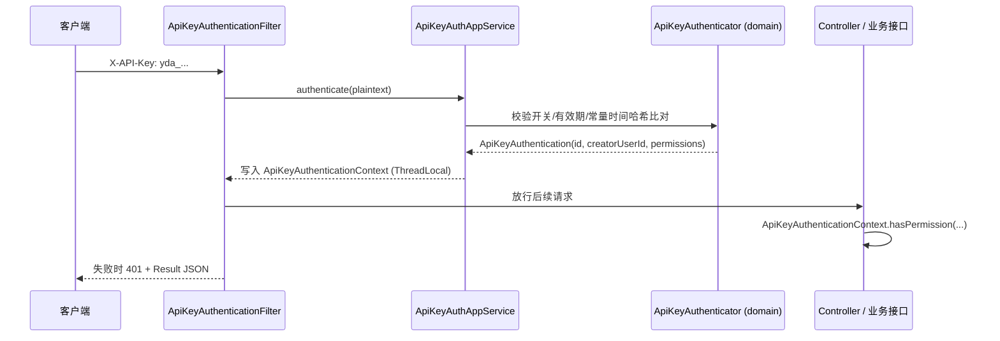

# API Key 认证

API Key 是面向服务端/脚本调用的一类凭证：由用户自助创建、携带权限范围（PermissionScope）、可设置过期时间，请求时通过 `X-API-Key` 请求头（或 `Authorization: Bearer yda_...`）携带，由过滤器完成认证并注入权限上下文。

> 源码：
> - `yudream-interfaces/src/main/java/online/yudream/base/interfaces/system/security/controller/UserApiKeyController.java`
> - `yudream-interfaces/.../system/security/filter/ApiKeyAuthenticationFilter.java`
> - `yudream-application/.../system/security/service/ApiSecurityAppService.java`、`ApiKeyAuthAppService.java`
> - `yudream-domain/.../system/security/service/ApiKeyAuthenticator.java`、`aggregate/ApiKeyCredential.java`

---

## 总体流程



## 密钥格式与存储

- 明文格式：`yda_` 前缀 + `32` 字节 `SecureRandom` 随机数的十六进制串（见 `ApiSecurityAppService.generatePlaintext()`），仅在创建响应中返回**一次**。
- 落库不存明文：存储 `prefix`（明文前 12 位，用于检索）+ SHA-256 哈希（`ApiKeySecretHasher.hash`）+ 掩码展示串；认证时按前缀查出候选凭据再做哈希常量时间比对（`MessageDigest.isEqual`）。
- 凭据聚合 `ApiKeyCredential` 维护状态与过期时间，`revoke()` 吊销后不可恢复。

## 端点一览

### 用户自助（需登录）

`UserApiKeyController`，挂载 `/api/user/me/api-keys`：

| 方法 | 路径 | 说明 |
|---|---|---|
| GET | `/api/user/me/api-keys` | 分页查询自己创建的 API Key（`keyword`/`page`/`size`） |
| POST | `/api/user/me/api-keys` | 创建 API Key，返回凭据信息 + **一次性明文** |
| POST | `/api/user/me/api-keys/{id}/revoke` | 吊销自己创建的 Key |

创建请求体（`ApiKeyCreateRequest`）：`name`、`permissions`（权限编码列表）、`expireTime`（可选）。响应 `ApiKeyCreateResultRes` 中 `plaintext` 仅此一次返回，请立即妥善保存。

### 管理端

管理端策略与凭据管理挂在 `/api/system/security`（`ApiSecurityController` / `OAuthPasskeyController`），可分页查看全部 Key 并吊销。

## 使用示例

```bash
# 方式一：专用请求头
curl -H "X-API-Key: yda_3f9a..." https://example.com/api/open/wiki/wiki-docs/search \
     -H "Content-Type: application/json" \
     -d '{"query": "部署指南", "topK": 5}'

# 方式二：Bearer（仅当 token 以 yda_ 开头时才按 API Key 处理）
curl -H "Authorization: Bearer yda_3f9a..." https://example.com/api/user/me/api-keys
```

过滤器解析规则（`ApiKeyAuthenticationFilter.resolveApiKey`）：

1. 优先读取 `X-API-Key` 请求头；
2. 否则读取 `Authorization: Bearer <token>`，且仅当 token 以 `yda_` 开头才视为 API Key——普通登录 JWT 与 API Key 互不干扰；
3. 未携带任何 Key 时直接放行，走正常登录态链路；
4. 认证失败返回 HTTP 401 与标准 `Result` JSON；无论成败，请求结束都会 `clear()` ThreadLocal，避免线程复用泄漏。

## 权限范围

- 创建时传入的权限编码必须是系统中已注册的权限（`PermissionRepo.findActive()` 校验），否则报"包含未注册权限"。
- 创建者只能授予自己拥有的权限；非超级管理员越权授予会被 `ApiKeyPermissionPolicy.validateCreatorScope` 拒绝。
- 业务侧通过 `ApiKeyAuthenticationContext.hasPermission(code)` 判定。例如 Wiki 开放检索接口 `WikiOpenController` 要求 `wiki:search:*` 或 `wiki:search:{spaceSlug}`：

```java
if (!ApiKeyAuthenticationContext.hasPermission("wiki:search:*")
        && !ApiKeyAuthenticationContext.hasPermission("wiki:search:" + spaceSlug)) {
    throw new BizException("API Key 无知识库检索权限");
}
```

> 源码：`yudream-interfaces/.../platform/wiki/controller/WikiOpenController.java`

## 认证失败与边界行为

| 场景 | 行为 |
|---|---|
| 未携带任何 Key 头 | 直接放行，走正常登录态（Sa-Token）链路 |
| Key 格式非法（非 `yda_` 前缀或过短） | `API Key 无效或已过期`，HTTP 401 |
| 前缀无匹配凭据 / 哈希不符 / 已吊销 / 已过期 | 同上 401 |
| 策略开关关闭 | `API Key 认证未启用` |
| 认证成功 | 凭据 `markUsed(now)` 记录最近使用时间 |

安全细节：哈希比对使用 `MessageDigest.isEqual`（常量时间），防止时序侧信道；`ApiKeyAuthenticationContext` 为 ThreadLocal，请求结束在 `finally` 中清理。

## 与登录 token 的关系

| 维度 | 登录 token（Sa-Token 双 token） | API Key |
|---|---|---|
| 主体 | 具体用户会话 | 凭据实体（关联 creatorUserId） |
| 权限 | 用户全部角色权限 | 显式授予的 `PermissionScope` 子集 |
| 吊销 | 登出/踢下线 | `revoke()` 终态 |
| 适用 | 浏览器/前端应用 | 服务端脚本、开放接口（如 Wiki 检索） |

## 凭据数据模型

`ApiKeyCredential` 聚合核心字段（`ApiKeyCredentialDO` 对应落库结构）：

| 字段 | 说明 |
|---|---|
| `id` | Snowflake 主键（JSON 中为 string） |
| `name` | 凭据名称，用户自定义 |
| `secret` | `ApiKeySecret` 值对象：`prefix`（明文前 12 位）、`secretHash`（SHA-256）、掩码展示串 |
| `creatorUserId` | 创建者 ID，决定"只能吊销自己创建的 Key"的归属校验 |
| `permissionScope` | `PermissionScope` 权限编码集合 |
| `expireTime` / `status` | 过期时间与状态；分页查询时会 `refreshExpiryStatus(now)` 实时刷新过期态 |

## 管理端端点

`ApiSecurityController` 挂载 `/api/system/security`，均需权限编码：

| 方法 | 路径 | 权限编码 |
|---|---|---|
| GET | `/api/system/security/api-keys` | `system:security:view` |
| POST | `/api/system/security/api-keys` | `system:security:api-key:create` |
| POST | `/api/system/security/api-keys/{id}/revoke` | `system:security:api-key:revoke` |

管理端创建时以当前登录管理员为 `creatorUserId`，同样受权限范围不得超出创建者的约束（超级管理员除外）。

## 启用开关

API Key 属于系统安全策略的一部分，受持久化策略聚合 `ApiSecurityPolicy` 的应用闸门控制：`apiKeyEnabled` 默认关闭，未启用时所有创建/认证动作抛出"API Key 未启用"。管理员经 `PUT /api/system/security/policy`（`ApiSecurityController` → `ApiSecurityAppService.updatePolicy`）统一切换六个开关（API 加密、双 token、API Key、Passkey、OAuth 服务端、OAuth 客户端）。

> 注意：这是数据库中的策略闸门，而非环境变量配置；无需额外 application 配置项即可使用。
>
> 策略查看/修改接口：`GET /api/system/security/policy`（权限 `system:security:view`）、`PUT /api/system/security/policy`（权限 `system:security:edit`），请求体字段见 `ApiSecurityPolicyUpdateRequest`。

## ID 类型约定

凭据主键为 Java `Long`（Snowflake ID）。在 JSON 报文、前端 TS 模型、表单与 URL 参数中一律使用 **`string`** 表示，禁止 `Number(id)` 转换，避免 JS 精度丢失。

---

> 源码引用：`yudream-interfaces/.../system/security/filter/ApiKeyAuthenticationFilter.java`、`controller/UserApiKeyController.java`、`yudream-application/.../security/service/ApiSecurityAppService.java`、`ApiKeyAuthAppService.java`、`ApiKeySecretHasher.java`、`yudream-domain/.../security/service/ApiKeyAuthenticator.java`、`aggregate/ApiKeyCredential.java`
