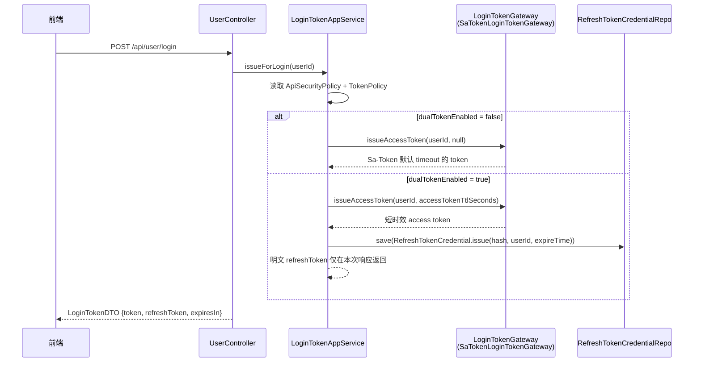
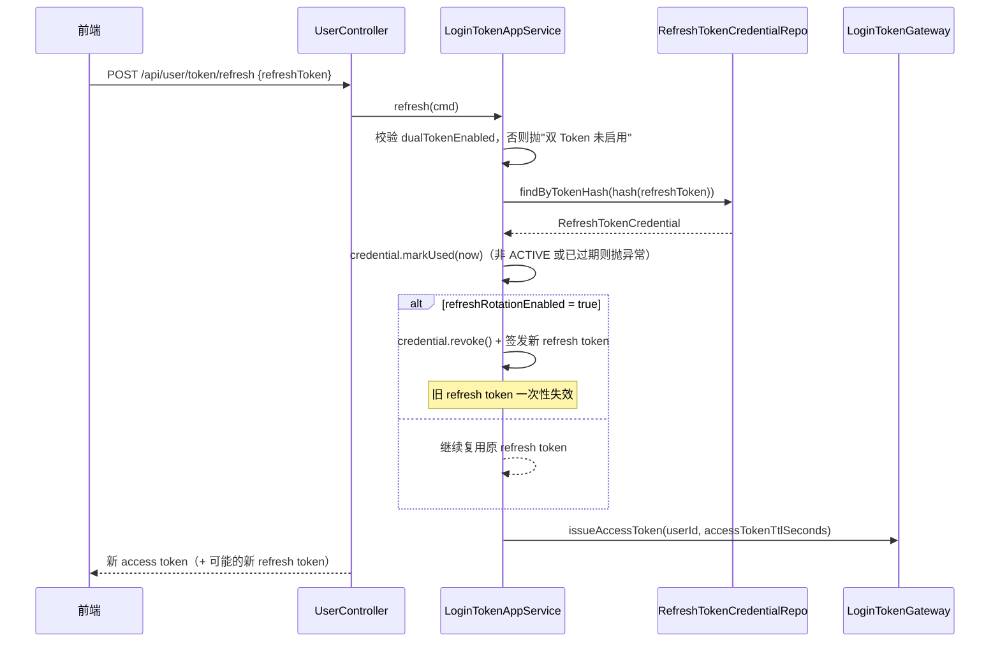

# 双 Token 认证

系统支持可选的 access/refresh 双令牌认证：access token 由 Sa-Token 签发并用于日常鉴权，refresh token 持久化落库、仅用于换取新 access token。开关由全局安全策略 `ApiSecurityPolicy.dualTokenEnabled` 控制，**默认关闭**——关闭时退回 Sa-Token 单令牌模式。

> 源码：
> - `yudream-application/src/main/java/online/yudream/base/application/system/security/service/LoginTokenAppService.java`
> - `yudream-domain/src/main/java/online/yudream/base/domain/system/security/valobj/TokenPolicy.java`
> - `yudream-infrastructure/src/main/java/online/yudream/base/infra/system/security/service/SaTokenLoginTokenGateway.java`
> - `yudream-interfaces/src/main/java/online/yudream/base/interfaces/system/user/controller/UserController.java`

---

## 令牌策略（TokenPolicy）

`TokenPolicy` 是不可变值对象，承载三个可配置项：

| 字段 | 默认值 | 说明 |
|---|---|---|
| `accessTokenTtlSeconds` | `7200`（2 小时） | access token 有效期 |
| `refreshTokenTtlSeconds` | `604800`（7 天） | refresh token 有效期 |
| `refreshRotationEnabled` | `true` | 刷新时是否轮换 refresh token（一次性使用） |

构造时的不变量校验（`yudream-domain/.../valobj/TokenPolicy.java:11`）：

- 两个 TTL 都必须大于 0；
- **refresh TTL 不能小于 access TTL**，否则抛出"刷新令牌有效期不能小于访问令牌有效期"。

策略持久化在 `ApiSecurityPolicy.tokenPolicy` 中，经安全中心 `/api/system/security/policy`（`PUT`）修改。

## 签发流程

登录成功后由 `UserController.login` 调用 `LoginTokenAppService.issueForLogin(userId)`：

关键实现细节：

1. **Sa-Token 登录**：`SaTokenLoginTokenGateway.issueAccessToken` 在传入正数超时时用 `new SaLoginModel().setTimeout(timeoutSeconds)` 覆盖全局配置，否则走默认 `StpUtil.login(userId)`。
2. **Refresh token 生成**：32 字节 `SecureRandom` 随机数，十六进制编码后加 `ydr_` 前缀（`LoginTokenAppService.randomRefreshToken()`）。
3. **只存哈希**：落库的是 `ApiKeySecretHasher.hash(plaintext)`，明文只在签发响应中出现一次；数据库泄露也无法还原令牌。
4. 返回的 `LoginTokenDTO` 含 `tokenName`（即 `Authorization`）、`dualTokenEnabled` 与 `expiresIn`，未启用双 Token 时 `refreshToken` 为 `null`、`expiresIn` 为 `0`。

## 刷新与轮换

刷新端点：`POST /api/user/token/refresh`，请求体为 `UserTokenRefreshRequest`（字段 `refreshToken`）：

要点：

- **轮换（rotation）开启时旧 refresh token 被 `revoke()` 置为 `REVOKED`，只能使用一次**；客户端必须保存每次刷新返回的新 token。
- `markUsed` 会再次校验 `activeAt`：状态非 `ACTIVE` 或已过 `expireTime` 时抛出"刷新令牌无效或已过期"，防止重放已吊销/过期凭证。
- 刷新方法整体标注 `@Transactional`，凭证吊销与新凭证写入原子提交。
- 凭证聚合的状态机见 `yudream-domain/src/main/java/online/yudream/base/domain/system/security/aggregate/RefreshTokenCredential.java`：`issue` → `ACTIVE`，`revoke()` → `REVOKED`，`activeAt` 同时检查状态与 `expireTime`。

## 客户端接入约定

- access token 放请求头：`Authorization: <token>`（token 名来自 `sa-token.token-name`）。
- 收到鉴权失败后调用 `/api/user/token/refresh` 换新 token 并重试；若刷新也失败（404 语义的"无效或已过期"业务错误），跳转登录页。
- **`userId` 等 Java `Long`（Snowflake ID）在 JSON 响应、TypeScript 模型与 URL 参数中一律使用字符串 `string`**，禁止 `Number(id)`。

## 配置项汇总

| 配置 | 位置 | 默认 | 说明 |
|---|---|---|---|
| `dualTokenEnabled` | 安全策略（`PUT /api/system/security/policy`） | `false` | 双 Token 总开关 |
| `accessTokenTtlSeconds` | `ApiSecurityPolicy.tokenPolicy` | `7200` | access token 有效期 |
| `refreshTokenTtlSeconds` | `ApiSecurityPolicy.tokenPolicy` | `604800` | refresh token 有效期 |
| `refreshRotationEnabled` | `ApiSecurityPolicy.tokenPolicy` | `true` | 刷新时轮换 refresh token |
| `sa-token.timeout` | `application.yml` | `86400` | 单令牌模式的默认有效期 |

## 存储模型

Refresh token 凭证持久化在 MongoDB 集合 `sysRefreshTokenCredential`（`yudream-infrastructure/src/main/java/online/yudream/base/infra/system/security/dataobj/RefreshTokenCredentialDO.java`）：

| 字段 | 类型 | 说明 |
|---|---|---|
| `tokenHash` | `String` | 令牌哈希，建索引支撑 `findByTokenHash` 精确查询 |
| `userId` | `Long` | 归属用户（Snowflake ID） |
| `expireTime` | `LocalDateTime` | 过期时间 |
| `status` | `CredentialStatus` | `ACTIVE` / `REVOKED` |
| `usedTime` | `LocalDateTime` | 最近一次成功使用时间 |

仓储实现为 `RefreshTokenCredentialRepoImpl`；`domain <-> dataobj` 转换只在 infra mapper 层完成，应用层只见聚合 `RefreshTokenCredential`。

> 注：凭证中的 `userId` 为 Java `Long`（Snowflake ID），出现在 JSON/TS/URL 中一律使用字符串 `string`。

## 常见问题

- **开启双 Token 后老登录态会失效吗？** 不会立即失效。已有 Sa-Token 会话仍按其原 timeout 存活；只有新登录才按 `accessTokenTtlSeconds` 签发短时效 token。
- **为什么 refresh TTL 必须大于等于 access TTL？** 若 refresh 先于 access 过期，双 Token 机制失去意义（无法续期）；该约束在 `TokenPolicy` 构造器中强制执行。
- **同一用户能否多端登录？** 可以。Sa-Token 配置 `is-concurrent: true`，每个会话独立签发各自的 refresh token。
- **refresh token 泄露怎么办？** 轮换开启时，泄露方与正常方先后使用同一 token，先使用者成功、后者收到"无效或已过期"，可据此检测异常并吊销该用户全部凭证。

## 错误信息对照

| 场景 | 业务异常文案 | 触发位置 |
|---|---|---|
| 策略未开启双 Token 时调用刷新 | "双 Token 未启用" | `LoginTokenAppService.refresh` |
| 请求体缺少 `refreshToken` | "刷新令牌不能为空" | 同上 |
| 哈希查不到凭证 / 已过期 / 已吊销 | "刷新令牌无效或已过期" | `findByTokenHash` 为空或 `markUsed` 校验失败 |
| TokenPolicy 参数非法 | "访问令牌有效期必须大于0" 等 | `TokenPolicy` 构造器 |

---

> 源码引用：
> - `yudream-application/src/main/java/online/yudream/base/application/system/security/service/LoginTokenAppService.java`
> - `yudream-domain/src/main/java/online/yudream/base/domain/system/security/valobj/TokenPolicy.java`
> - `yudream-domain/src/main/java/online/yudream/base/domain/system/security/aggregate/RefreshTokenCredential.java`
> - `yudream-infrastructure/src/main/java/online/yudream/base/infra/system/security/service/SaTokenLoginTokenGateway.java`
> - `yudream-interfaces/src/main/java/online/yudream/base/interfaces/system/user/controller/UserController.java`（`POST /api/user/login`、`POST /api/user/token/refresh`）
