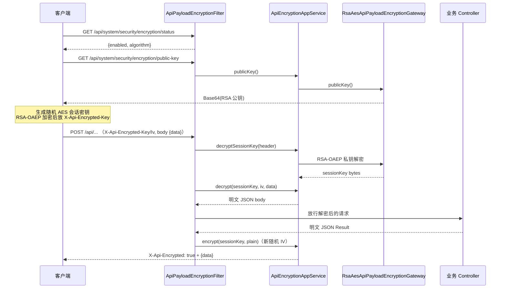

# 接口加密

接口加密为 `/api/**` 的 JSON 请求/响应体提供端到端的应用层加密：客户端用服务端下发的 RSA 公钥加密一个随机 AES 会话密钥，之后整个请求/响应体用该会话密钥做 AES-GCM 加密。开关由全局安全策略 `ApiSecurityPolicy.apiEncryptionEnabled` 控制，**默认关闭**。

> 源码：
> - `yudream-interfaces/src/main/java/online/yudream/base/interfaces/system/security/filter/ApiPayloadEncryptionFilter.java`
> - `yudream-application/src/main/java/online/yudream/base/application/system/security/service/ApiEncryptionAppService.java`
> - `yudream-infrastructure/src/main/java/online/yudream/base/infra/system/security/service/RsaAesApiPayloadEncryptionGateway.java`

---

## 算法组合

算法标识对外固定为 `RSA-OAEP/AES-GCM`（`ApiEncryptionAppService.ALGORITHM`），具体参数在 infra 网关 `RsaAesApiPayloadEncryptionGateway` 中定义：

| 环节 | 算法 / 参数 |
|---|---|
| 密钥交换 | `RSA/ECB/OAEPWithSHA-256AndMGF1Padding`，RSA 2048 位，OAEP 使用 SHA-256 + MGF1(SHA-256) |
| 载荷加密 | `AES/GCM/NoPadding`，GCM tag 128 位，IV 12 字节随机生成 |
| 编码 | 密文与 IV 均为 Base64 字符串 |

- RSA 密钥对由网关在 Bean 构造时生成（`createKeyPair()`），**存于内存、重启后更换**——客户端每次启动应重新拉取公钥。
- 每次响应加密都通过 `newIv()` 生成新的 12 字节随机 IV，同一会话密钥不重复使用 IV。
- 解密失败统一抛出业务异常："接口加密会话密钥解密失败" / "接口请求体解密失败"，不向客户端泄露密码学细节。

## 协议头与报文格式

Filter 定义了三个协议头：

| Header | 方向 | 说明 |
|---|---|---|
| `X-Api-Encrypted: true` | 双向 | 标记载荷已加密；请求缺少它时直接返回 400"接口加密已开启，请使用加密请求" |
| `X-Api-Encrypted-Key` | 请求 → 服务端 | RSA-OAEP 加密后的 AES 会话密钥（Base64） |
| `X-Api-Encrypted-Iv` | 请求 → 服务端 | 请求体对应的 GCM IV（Base64） |

加密封包的 JSON 结构（`ApiEncryptedPayloadRequest` / 响应 `ApiEncryptedPayloadRes`）：

```json
{ "data": "<Base64(AES-GCM(plainText))>" }
```

响应加密后 Filter 会回写 `X-Api-Encrypted: true` 头，客户端据此解密。

## 完整流程



## 生效范围与豁免路径

Filter 以 `OncePerRequestFilter` 实现，排序 `Ordered.HIGHEST_PRECEDENCE + 10`，确保在其他过滤器之前完成解密。`shouldFilter()` 决定哪些请求参与加密（`ApiPayloadEncryptionFilter.java:79`）：

**参与条件**（同时满足）：

- 路径以 `/api/` 开头；
- Content-Type 为空或包含 `application/json`；
- 非 `OPTIONS` 预检请求；
- 全局策略 `apiEncryptionEnabled = true`（未开启直接放行）。

**豁免路径**：

| 豁免对象 | 匹配规则 |
|---|---|
| 加密协商端点自身 | `/api/system/security/encryption/status`、`/encryption/public-key`（否则鸡生蛋问题） |
| 公开 CMS 内容 | `/api/public/cms/**` |
| 二进制流 | `/api/system/excel/**`、`/api/system/files/**`、`/api/files/{id}/content`、插件静态资源 `/api/platform/plugins/{code}/assets/**` |
| SSE 流式接口 | 请求解密照常执行，但 `Accept: text/event-stream` 时跳过响应加密，保证真流式不被缓冲破坏 |

另外两个细节：

- **带体的方法才解密**：仅对 `POST/PUT/PATCH/DELETE` 且携带 `X-Api-Encrypted-Iv` 的请求读取并解密 `{data}`，GET 等无体请求只要求协议头合法。解密结果包装进 `ApiEncryptedRequestWrapper` 供后续读取。
- **响应仅加密 JSON**：经 `ContentCachingResponseWrapper` 缓冲后检查 Content-Type，非 JSON 响应原样透传。

## 客户端接入步骤

1. 启动时调用 `GET /api/system/security/encryption/status` 判断是否启用；
2. 启用时调用 `GET /api/system/security/encryption/public-key` 取 Base64 公钥；
3. 每个请求生成随机 AES 会话密钥（建议 256 位）与 IV：
   - 会话密钥用公钥做 **RSA-OAEP(SHA-256)** 加密，放 `X-Api-Encrypted-Key`；
   - 请求体序列化后用 **AES-GCM** 加密，Base64 后填入 `{ "data": ... }`，IV 放 `X-Api-Encrypted-Iv`；
4. 响应头 `X-Api-Encrypted: true` 时用同一会话密钥解密 `data` 字段。

## 配置与管理

| 配置 | 说明 |
|---|---|
| `apiEncryptionEnabled` | 安全策略开关，经安全中心 `PUT /api/system/security/policy` 修改，需 `system:security:edit` 权限 |
| 算法标识 | 固定 `RSA-OAEP/AES-GCM`，见 `ApiEncryptionAppService` |

## 常见问题

- **为什么不用 RSA 直接加密业务体？** RSA 有长度上限且性能差；混合加密让大载荷走对称算法，RSA 只保护会话密钥本身。
- **重启后旧会话密钥为何失效？** RSA 密钥对只在内存中存活于进程生命周期，重启后私钥更换，客户端必须重新拉取公钥并重建会话密钥。
- **上传/下载文件需要加密吗？** 当前实现将 Excel 与文件端点整体豁免，二进制内容的机密性依赖 HTTPS 传输层。
- **SSE 对话为什么响应不加密？** SSE 必须端到端真流式，缓冲整条流再加密会破坏增量推送；Filter 对 `text/event-stream` 只解密请求、透传响应。
- **ID 字段注意**：加密报文内的业务字段若含 Java `Long`（Snowflake ID），在 JSON/TS/URL 中一律使用字符串 `string`，禁止 `Number(id)`。

## 错误信息对照

| 场景 | HTTP 状态 / 文案 | 触发位置 |
|---|---|---|
| 加密已开启但请求未带 `X-Api-Encrypted` | 400 "接口加密已开启，请使用加密请求" | Filter `encryptedRequest` 校验 |
| 会话密钥解密失败（密钥不匹配/被篡改） | 业务异常 "接口加密会话密钥解密失败"，Filter 转 400 | `RsaAesApiPayloadEncryptionGateway.decryptSessionKey` |
| 请求体解密失败（IV 错误、密文损坏） | 业务异常 "接口请求体解密失败"，Filter 转 400 | 同上 `decrypt` |
| 响应体加密失败 | 业务异常 "接口响应体加密失败" | 同上 `encrypt` |

所有密码学异常都收敛为统一的中文 `BizException`，由 Filter 以 `Result.fail(ResultCode.BAD_REQUEST...)` 形式返回，不暴露堆栈或算法细节。

## 与双 Token 的组合

接口加密与[双 Token 认证](./dual-token.md)可同时开启，两者作用层次不同：

- 双 Token 解决"**谁在调用**"（认证与令牌生命周期）；
- 接口加密解决"**中间人能否看到内容**"（载荷机密性与完整性，GCM 自带认证标签）。

同时开启时的推荐顺序：客户端先完成加密握手（拉取公钥、生成会话密钥），登录请求体也走加密通道；返回的 access/refresh token 只存在于密文中，不以明文经过网络。

---

> 源码引用：
> - `yudream-interfaces/src/main/java/online/yudream/base/interfaces/system/security/filter/ApiPayloadEncryptionFilter.java`
> - `yudream-interfaces/src/main/java/online/yudream/base/interfaces/system/security/filter/ApiEncryptedRequestWrapper.java`
> - `yudream-application/src/main/java/online/yudream/base/application/system/security/service/ApiEncryptionAppService.java`
> - `yudream-infrastructure/src/main/java/online/yudream/base/infra/system/security/service/RsaAesApiPayloadEncryptionGateway.java`
> - `yudream-domain/src/main/java/online/yudream/base/domain/system/security/service/ApiPayloadEncryptionGateway.java`
