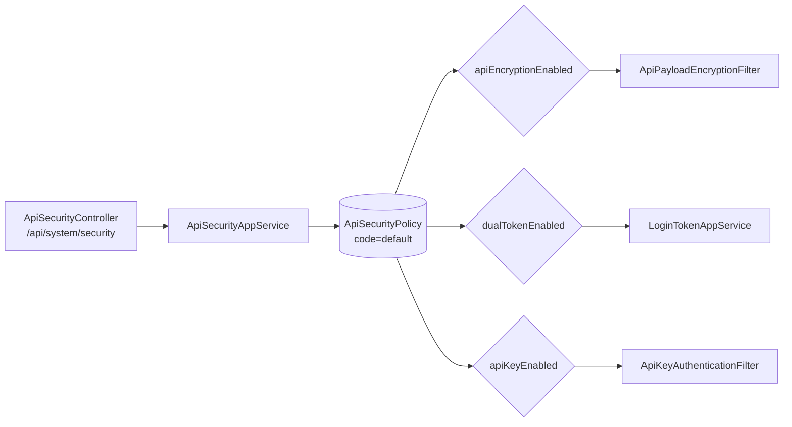

# 安全体系总览

YuDream Admin 的系统安全能力集中在 `system` 域的 security 模块，由一张**全局安全策略聚合**（`ApiSecurityPolicy`）统一控制各类安全机制的开关，覆盖：接口加密、双 Token 认证、API Key、Passkey、OAuth 服务端与 OAuth 客户端。

> 源码：
> - `yudream-domain/src/main/java/online/yudream/base/domain/system/security/`（聚合、值对象、仓储接口）
> - `yudream-application/src/main/java/online/yudream/base/application/system/security/`
> - `yudream-infrastructure/src/main/java/online/yudream/base/infra/system/security/`
> - `yudream-interfaces/src/main/java/online/yudream/base/interfaces/system/security/`

---

## 安全策略聚合

所有安全开关都持久化在默认策略（`code = "default"`）上，运行时通过 `ApiSecurityPolicyRepo.findDefault()` 读取；未初始化时回退到 `createDefault()`（全部关闭）：

| 开关 | 字段 | 说明 | 文档 |
|---|---|---|---|
| 接口加密 | `apiEncryptionEnabled` | RSA-OAEP + AES-GCM 请求/响应体加密 | [接口加密](./encryption.md) |
| 双 Token | `dualTokenEnabled` | access + refresh 双令牌登录 | [双 Token 认证](./dual-token.md) |
| API Key | `apiKeyEnabled` | 服务端到服务端调用凭证 | — |
| Passkey | `passkeyEnabled` | WebAuthn 无密码认证 | — |
| OAuth 服务端 | `oauthServerEnabled` | 对外提供 OAuth 授权服务 | — |
| OAuth 客户端 | `oauthClientEnabled` | 接入第三方 OAuth 登录 | — |

策略读取在 `yudream-domain/src/main/java/online/yudream/base/domain/system/security/aggregate/ApiSecurityPolicy.java` 中实现；管理端点由 `ApiSecurityController`（`/api/system/security`）暴露，修改需要 `system:security:edit` 权限。



## 分层职责

按照项目 DDD 约定，安全能力在各层的位置如下：

| 层 | 内容 | 代表类 |
|---|---|---|
| domain | 聚合 / 值对象 / 仓储接口 / 网关接口 | `ApiSecurityPolicy`、`TokenPolicy`、`RefreshTokenCredential`、`LoginTokenGateway`、`ApiPayloadEncryptionGateway` |
| application | 应用 service / cmd / dto / assembler | `LoginTokenAppService`、`ApiEncryptionAppService`、`ApiKeyAuthAppService` |
| infrastructure | 仓储实现 / 技术网关 | `RefreshTokenCredentialRepoImpl`、`SaTokenLoginTokenGateway`、`RsaAesApiPayloadEncryptionGateway` |
| interfaces | Controller / Filter / request-res / assembler | `ApiSecurityController`、`UserController`、`ApiPayloadEncryptionFilter`、`ApiKeyAuthenticationFilter` |

关键设计点：

- **网关接口定义在 domain**（如 `LoginTokenGateway`），infra 用具体技术实现——认证底层是 **Sa-Token**（`SaTokenLoginTokenGateway` 直接封装 `StpUtil.login(...)`），替换认证框架不影响应用层。
- **加密算法细节只存在于 infra**（`RsaAesApiPayloadEncryptionGateway`），应用层只见 `encrypt/decrypt/publicKey` 等抽象方法。
- Controller 只做边界校验并经 assembler 返回 `Result`，不触碰 cmd/res 构造以外的业务逻辑。

## 认证底座：Sa-Token

`yudream-bootstrap/src/main/resources/application.yml` 中的 Sa-Token 配置是访问令牌的基础行为：

```yaml
sa-token:
  token-name: Authorization
  timeout: 86400          # 默认有效期（秒）；双 Token 启用时按 accessTokenTtlSeconds 覆盖
  active-timeout: -1      # 不启用无操作过期
  is-concurrent: true
  is-share: true
  token-style: uuid
  is-read-cookie: false   # 仅从 Header 读取，规避 CSRF
  is-read-header: true
```

- 令牌名固定为 `Authorization`，仅从请求头读取、不读 Cookie。
- 未开启双 Token 时使用该全局 `timeout`；开启后由策略中的 `accessTokenTtlSeconds` 控制（见 [双 Token 认证](./dual-token.md)）。

## 权限注册机制

权限点不手工维护清单，而是在 Controller 方法上声明注解，启动时统一登记：

```java
@GetMapping("/policy")
@PermissionRegister(code = "system:security:view", name = "查看安全中心",
        module = "系统管理", desc = "查看系统安全策略")
public Result<ApiSecurityPolicyRes> policy() { ... }
```

链路：`PermissionRegisterBootstrap` → `PermissionRegisterAspect` → `SaTokenPermissionProvider`，把 `@PermissionRegister` 标注的权限码汇总为权限清单供 Sa-Token 鉴权使用。

> 源码：`yudream-infrastructure/src/main/java/online/yudream/base/infra/system/security/bootstrap/PermissionRegisterBootstrap.java`、同目录 `aspect/PermissionRegisterAspect.java`、`service/SaTokenPermissionProvider.java`；注解定义在 `yudream-domain/.../security/anno/PermissionRegister.java`

前端新增 `v-auth` 权限按钮时，需同步对应的权限码枚举（见工程规则第 6 节）。

## 与其他认证方式的关系

安全中心各开关相互独立，可组合生效：

- **API Key**（`apiKeyEnabled`）：面向服务端调用方，走独立的 `ApiKeyAuthenticationFilter`，凭证同样只存哈希（`ApiKeyCredentialRepoImpl`），创建时明文仅返回一次。
- **Passkey**（`passkeyEnabled`）：WebAuthn 无密码登录，成功后同样经 `LoginTokenAppService.issueForLogin` 签发令牌——即 Passkey 只是替代"密码验证"这一步，令牌体系不变。
- **OAuth**：服务端模式对外颁发独立于 Sa-Token 的 access/refresh token（`OAuthServerAppService`）；客户端模式用于第三方账号绑定登录（`ExternalLoginAppService`）。
- **接口加密**：正交于认证的传输层加固，开启后所有 JSON API（含登录接口本身）都要求加密载荷。

## 设计原则

从源码实现可以归纳出安全模块的四条原则：

1. **开关集中、默认关闭**：所有能力收敛到单一策略聚合，未显式开启时不改变既有行为（如接口加密关闭时 Filter 直接放行）。
2. **秘密只存哈希**：refresh token 与 API Key 落库前都经 `ApiKeySecretHasher.hash(...)`，明文仅在创建/签发响应中出现一次。
3. **技术无关的领域端口**：domain 只定义 `LoginTokenGateway`、`ApiPayloadEncryptionGateway` 等接口，Sa-Token、JCE 等技术细节全部隔离在 infra。
4. **失败即拒绝**：加密请求缺协议头返回 400；凭证过期/吊销在 `markUsed` 处强校验；TokenPolicy 不变量在构造时拒绝非法配置。

## ID 序列化约定

安全模块中 `ApiKeyCredential`、`RefreshTokenCredential` 等实体的主键为 Java `Long`（Snowflake ID）。**凡出现在 JSON 响应、TypeScript 模型或 URL 参数中时一律使用字符串 `string`**，禁止 `Number(id)` 或数值序列化，避免 JS 精度丢失。

---

## 主要端点一览

| 端点 | 方法 | 权限 | 说明 |
|---|---|---|---|
| `/api/system/security/encryption/status` | GET | 公开 | 查询接口加密是否启用 |
| `/api/system/security/encryption/public-key` | GET | 公开 | 获取 RSA 公钥 |
| `/api/system/security/policy` | GET / PUT | `system:security:view` / `system:security:edit` | 查看/修改安全策略 |
| `/api/system/security/api-keys` | GET / POST | `system:security:view` / `system:security:api-key:create` | API Key 分页/创建 |
| `/api/system/security/api-keys/{id}/revoke` | POST | `system:security:api-key:revoke` | 吊销 API Key |
| `/api/user/login` | POST | 公开 | 密码登录并签发令牌 |
| `/api/user/token/refresh` | POST | 公开（凭 refreshToken） | 刷新 access token |

> `id` 为 Java `Long`（Snowflake ID），在 URL 与 JSON 中一律使用字符串 `string`。

## 页面导航

- [双 Token 认证](./dual-token.md)：access/refresh 双令牌的签发、刷新轮换与存储模型
- [接口加密](./encryption.md)：RSA-OAEP 会话密钥交换 + AES-GCM 载荷加解密的完整流程

## 常见问题

- **安全开关在哪里修改？** 安全中心页面或直接调用 `PUT /api/system/security/policy`，需要 `system:security:edit` 权限；修改即时生效，无需重启。
- **开启接口加密后前端需要改什么？** 前端需先请求公钥并实现 RSA-OAEP + AES-GCM 封包，详见[接口加密](./encryption.md)；未升级的旧客户端将收到 400。
- **双 Token 与单 Token 可以混用吗？** 开关只影响新签发的登录会话；已存在的 Sa-Token 会话按原 timeout 存活至自然过期，详见[双 Token 认证](./dual-token.md)。
- **这些能力对插件开放吗？** 插件经 SPI 的 security 端口使用宿主安全能力（见 `docs/plugin/spi/v1/security.md`），插件自身不直接读取 `ApiSecurityPolicy`。

> 源码引用：
> - `yudream-domain/src/main/java/online/yudream/base/domain/system/security/aggregate/ApiSecurityPolicy.java`
> - `yudream-bootstrap/src/main/resources/application.yml`（`sa-token:` 段）
> - `yudream-interfaces/src/main/java/online/yudream/base/interfaces/system/security/controller/ApiSecurityController.java`
