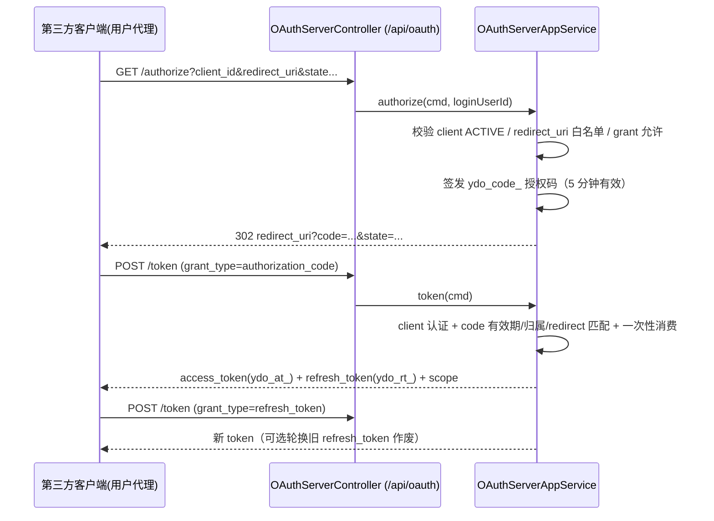
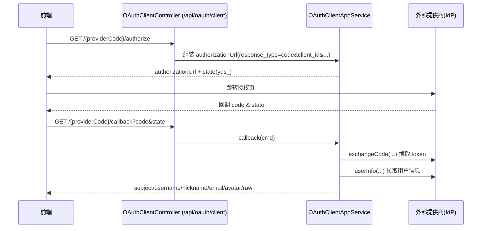

# OAuth 2.0：服务端与客户端

系统的 OAuth 能力分为两半：

- **OAuth 服务端（Authorization Server）**：本系统作为授权方，向第三方客户端颁发 Authorization Code / Access Token / Refresh Token；
- **OAuth 客户端（Client）**：本系统作为接入方，通过外部提供商（GitHub、自建 IdP 等任意标准端点配置）完成授权码换取用户信息。

两者各自有独立的启用开关（`oauthServerEnabled` / `oauthClientEnabled`），互不依赖。

> 源码：
> - `yudream-interfaces/.../system/security/controller/OAuthServerController.java`、`OAuthClientController.java`、`OAuthPasskeyController.java`
> - `yudream-application/.../security/service/OAuthServerAppService.java`、`OAuthClientAppService.java`、`OAuthPasskeyAppService.java`
> - `yudream-domain/.../security/aggregate/OAuthClientRegistration.java`、`aggregate/OAuthProviderRegistration.java`

---

## 服务端：授权码模式

### 授权流程



### 端点

`OAuthServerController`，挂载 `/api/oauth`：

| 方法 | 路径 | 说明 |
|---|---|---|
| GET | `/api/oauth/authorize` | 需登录态；签发授权码并以 `RedirectView` 重定向回客户端 |
| POST | `/api/oauth/token` | `application/x-www-form-urlencoded`；支持 `authorization_code` 与 `refresh_token` 两种 `grant_type` |

token 响应字段（`OAuthTokenRes`）：`accessToken`、`refreshToken`、`tokenType=Bearer`、`expiresIn`、`scope`。

### 客户端注册与管理

管理员经 `OAuthPasskeyController` 管理（挂载 `/api/system/security`，权限编码 `system:security:oauth:view` / `system:security:oauth:edit`）：

| 方法 | 路径 | 说明 |
|---|---|---|
| GET | `/api/system/security/oauth/clients` | 客户端列表 |
| POST | `/api/system/security/oauth/clients` | 新增，返回一次性 `clientSecret` |
| PUT | `/api/system/security/oauth/clients/{id}` | 编辑（名称、auth method、grant types、redirect URIs、scopes、TTL 等） |
| DELETE | `/api/system/security/oauth/clients/{id}` | 禁用 |
| POST | `/api/system/security/oauth/clients/{id}/enable` | 启用 |

- `clientId` 全局唯一；`clientSecret` 格式为 `ydc_` + 32 字节随机十六进制，落库仅存哈希（`ApiKeySecretHasher.hash`），明文只在创建响应中出现一次。
- 授权码有效期固定 5 分钟且一次性消费；access/refresh token TTL 取全局 `TokenPolicy`（可在安全策略中调整，支持 refresh rotation）。
- token 落库同样只存哈希，刷新时按 `refreshTokenHash` 检索比对。

## 客户端：接入外部提供商

### 流程



### 端点

`OAuthClientController`，挂载 `/api/oauth/client`：

| 方法 | 路径 | 说明 |
|---|---|---|
| GET | `/api/oauth/client/{providerCode}/authorize` | 返回跳转 URL 与 `state`（未传则随机生成 `yds_` 前缀值） |
| GET | `/api/oauth/client/{providerCode}/callback` | 用回调 `code`/`state` 换取用户信息 |

回调返回 `subject`（提供商侧唯一标识）、`username`、`nickname`、`email`、`avatar` 及 `raw`（原始 userinfo 报文）。拿到这些信息后即可对接第三方登录绑定流程（见 `ExternalLoginController` 的 `/api/external-login/**` 与 `/api/user/me/external-accounts/**`）。

### 提供商配置

管理员经 `/api/system/security/oauth/providers` 系列 CRUD 维护 `OAuthProviderRegistration`，字段包括：`name`、`issuerUri`、`authorizationUri`、`tokenUri`、`userInfoUri`、`clientId`、`clientSecret`、`authMethod`（`OAuthClientAuthMethod`）、`scopes`（缺省 `openid profile email`）、`redirectUri`、`status`。

也就是说任何"能填出这四个 URI"的标准 OAuth2/OIDC 提供商都可以直接接入，无需写适配代码——HTTP 调用由 infra 层 `JdkOAuthClientGateway` 统一完成。

## 服务端校验与失败场景

`OAuthServerAppService.token(...)` 的关键校验（任一不满足抛 `BizException`）：

| 校验 | 失败文案 |
|---|---|
| `grant_type` 不在支持范围 | `OAuth grant_type 暂不支持` |
| 客户端不存在或非 ACTIVE | `OAuth 客户端不存在/已停用` |
| client 认证失败（secret 哈希比对） | client secret 错误 |
| 客户端未登记该 grant type | grant 未授权给该客户端 |
| 授权码过期 / 已使用 / 归属不符 | `OAuth 授权码无效或已过期` |
| 回调地址与签发时不一致 | `OAuth 回调地址不匹配` |
| refresh token 过期或已轮换作废 | `OAuth Refresh Token 无效或已过期` |

客户端认证方式由注册时的 auth method 决定，支持从 `Authorization: Basic` 请求头或表单字段读取凭据（见 `OAuthTokenRequest` 与 `ApiSecurityWebAssembler.toCmd(request, authorizationHeader)`）。

## 数据落库

| 聚合 | 说明 |
|---|---|
| `OAuthClientRegistration` | clientId 全局唯一；secret 仅存哈希；redirect URIs 白名单、grant types、scopes、TTL 覆盖 |
| `OAuthAuthorizationCode` | 5 分钟有效期，`use(now)` 保证一次性消费，状态机见 `OAuthAuthorizationCodeStatus` |
| `OAuthAccessToken` | access/refresh token 双哈希存储，刷新时按 `refreshTokenHash` 检索；rotation 开启时旧 token 直接 `revoke()` |

## 配置说明

OAuth 不依赖环境变量或 application.yml 配置项，所有开关与参数都是持久化数据：

| 项目 | 位置 | 说明 |
|---|---|---|
| `oauthServerEnabled` / `oauthClientEnabled` | 安全策略聚合 `ApiSecurityPolicy`，默认 `false` | 经 `GET/PUT /api/system/security/policy` 查看/修改；未启用时相关接口抛"OAuth 服务端/客户端未启用" |
| `accessTokenTtlSeconds` / `refreshTokenTtlSeconds` / `refreshRotationEnabled` | 同上策略的 `TokenPolicy` | 服务端签发 token 的全局 TTL 与轮换策略 |
| 客户端 / 提供商登记 | 数据库 | 经 `/api/system/security/oauth/clients|providers` 管理 |

## 使用示例

```bash
# 服务端：第三方客户端拿授权码换 token
curl -X POST https://example.com/api/oauth/token \
     -H "Content-Type: application/x-www-form-urlencoded" \
     -d "grant_type=authorization_code&code=ydo_code_xxx\
&client_id=my-app&client_secret=ydc_xxx&redirect_uri=https://my-app/cb"

# 客户端：前端引导用户跳转外部 IdP
const { authorizationUrl } = await fetch('/api/oauth/client/github/authorize').then(r => r.json())
location.href = authorizationUrl
```

## ID 类型约定

OAuth 客户端/提供商记录主键 `id`、关联 `userId` 为 Java `Long`（Snowflake ID），在 JSON 报文、TS 模型与 URL 参数中一律使用 **`string`**，禁止 `Number(id)`。

---

> 源码引用：`yudream-interfaces/.../system/security/controller/OAuthServerController.java`、`OAuthClientController.java`、`OAuthPasskeyController.java`、`ExternalLoginController.java`、`yudream-application/.../security/service/OAuthServerAppService.java`、`OAuthClientAppService.java`、`OAuthPasskeyAppService.java`、`yudream-infrastructure/.../security/service/JdkOAuthClientGateway.java`、`yudream-domain/.../security/enumerate/OAuthGrantType.java`、`OAuthClientAuthMethod.java`
