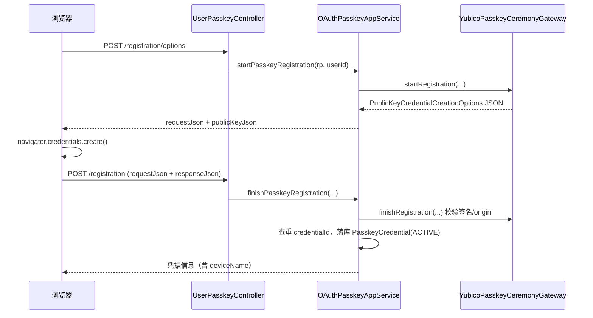
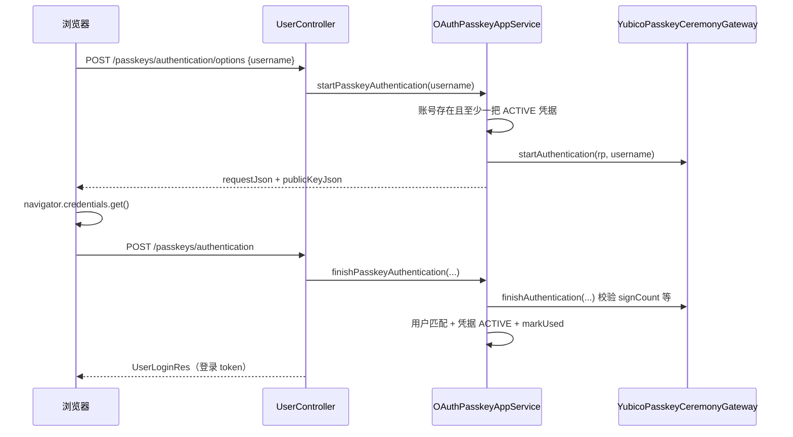

# Passkey（WebAuthn）认证

Passkey 基于 FIDO2/WebAuthn 提供无密码登录与凭据管理。宿主使用 [java-webauthn-server](https://github.com/Yubico/java-webauthn-server)（Yubico）在 infra 层完成注册/断言（ceremony）校验，应用层负责用户绑定、状态检查与双闸门开关。

> 源码：
> - `yudream-interfaces/.../system/security/controller/UserPasskeyController.java`、`controller/OAuthPasskeyController.java`、`support/PasskeyRelyingPartySupport.java`
> - `yudream-interfaces/.../system/user/controller/UserController.java`（登录端点）
> - `yudream-application/.../security/service/OAuthPasskeyAppService.java`
> - `yudream-infrastructure/.../security/service/YubicoPasskeyCeremonyGateway.java`

---

## 注册流程（绑定 Passkey）

已登录用户在 `/api/user/me/passkeys` 上完成两步注册：



## 登录流程（无密码认证）

登录端点在 `UserController` 下，无需预先登录：

| 方法 | 路径 | 说明 |
|---|---|---|
| POST | `/api/user/passkeys/authentication/options` | 按账号生成断言挑战 |
| POST | `/api/user/passkeys/authentication` | 提交断言结果，成功后签发登录 token |



登录成功后走统一的 `LoginTokenAppService.issueForLogin(user.getId())` 签发 token，并记录登录日志（成功/失败均记录）；失败时原样抛出业务异常。

## RP（Relying Party）的确定

`PasskeyRelyingPartySupport.from(request, siteName)` 从当前 HTTP 请求推导 WebAuthn 的 `rpId` 与 `origin`：

1. 优先取请求头 `Origin`；
2. 否则回退到 `X-Forwarded-Proto` / `X-Forwarded-Host` / `Host`（兼容反向代理部署）；
3. 本机地址（`localhost` / `127.0.0.1` / `::1`）默认用 `http`，其余默认 `https`；
4. `rpName` 传入系统设置中的站点名称（认证器弹窗展示），取不到时由领域层兜底。

这意味着**无需为 Passkey 单独配置域名**——浏览器访问哪个 origin，凭据就绑定在哪个 origin 上。

## 端点一览

### 用户自助（需登录，Sa-Token）

`UserPasskeyController`，挂载 `/api/user/me/passkeys`：

| 方法 | 路径 | 说明 |
|---|---|---|
| GET | `/api/user/me/passkeys` | 列出自己的全部凭据 |
| POST | `/api/user/me/passkeys/registration/options` | 开始注册，返回创建参数 |
| POST | `/api/user/me/passkeys/registration` | 完成注册（`deviceName` 标记设备） |
| POST | `/api/user/me/passkeys/{id}/revoke` | 吊销自己的凭据 |

### 管理端

`OAuthPasskeyController`，挂载 `/api/system/security`：

| 方法 | 路径 | 权限编码 | 说明 |
|---|---|---|---|
| GET | `/api/system/security/passkeys?userId=` | `system:security:passkey:view` | 查看（可按用户过滤） |
| POST | `/api/system/security/passkeys/{id}/revoke` | `system:security:passkey:revoke` | 吊销任意用户凭据 |

## 安全校验要点（`OAuthPasskeyAppService`）

- **应用闸门**：每个方法入口都执行 `ensurePasskeyEnabled()`；策略聚合 `ApiSecurityPolicy.passkeyEnabled` 默认关闭，经 `PUT /api/system/security/policy` 开启。
- 注册完成时按 `credentialId` 全局查重，防止同一把凭据重复绑定。
- 断言完成时校验：返回用户必须与请求账号一致、凭据属于该用户且状态为 `ACTIVE`、`signCount` 通过网关校验后 `markUsed` 更新。
- 账号解析支持用户名或邮箱（`userRepo.findByUsername(...).or(() -> findByEmail(...))`），停用账号直接拒绝。
- 凭据吊销是终态操作，吊销后该 Key 不能再用于登录。

## 前端调用示例

```ts
// 1. 取创建参数并调用浏览器 API
const options = await http.post('/api/user/me/passkeys/registration/options')
const credential = await navigator.credentials.create(JSON.parse(options.publicKeyJson))

// 2. 提交结果完成绑定
await http.post('/api/user/me/passkeys/registration', {
  requestJson: options.requestJson,
  responseJson: JSON.stringify(credential),
  deviceName: 'MacBook Touch ID',
})
```

具体字段以 `PasskeyRegistrationFinishRequest` / `PasskeyAuthenticationFinishRequest` 为准；`requestJson`/`responseJson` 均为字符串形式的 JSON。

## 凭据数据模型

`PasskeyCredential` 聚合核心字段：

| 字段 | 说明 |
|---|---|
| `id` | Snowflake 主键（JSON 中为 string） |
| `userId` | 绑定用户 ID（string） |
| `credentialId` | WebAuthn 凭据 ID（全局唯一，注册时查重） |
| `publicKey` | 公钥（COSE，由 Yubico 网关解析保存） |
| `deviceName` | 用户标注的设备名（如 "iPhone Face ID"） |
| `signCount` | 断言计数器，每次登录后经 `markUsed` 更新 |
| `status` | `ACTIVE` / 已吊销（终态） |

infra 层 `YubicoPasskeyCeremonyGateway` 实现了 `PasskeyCeremonyGateway` 领域端口与 Yubico 所需的 `CredentialRepository`：按用户过滤已注册凭据、构造 `RelyingParty`、校验签名与 origin。领域层不依赖 Yubico 类型，网关只在 infra 出现——符合 DDD 分层约束。

## 常见失败场景

| 报错 | 触发条件 |
|---|---|
| `Passkey 未启用` | 安全策略开关未打开 |
| `Passkey 凭据已存在` | 同一把凭据重复注册 |
| `当前账号未绑定可用 Passkey` | 账号没有 ACTIVE 凭据却发起登录 options |
| `Passkey 登录用户不匹配` | 断言返回的用户与请求账号不一致 |
| `Passkey 凭据不可用` | 凭据不属于该用户或已被吊销 |
| `Passkey Origin 无效` / `RP ID 无效` | 请求头缺失且无法推导出合法 origin/host |

## ID 类型约定

凭据主键 `id` 与 `userId` 为 Java `Long`（Snowflake ID），在 JSON 报文、TS 模型与 URL 参数中一律使用 **`string`**，禁止 `Number(id)`。

---

> 源码引用：`yudream-interfaces/.../system/security/controller/UserPasskeyController.java`、`OAuthPasskeyController.java`、`support/PasskeyRelyingPartySupport.java`、`assembler/PasskeyWebAssembler.java`、`yudream-interfaces/.../system/user/controller/UserController.java`、`yudream-application/.../security/service/OAuthPasskeyAppService.java`、`yudream-infrastructure/.../security/service/YubicoPasskeyCeremonyGateway.java`、`yudream-domain/.../security/aggregate/ApiSecurityPolicy.java`
